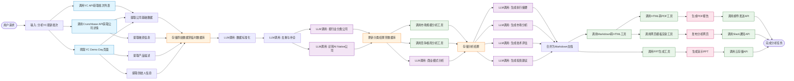

```mermaid
flowchart LR
    %% 起始节点
    Start([用户请求]) --> Input["输入: 分析YC最新批次"]
    
    %% 数据获取阶段
    Input --> API1["调用YC API获取批次列表"]
    Input --> API2["调用Crunchbase API获取公司详情"]
    Input --> Web1["爬取YC Demo Day页面"]
    
    %% 数据处理阶段
    API1 --> Extract1["提取公司基础数据"]
    API2 --> Extract1
    Web1 --> Extract1
    
    API2 --> Extract2["提取融资信息"]
    Web1 --> Extract3["提取产品描述"]
    Web1 --> Extract4["提取创始人信息"]
    
    %% 数据聚合与清洗
    Extract1 --> DB1["存储原始数据至临时数据库"]
    Extract2 --> DB1
    Extract3 --> DB1
    Extract4 --> DB1
    
    DB1 --> Clean1["LLM调用: 数据标准化"]
    Clean1 --> Clean2["LLM调用: 去重与补全"]
    
    %% 分类与分析
    Clean2 --> LLM1["LLM调用: 按行业分类公司"]
    Clean2 --> LLM2["LLM调用: 识别AI Native公司"]
    
    LLM1 --> DB2["更新分类结果至数据库"]
    LLM2 --> DB2
    
    DB2 --> Tool1["调用市场规模分析工具"]
    DB2 --> Tool2["调用竞争格局分析工具"]
    DB2 --> LLM3["LLM调用: 商业模式分析"]
    
    %% 分析结果聚合
    Tool1 --> DB3["存储分析结果"]
    Tool2 --> DB3
    LLM3 --> DB3
    
    %% 投资备忘录生成
    DB3 --> LLM4["LLM调用: 生成执行摘要"]
    DB3 --> LLM5["LLM调用: 生成市场分析"]
    DB3 --> LLM6["LLM调用: 生成技术评估"]
    DB3 --> LLM7["LLM调用: 生成投资建议"]
    
    %% 文档聚合
    LLM4 --> Doc1["合并为Markdown文档"]
    LLM5 --> Doc1
    LLM6 --> Doc1
    LLM7 --> Doc1
    
    %% 格式转换与输出
    Doc1 --> Tool3["调用Markdown转HTML工具"]
    Tool3 --> Tool4["调用HTML转PDF工具"]
    Tool3 --> Tool5["调用网页模板渲染工具"]
    Doc1 --> Tool6["调用PPT生成工具"]
    
    %% 输出处理
    Tool4 --> Out1["生成PDF报告"]
    Tool5 --> Out2["发布分析网页"]
    Tool6 --> Out3["生成演示PPT"]
    
    %% 通知分发
    Out1 --> Tool7["调用邮件发送API"]
    Out2 --> Tool8["调用Slack通知API"]
    Out3 --> Tool9["调用云存储API"]
    
    %% 完成节点
    Tool7 --> End([完成分析任务])
    Tool8 --> End
    Tool9 --> End
    
    %% 样式定义
    classDef apiClass fill:#e1f5fe,stroke:#0277bd
    classDef llmClass fill:#f3e5f5,stroke:#7b1fa2
    classDef toolClass fill:#e8f5e9,stroke:#2e7d32
    classDef dbClass fill:#fff3e0,stroke:#ef6c00
    classDef outClass fill:#fce4ec,stroke:#c2185b
    
    class API1,API2,Web1 apiClass
    class LLM1,LLM2,LLM3,LLM4,LLM5,LLM6,LLM7 llmClass
    class Tool1,Tool2,Tool3,Tool4,Tool5,Tool6,Tool7,Tool8,Tool9 toolClass
    class DB1,DB2,DB3 dbClass
    class Out1,Out2,Out3 outClass
```