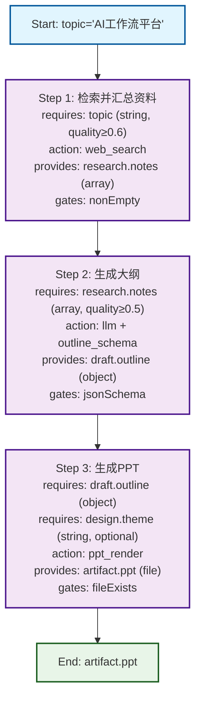
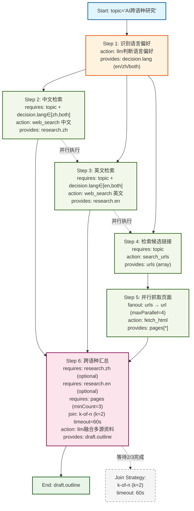
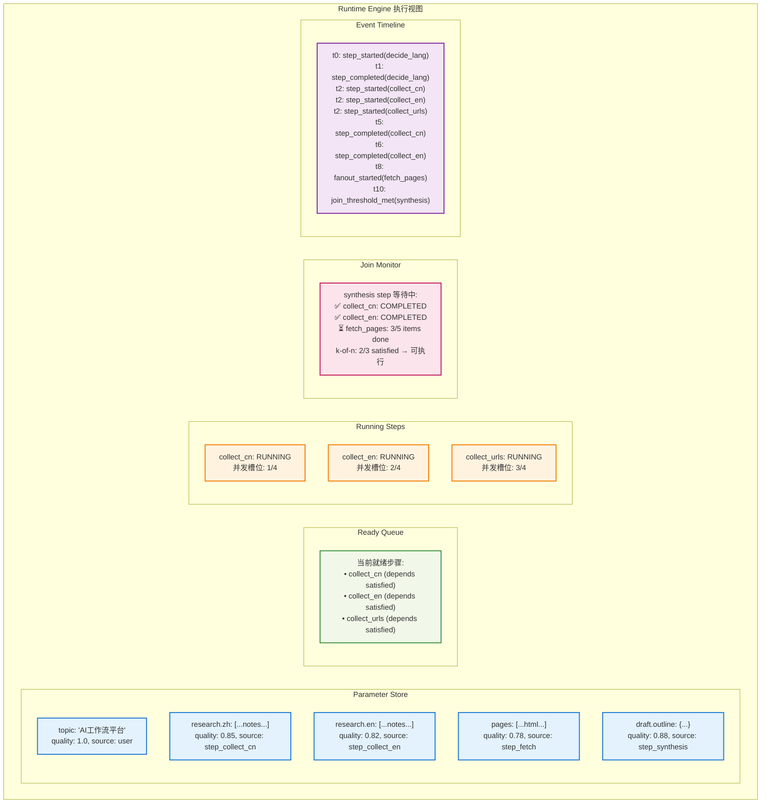
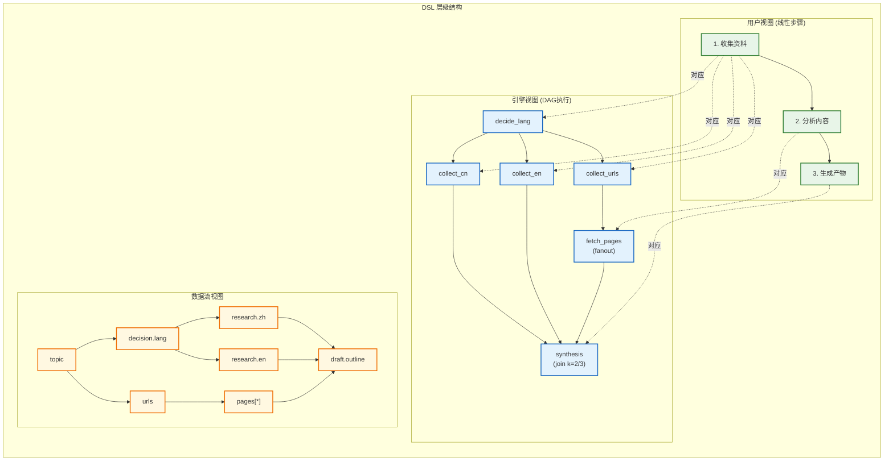

### 可行性结论（先给答案）
- **可行**：将传统 if/else/while 等显式控制结构，收敛为“顺序步骤 + 上下文依赖 + 持续 AI 提问/抽取”的编排范式在技术上是可行的。落地关键在于：可声明的“就绪条件”、可演化的“参数显化机制”、以及对非确定性的“质量评估与修复回路”。
- **核心取舍**：不暴露控制结构给用户，但在引擎层提供“声明式依赖条件 + 质量门控 + 有限重试/修复 + 人机澄清”即可覆盖绝大多数分支/循环场景；剩余极少数流程可由“隐式决策”+“步骤重排/插入”解决。
- **MVP 路线**：4 周可完成技术验证版（Builder Agent + Runtime Engine + 参数抽取 + Test Run/Debug）。

---

### 目标范式定义（Workflow 3.0）
- **构建方式**：用户围绕“要交付的产物”逐步对 AI 提问；AI 依据上下文与工具能力，提议/生成顺序步骤（step），每个 step 只声明：
  - requires: 需要哪些参数/上下文（键/标签/数据类型/质量分）
  - action: 调用工具或 LLM 指令（结构化输出）
  - provides: 产出哪些上下文键（含类型/质量分/来源）
  - gates: 产出质量校验（可声明式）
- **运行方式**：引擎按“可就绪的下一个 step”推进，沿途持续“参数抽取与显化”，直至产物满足完成度标准。
- **复用方式**：Start 参数为“可注入项”；其余均由运行时抽取或补足；模板一键试运行无需二次配置。

---

### 参考架构与组件
- **Builder 层（构建态）**
  - Builder Agent：将用户自然语言 + 已有上下文 → 生成/修改 step 列表（Plan-Refine）
  - Schema 生成器：从对话中推断参数清单（JSON Schema），并可在运行中不断升级（promote/rename/merge）
  - 工具目录：以工具能力描述（输入/输出 schema、前置条件、成本/时延）
- **Runtime 层（运行态）**
  - Orchestrator：选择“下一个就绪 step”（所有 requires 在上下文中存在且满足 gates）
  - Parameter Store：全局键值 + 质量分 + 来源链路（可追溯）
  - Memory/Knowledge：项目级上下文与知识库（向量检索/RAG）
  - Quality Gates：结构化校验器（JSON Schema、正则、评分器、对齐检查）
  - Repair 子循环：当 gate 失败时，自动生成“修复指令”有限重试；必要时触发“澄清提问”（Ask-User 或 Ask-Builder）
  - Observability：事件溯源（event-sourced run）、中间产物可视化、步骤级回放
- **分发层**
  - 一键发布 Chatbot/API/模板，注入 Start 参数即可运行

---

### 关键机制设计

- 参数抽取与显化（Promote On Run）
  - 从每个 step 的输出用 LLM 结构化抽取匹配 JSON Schema 的字段；未知字段置为 unknown 且给出建议取值来源（tools/用户澄清）
  - UI 支持“将临时值提升为全局参数”，形成强约束；支持改名/合并；保留来源与置信度
  - 多源冲突采用“质量分 + 来源优先级 + 人机确认”

- 就绪条件与门控（不用 if/else 的替代）
  - requires: 仅声明“存在性/类型/最小质量分/最近更新时序”
  - gates: 声明式质量门控（长度范围、包含要点、结构必填、对齐校验、工具可用性）
  - 引擎策略：扫描所有 step，选择第一个“就绪且未完成”的 step 执行；失败进入 repair；超过 N 次则启动 Builder 生成“插入式插补 step”（如先检索资料、先翻译、先清洗数据）

- 决策与分支的“顺序化”表达
  - 不暴露 if；通过“决策 step”产出一个上下文字段 decision: enum；后续步骤声明 requires: decision=foo 即可完成原 if/else 的效果，但在 UI 上仍显示为线性步骤
  - 循环的替代：通过“集合处理 step”产出一个 items 列表；后续使用“map-like step（批量工具）”或“迭代模板 step（系统内部批处理，不暴露 while）”

- Test Run / Debug
  - 注入 Start 参数局部运行；缺失参数自动触发“抽取 → 建议 → 人机补全”
  - 单步重跑、变更 prompt 后局部重放；记录“输入/输出/提示词/工具调用/成本”
  - 断点与快照：对 Parameter Store 做快照，支持分叉试验

- 稳定性与可重复性
  - 强制 JSON Schema 输出、使用 function call 模式
  - 引入评分器（rule-based + LLM Judge）稳定输出质量
  - 缓存命中（同上下文与提示词哈希），以及温度/种子控制
  - 工具调用设置超时与幂等重试

---

### 核心数据模型（建议）
```json
{
  "workflowId": "string",
  "start": {
    "paramsSchema": { "type": "object", "properties": { "topic": { "type": "string" } }, "required": ["topic"] }
  },
  "steps": [
    {
      "id": "collect_research",
      "title": "检索并汇总资料",
      "requires": [{ "key": "topic", "type": "string", "minQuality": 0.6 }],
      "action": { "type": "tool", "name": "web_search", "inputMap": { "query": "{{topic}}" } },
      "provides": [{ "key": "research.notes", "type": "array", "qualityFrom": "heuristics" }],
      "gates": [{ "type": "nonEmpty" }]
    },
    {
      "id": "outline",
      "title": "生成大纲",
      "requires": [{ "key": "research.notes", "type": "array", "minQuality": 0.5 }],
      "action": { "type": "llm", "prompt": "基于资料生成10页PPT大纲，JSON返回", "responseSchemaRef": "OutlineSchema" },
      "provides": [{ "key": "draft.outline", "type": "object" }],
      "gates": [{ "type": "jsonSchema", "schemaRef": "OutlineSchema" }]
    },
    {
      "id": "slides",
      "title": "生成PPT",
      "requires": [
        { "key": "draft.outline", "type": "object" },
        { "key": "design.theme", "type": "string", "optional": true }
      ],
      "action": { "type": "tool", "name": "ppt_render", "inputMap": { "outline": "{{draft.outline}}", "theme": "{{design.theme|default('clean')}}" } },
      "provides": [{ "key": "artifact.ppt", "type": "file" }],
      "gates": [{ "type": "fileExists" }]
    }
  ],
  "schemas": {
    "OutlineSchema": { "type": "object", "properties": { "slides": { "type": "array" } }, "required": ["slides"] }
  }
}
```

**基础顺序推进可视化：**


---

### 引擎执行伪代码（顺序推进，无显式分支）
```python
while not is_done(workflow, context):
    ready_steps = [s for s in workflow.steps if is_ready(s, context) and not is_completed(s, context)]
    if not ready_steps:
        repair_or_ask(builder_agent, context)  # 触发插补或澄清
        continue
    step = pick_next(ready_steps)  # 简单策略：顺序优先，或基于依赖深度
    inputs = materialize_inputs(step, context)
    output = run_action(step.action, inputs)  # LLM/Tool，带超时、重试、缓存
    extracted = extract_and_promote_params(output, global_schema)
    context = merge(context, output, extracted)
    if not pass_gates(step.gates, context):
        if can_repair(step):
            context = attempt_repair(step, context, max_attempts=2)
        else:
            ask_user_for_missing_or_low_quality(context)
    mark_progress(step, context)
```


---

### 多分支交叉依赖的顺序推进（DAG 扩展）

- 模型扩展（仅引擎可见，UI 仍保持线性步骤感知）
  - dependsOn: 显式声明对其他 step 的完成依赖，用于拓扑约束与安全校验。
  - condition: 对 requires 的值域做断言（如 valueIn、range、predicateRef），不暴露 if，仅以“可就绪/不可就绪”体现。
  - fanout: 声明集合型输入的并行映射执行 `{ from, itemKey, maxParallel, batchWindowMs? }`。
  - join: 汇聚多个上游/分片结果，支持 `strategy: all | any | kOfN | quorum(p)`，含 `timeoutSec` 与降级策略（如跳过低质量/迟到项）。
  - schedulingHints: `priority, costEstimate, deadline, affinity(group)` 等软约束，用于选择下一个 step。
  - execution: `concurrency`（全局/分组并发限流）、`idempotencyKey`、`retryPolicy`（退避/次数）。

- 状态机（step-level）
  - Pending → Ready → Running → Repairing? → Succeeded | Failed | Skipped | Blocked
  - 失败分两类：硬失败（工具/网络）与软失败（gate 未过），软失败优先进入 Repair 回路，超过阈值再转 Builder 插补。

- 调度策略（拓扑 + 质量 + 代价的启发式）
  - 构建 DAG：以 `dependsOn` + 隐式 join 关系为边，做环检测与不可达校验。
  - Ready 集合：满足 requires/gates 且所有 `dependsOn` 完成；对于 join，满足策略阈值（如 k-of-n）。
  - 选取规则：按 `topoDepth`（越浅优先）→ `criticalPathLen` → `priority` → `recency/backoff` 排序；遵守并发与同类限流。
  - 进度推进：优先满足阻塞下游最长链路（Critical Path），降低总完成时间；遇到长期缺口触发 Builder 生成插补 step。

- 安全性与死锁防护
  - 静态校验：环检测（SCC）、不可达/无提供者的 requires、产出键冲突、未引用产物提示。
  - 运行期监控：Join 超时、长期空 Ready、重复修复未收敛 → 触发 Ask-Builder/Ask-User 或强制完成策略。

- 可观测性
  - DAG 视图（仅观测）：分支/汇聚节点高亮、Critical Path 标注、Join 满足度（k/n、迟到项）。
  - 事件流：stepTransition、gateResult、joinUpdate、repairAttempt、insertStep 等统一记录，支持回放。

- 扩展示例（含跨语种分支 + 并行抓取 + k-of-n 汇聚）
```json
{
  "steps": [
    { "id": "decide_lang", "title": "识别语言偏好", "action": { "type": "llm", "prompt": "判断话题适合的处理语言(en/zh/both)" },
      "provides": [{ "key": "decision.lang", "type": "string", "enum": ["en", "zh", "both"] }] },

    { "id": "collect_cn", "title": "中文检索", "dependsOn": ["decide_lang"],
      "requires": [
        { "key": "topic", "type": "string" },
        { "key": "decision.lang", "type": "string", "valueIn": ["zh", "both"] }
      ],
      "action": { "type": "tool", "name": "web_search", "inputMap": { "query": "中文: {{topic}}" } },
      "provides": [{ "key": "research.zh", "type": "array" }] },

    { "id": "collect_en", "title": "英文检索", "dependsOn": ["decide_lang"],
      "requires": [
        { "key": "topic", "type": "string" },
        { "key": "decision.lang", "type": "string", "valueIn": ["en", "both"] }
      ],
      "action": { "type": "tool", "name": "web_search", "inputMap": { "query": "English: {{topic}}" } },
      "provides": [{ "key": "research.en", "type": "array" }] },

    { "id": "collect_urls", "title": "检索候选链接",
      "requires": [{ "key": "topic", "type": "string" }],
      "action": { "type": "tool", "name": "search_urls", "inputMap": { "query": "{{topic}}" } },
      "provides": [{ "key": "urls", "type": "array" }] },

    { "id": "fetch_pages", "title": "并行抓取页面", "dependsOn": ["collect_urls"],
      "fanout": { "from": "urls", "itemKey": "url", "maxParallel": 4, "batchWindowMs": 300 },
      "action": { "type": "tool", "name": "fetch_html", "inputMap": { "url": "{{url}}" } },
      "provides": [{ "key": "pages[*]", "type": "array:item" }] },

    { "id": "synthesis", "title": "跨语种汇总与抽取",
      "requires": [
        { "key": "research.zh", "type": "array", "optional": true },
        { "key": "research.en", "type": "array", "optional": true },
        { "key": "pages", "type": "array", "minCount": 3 }
      ],
      "join": { "from": ["collect_cn", "collect_en", "fetch_pages"], "strategy": { "type": "kOfN", "k": 2 }, "timeoutSec": 60 },
      "action": { "type": "llm", "prompt": "融合多源资料，输出结构化大纲", "responseSchemaRef": "OutlineSchema" },
      "provides": [{ "key": "draft.outline", "type": "object" }],
      "gates": [{ "type": "jsonSchema", "schemaRef": "OutlineSchema" }]
    }
  ]
}
```

**多分支交叉依赖可视化：**


- 调度伪代码（并发 + Join/K-of-N）
```python
graph = build_dependency_graph(workflow.steps)  # dependsOn + 隐式 join 边
concurrency_limit = cfg.concurrency or cpu_count()

while not is_done(workflow, context):
    ready = [s for s in workflow.steps
             if not is_completed(s, context)
             and deps_satisfied(graph, s)
             and requires_satisfied(s, context)
             and join_threshold_met(s, context, now)]

    if not ready:
        if can_progress_with_quorum_timeout(workflow, context, now):
            promote_quorum_and_proceed(workflow, context)
            continue
        repair_or_ask(builder_agent, context)
        continue

    ranked = rank(ready, keys=["topoDepth", "criticalPathLen", "priority", "recency"])
    for step in take(ranked, concurrency_limit):
        dispatch_async(step, materialize_inputs(step, context))

    ev = wait_for_any_completion_or_timeout()
    for done in ev.completed:
        outputs = done.outputs
        extracted = extract_and_promote_params(outputs, global_schema)
        context = merge(context, outputs, extracted)
        if not pass_gates(done.step.gates, context):
            if can_repair(done.step):
                context = attempt_repair(done.step, context, max_attempts=2)
            else:
                ask_user_for_missing_or_low_quality(context)
        mark_progress(done.step, context)
```

**Runtime Engine 执行视图：**


- PoC 最小落地面（建议第 1-2 周覆盖）
  - 支持 `dependsOn`、`fanout`（map over array）、`join.kOfN` 与 `timeout`。
  - 实现并发调度与全局/同类限流；事件溯源记录 join 更新与分片完成。
  - Ready 集合排序启发式与 Critical Path 估算（可先用拓扑深度近似）。
  - UI 增加只读 DAG 视图与 Join 进度条（不暴露 if/while）。

**DSL 层级结构对比：**


---

### 技术验证（PoC）实施计划（4 周）

- 第1周：基础骨架
  - 定义数据模型（workflow/step/parameter store/gates）
  - 实现最小引擎：就绪判断 -> 执行 -> 抽取 -> 门控 -> 记录
  - 接入 2 个工具：web_search、ppt_render（可用伪实现）
  - LLM 输出强制 JSON + 校验

- 第2周：Builder 与参数机制
  - Chat 式 Builder：将用户目标转为 steps（先规则/模板驱动 + 少量 LLM 生成）
  - 运行时参数抽取与显化（promote/rename/merge），人机确认 UI
  - 质量分与来源追踪（context item: value, quality, source, ts）

- 第3周：Test Run/Debug 与修复
  - 单步重跑、快照回放、输入可视化
  - Repair 回路（有限重试 + 结构化修复提示语）
  - 评分器与 gates 集合（长度、关键词覆盖、schema、正则、毒性/合规可选）

- 第4周：分发与评测
  - 一键发布 API/Chatbot（注入 Start 参数）
  - 回归测试与基准用例（PPT/文章/视频三类产物）
  - 指标面板：成功率、平均步数、平均修复次数、可重复性

---

### 风险与对策
- 非确定性导致结果波动：使用 JSON Schema、温度控制、种子/缓存、评分器、最小差异重试
- 隐性循环/不收敛：限制修复次数；触发“插补 step”或请求澄清；提供“强制完成”选项
- 参数幻觉/错误抽取：显化 + 人机确认 + 来源追溯 + 冲突解决策略
- 工具失败/速率限制：异步队列、幂等重试、回退到替代工具
- 大上下文成本：分块检索、摘要缓存、步骤粒度控制

---

### 成功标准（技术验证）
- 不使用显式 if/else/while 的 UI，完成至少三类产物（PPT/文章/流程文档）
- 模板“零配置”一键运行成功率 ≥ 70%，有输入时 ≥ 85%
- 平均每个流程修复 ≤ 1.5 次，重复运行结果差异可控（评分方差阈值内）
- Debug 回放能完全重现一次运行（含提示词、工具调用、参数演化）

---

## 关键术语解释

### 1. 参数抽取与显化（Promote On Run）

**定义**：在工作流运行过程中，自动从步骤输出中识别、提取并升级为全局参数的机制。

**核心原理**：
- **抽取**：使用 LLM 结构化解析每个 step 的输出，匹配预定义的 JSON Schema 字段
- **显化**：将临时/局部的值提升为全局可引用的参数，形成跨步骤的数据依赖
- **演化**：参数 schema 在运行中动态扩展，支持 promote/rename/merge 操作

**实现机制**：
```json
{
  "extraction": {
    "input": "步骤输出的原始内容",
    "schema": "当前全局参数 schema",
    "extracted": {
      "topic": "AI工作流平台",
      "confidence": 0.85,
      "source": "step_collect_research"
    },
    "suggestions": [
      {"action": "promote", "field": "research_summary", "to": "global.summary"},
      {"action": "merge", "field": "keywords", "with": "global.tags"}
    ]
  }
}
```

**用户体验**：
- UI 显示"发现新参数建议"，用户一键确认或调整
- 支持参数改名、合并、设置默认值
- 保留参数来源链路，便于调试和回溯

---

### 2. 就绪条件与门控（Ready Conditions & Gates）

**定义**：替代传统 if/else 控制结构的声明式依赖机制。

**就绪条件（requires）**：
- **存在性**：参数是否在上下文中存在
- **类型匹配**：string/object/array/file 等类型约束
- **质量阈值**：最小质量分要求（0.0-1.0）
- **时序约束**：最近更新时间、依赖步骤完成状态

**质量门控（gates）**：
- **结构校验**：JSON Schema、正则表达式匹配
- **内容校验**：长度范围、关键词覆盖、完整性检查
- **业务规则**：自定义校验逻辑、合规性检查
- **评分器**：LLM Judge 或规则引擎评分

**示例配置**：
```json
{
  "requires": [
    {"key": "topic", "type": "string", "minQuality": 0.6},
    {"key": "research.notes", "type": "array", "minCount": 3}
  ],
  "gates": [
    {"type": "nonEmpty"},
    {"type": "jsonSchema", "schemaRef": "OutlineSchema"},
    {"type": "keywords", "config": {"required": ["背景", "方案"]}}
  ]
}
```

---

### 3. Builder Agent（构建时智能体）

**定义**：负责将用户自然语言需求转化为可执行工作流步骤的 AI 代理。

**核心能力**：
- **意图理解**：解析用户目标，识别所需产物类型和质量要求
- **步骤规划**：基于工具目录和最佳实践，生成合理的步骤序列
- **动态插补**：当运行时发现缺失依赖时，自动生成补充步骤
- **版本管理**：支持步骤修改、回滚、分支试验

**工作流程**：
```
用户输入："我要做10页PPT介绍AI工作流"
    ↓
Builder 分析：产物=PPT, 页数=10, 主题=AI工作流
    ↓
生成步骤：
1. 检索相关资料 (web_search)
2. 生成PPT大纲 (llm + outline_schema)
3. 渲染PPT文件 (ppt_render)
    ↓
动态调整：发现缺少设计主题 → 插入"选择PPT模板"步骤
```

**插补机制**：
- **触发条件**：无就绪步骤但目标未完成、质量门控持续失败、用户明确补充需求
- **插补策略**：基于缺失的 requires，生成"获取XXX"类型的前置步骤
- **位置选择**：在依赖链的合适位置插入，保持拓扑顺序

---

### 4. Parameter Store（参数仓库）

**定义**：工作流运行时的全局状态管理中心，存储所有参数的值、元数据和血缘关系。

**数据结构**：
```json
{
  "key": "research.summary",
  "value": "AI工作流平台是...",
  "type": "string",
  "quality": 0.82,
  "source": "step_synthesis",
  "lineage": ["step_collect", "step_extract", "step_synthesis"],
  "timestamp": 1710000000000,
  "confidence": 0.85,
  "metadata": {
    "extractionMethod": "llm_structured",
    "validatedBy": ["schema_check", "keyword_match"]
  }
}
```

**关键特性**：
- **血缘追踪**：记录参数的完整生成链路，支持影响面分析
- **质量评分**：基于来源可靠性、校验结果、置信度的综合评分
- **冲突解决**：多源数据冲突时的优先级策略和人机确认机制
- **版本控制**：支持参数值的历史版本和回滚

**访问模式**：
- **模板引用**：`{{research.summary}}` 在步骤配置中动态替换
- **条件依赖**：`requires: [{"key": "decision.lang", "valueIn": ["zh", "en"]}]`
- **类型约束**：确保类型安全和运行时校验

---

### 5. Repair 回路（修复机制）

**定义**：当步骤输出未通过质量门控时的自动修复和重试机制。

**修复策略**：
1. **结构化修复**：基于失败原因生成具体的修复指令
2. **有限重试**：最多N次修复尝试，避免无限循环
3. **降级策略**：重试失败后的备选方案（降低质量要求、跳过可选步骤）
4. **人机澄清**：复杂问题触发用户确认或Builder重新规划

**修复流程**：
```python
def repair_loop(step_output, gate_failure, max_attempts=2):
    for attempt in range(max_attempts):
        repair_instruction = generate_repair_instruction(gate_failure)
        fixed_output = retry_with_instruction(step_output, repair_instruction)
        
        if passes_gates(fixed_output):
            return fixed_output
            
    # 修复失败，升级处理
    if is_critical_failure(gate_failure):
        ask_user_intervention(step_output, gate_failure)
    else:
        return apply_fallback_strategy(step_output)
```

**修复类型**：
- **格式修复**：JSON格式错误、必填字段缺失
- **内容补充**：关键词缺失、长度不足、要点不全
- **质量提升**：逻辑不清、表达不准确、结构混乱
- **合规修正**：敏感内容过滤、版权问题、格式规范

---

### 6. 事件溯源（Event Sourcing）

**定义**：将工作流执行过程记录为不可变事件序列的架构模式，支持完整回放和调试。

**事件类型**：
```json
{
  "events": [
    {"type": "step_started", "stepId": "collect", "timestamp": "...", "inputs": {}},
    {"type": "tool_called", "toolName": "web_search", "params": {}, "latency": 1200},
    {"type": "llm_output", "model": "gpt-4", "tokens": 150, "cost": 0.003},
    {"type": "gate_failed", "gateType": "keywords", "reason": "missing: 方案"},
    {"type": "repair_attempted", "attempt": 1, "instruction": "补充方案部分"},
    {"type": "step_completed", "stepId": "collect", "outputs": {}, "quality": 0.85},
    {"type": "parameter_promoted", "key": "summary", "source": "step_collect"}
  ]
}
```

**应用场景**：
- **Debug回放**：精确重现某次运行的每个决策点
- **性能分析**：识别瓶颈步骤、优化工具调用
- **成本核算**：统计token使用、API调用成本
- **A/B测试**：对比不同prompt或参数设置的效果

**实现优势**：
- **可重现性**：给定相同输入和随机种子，确保相同输出
- **增量恢复**：从任意中间状态恢复执行
- **审计跟踪**：满足合规要求的完整操作记录

---

### 7. 一键分发（One-Click Publishing）

**定义**：将构建好的工作流模板发布为可直接使用的API或Chatbot的机制。

**分发模式**：
- **API模式**：生成RESTful接口，支持程序化调用
- **Chatbot模式**：包装为对话界面，支持自然语言交互
- **模板模式**：发布到模板市场，用户可一键复制和定制

**技术实现**：
```json
{
  "publishConfig": {
    "workflowId": "ppt_generator",
    "publishType": "api",
    "endpoint": "/api/workflows/ppt_generator/execute",
    "auth": "bearer_token",
    "rateLimit": {"rpm": 60, "burst": 10},
    "pricing": {"free_quota": 5, "paid_per_run": 0.1}
  },
  "startParams": {
    "topic": {"type": "string", "required": true, "description": "PPT主题"},
    "slides": {"type": "number", "default": 10, "range": [5, 20]}
  }
}
```

**用户体验**：
- **零配置运行**：注入Start参数即可运行，无需重新配置API密钥
- **参数验证**：自动校验输入参数格式和范围
- **结果通知**：支持回调URL或轮询方式获取结果
- **用量统计**：提供调用次数、成功率、平均时长等指标

---

### 建议技术栈
- 后端：TypeScript/Node.js，Fastify/NestJS，事件溯源存储（PostgreSQL + JSONB），向量库（pgvector 或 LiteLLM+外部向量库）
- LLM：OpenAI/Anthropic（function calling + JSON schema 严格模式），本地可替代模型
- 前端：React + Tailwind + TanStack Query，Monaco/CodeMirror for prompt 编辑
- 评测：Playwright + golden files（产物校验）+ LLM Judge

---

### 小示例：用户构建到运行的体验
- 用户：我要做“把链接文章做成10页PPT”
- Builder 生成 3 个 step（检索/大纲/PPT渲染），Start 仅有 `topic` 或 `url`
- Test Run：注入 `url`，引擎推进；缺 `design.theme` 时参数抽取建议“clean”，用户点选提升为全局参数
- Debug：大纲 gate 未过，自动触发“补充要点”修复，第二次通过，产出 `artifact.ppt`

---

- 以上设计可以在不暴露显式控制结构的前提下，完成多数复杂流程的可控执行，并支持“边搭边跑”的体验。若你同意，我可以按上面的 4 周计划启动 PoC 的目录结构与基础服务骨架。