### 3. AI插画师与图文内容自动生成器

**Workflow 名称**
AI驱动的多媒体图文内容智能创作平台

**产物描述**
基于文案或创意概念，自动生成包含插画、图文排版、多尺寸适配的完整视觉内容，支持各种营销场景和平台需求。

**Start 参数**
```json
{
  "content_brief": "string", // 内容创作简报
  "visual_style": "object", // 视觉风格偏好
  "target_platforms": "array", // 目标平台列表
  "brand_guidelines": "object", // 品牌视觉规范
  "content_type": "string", // 内容类型（海报/信息图/文章配图等）
  "output_formats": "array" // 输出格式要求
}
```

**Agent 节点设计**

**Agent 1: 创意概念分析师**
- **上下文**: 创作简报、目标受众、传播目标、品牌调性
- **输入变量**: `content_brief` (内容创作简报)、`brand_guidelines` (品牌视觉规范)
- **Prompt**: 深度分析创作需求，提炼核心创意概念和视觉表达方向
- **Tools**: n8n (OpenAI GPT-4 Integration)、Make (Notion Integration)、Zapier (Google Docs API)、AI Analysis MCP
- **输出**: 创意概念、视觉方向、表达重点、情感基调

**Agent 2: 插画风格设计师**
- **上下文**: 创意概念、品牌规范、流行趋势、目标平台特性
- **输入变量**: `visual_style` (视觉风格偏好)、创意概念分析结果
- **Prompt**: 确定插画风格和视觉元素，制定统一的设计语言
- **Tools**: n8n (Midjourney Integration)、Zapier (DALL-E API)、Make (Figma Integration)、Stable Diffusion MCP
- **输出**: 插画风格指南、色彩方案、视觉元素库、设计规范

**Agent 3: AI插画生成专家**
- **上下文**: 插画风格、具体场景、构图要求、技术参数
- **输入变量**: 插画风格指南、`content_type` (内容类型)
- **Prompt**: 使用AI工具生成高质量的插画和图像素材
- **Tools**: n8n (Midjourney API)、Zapier (DALL-E Integration)、Make (Stable Diffusion)、Leonardo AI MCP
- **输出**: 原创插画素材、多版本变体、高清图像文件、素材库

**Agent 4: 文案内容创作师**
- **上下文**: 创意概念、目标受众、平台特性、传播目标
- **输入变量**: `target_platforms` (目标平台列表)、创意概念
- **Prompt**: 创作符合平台特点和传播目标的文案内容
- **Tools**: n8n (Claude API)、Zapier (OpenAI GPT-4)、Make (Google Docs Integration)、Anthropic MCP
- **输出**: 平台适配文案、标题优化、hashtag建议、文案变体

**Agent 5: 图文排版设计师**
- **上下文**: 插画素材、文案内容、排版规则、品牌规范
- **输入变量**: 插画素材、文案内容、`brand_guidelines` (品牌视觉规范)
- **Prompt**: 进行专业的图文排版设计，确保视觉层次和阅读体验
- **Tools**: n8n (Canva API)、Make (Figma Integration)、Zapier (Adobe Creative SDK)、InDesign MCP
- **输出**: 排版设计稿、多版本布局、字体规范、视觉层次

**Agent 6: 多尺寸适配专家**
- **上下文**: 设计稿、平台规格、显示要求、质量标准
- **输入变量**: `output_formats` (输出格式要求)、排版设计稿
- **Prompt**: 将设计内容适配到不同平台和尺寸要求
- **Tools**: n8n (Image Resize API)、Zapier (Canva Resize)、Make (Photoshop API)、ImageMagick MCP
- **输出**: 多尺寸图像、平台适配版本、质量检查报告

**Agent 7: 质量控制与优化师**
- **上下文**: 所有输出内容、质量标准、品牌一致性、技术规范
- **输入变量**: 所有Agent输出结果、质量标准
- **Prompt**: 检查内容质量，确保品牌一致性和技术规范达标
- **Tools**: Make (Quality Check API)、n8n (Brand Compliance)、Zapier (Image Analysis)、Quality Control MCP
- **输出**: 质量检查报告、优化建议、最终版本确认

**Agent 8: 内容包装与交付专家**
- **上下文**: 最终内容、交付格式、使用指南、版权信息
- **输入变量**: 最终内容、交付要求配置
- **Prompt**: 打包所有内容，提供使用指南和交付服务
- **Tools**: n8n (File Management)、Zapier (Google Drive API)、Make (Dropbox Integration)、Archive MCP
- **输出**: 完整内容包、使用指南、源文件、版权声明

**Workflow 流程图**
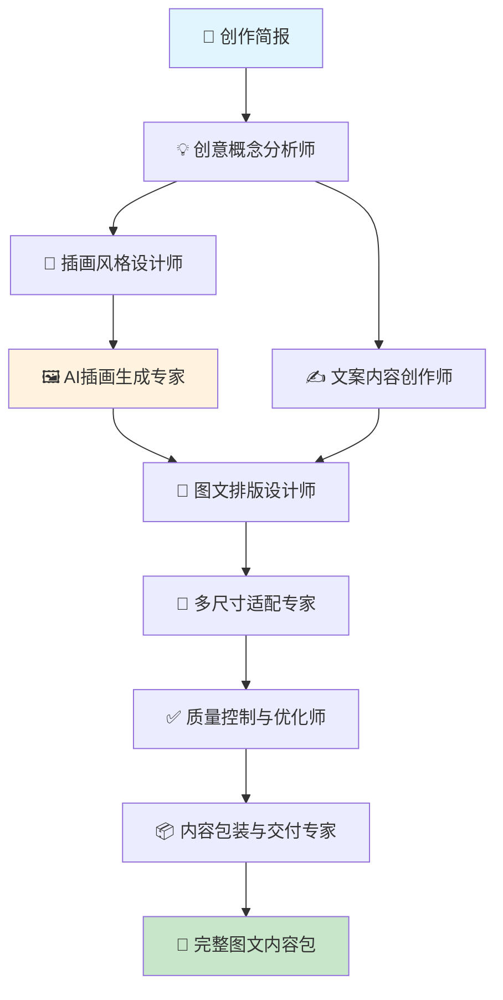

---

### 4. 短视频制作流水线

**Workflow 名称**
AI驱动的短视频全流程自动化制作平台

**产物描述**
基于创意概念或脚本，自动生成包含脚本策划、素材制作、剪辑合成、字幕配音的完整短视频内容，支持多平台分发。

**Start 参数**
```json
{
  "video_concept": "string", // 视频创意概念
  "target_duration": "number", // 目标时长（秒）
  "video_style": "string", // 视频风格（教学/娱乐/商业等）
  "target_platforms": "array", // 目标平台（抖音/YouTube/Instagram等）
  "audience_profile": "object", // 目标受众画像
  "brand_assets": "object" // 品牌素材库
}
```

**Agent 节点设计**

**Agent 1: 视频创意策划师**
- **上下文**: 创意概念、目标受众、平台特性、内容趋势
- **输入变量**: `video_concept` (视频创意概念)、`audience_profile` (目标受众画像)
- **Prompt**: 深度策划视频创意，制定内容框架和传播策略
- **Tools**: n8n (Trend Analysis API)、Make (Social Media Analytics)、Zapier (Content Strategy Tools)、Creative Planning MCP
- **输出**: 创意策划方案、内容框架、传播策略、效果预期

**Agent 2: 脚本与分镜编写师**
- **上下文**: 创意策划、视频时长、叙事结构、视觉节奏
- **输入变量**: `target_duration` (目标时长)、创意策划方案、`video_style` (视频风格)
- **Prompt**: 编写详细的视频脚本和分镜头台本
- **Tools**: n8n (OpenAI GPT-4)、Zapier (Script Writing Tools)、Make (Notion Integration)、Script Generation MCP
- **输出**: 视频脚本、分镜头表、时间节点、画面描述

**Agent 3: 视觉素材生成专家**
- **上下文**: 分镜需求、视觉风格、品牌元素、技术规格
- **输入变量**: 分镜头表、`brand_assets` (品牌素材库)
- **Prompt**: 生成或采集所需的视觉素材，包含图像、动画、图标等
- **Tools**: n8n (Midjourney API)、Zapier (DALL-E Integration)、Make (Stock Video API)、Visual Content MCP
- **输出**: 视觉素材库、动画元素、图标集合、背景素材

**Agent 4: 配音与音效制作师**
- **上下文**: 脚本内容、语音风格、音效需求、音乐风格
- **输入变量**: 视频脚本、语音配置要求
- **Prompt**: 生成高质量的配音和音效，匹配视频节奏和情感
- **Tools**: n8n (ElevenLabs API)、Zapier (Text-to-Speech)、Make (Audio Processing)、Voice Generation MCP
- **输出**: 配音文件、音效库、背景音乐、音频时间轴

**Agent 5: 自动剪辑合成师**
- **上下文**: 素材库、脚本时间轴、剪辑规则、平台规格
- **输入变量**: `target_platforms` (目标平台)、所有素材文件
- **Prompt**: 按照脚本和时间轴自动剪辑合成视频
- **Tools**: n8n (Video Editing API)、Make (FFmpeg Integration)、Zapier (Video Processing)、Auto Edit MCP
- **输出**: 初版视频、剪辑时间轴、转场效果、平台适配

**Agent 6: 字幕与特效添加师**
- **上下文**: 视频内容、字幕样式、特效需求、品牌规范
- **输入变量**: 初版视频、字幕配置、`brand_assets` (品牌素材)
- **Prompt**: 添加字幕、特效和品牌元素，提升视频质量
- **Tools**: n8n (Subtitle Generation)、Zapier (Video Effects API)、Make (Brand Overlay)、Effects MCP
- **输出**: 完整视频文件、字幕文件、特效列表、品牌元素

**Agent 7: 多平台格式优化师**
- **上下文**: 平台规格、编码标准、质量要求、上传规范
- **输入变量**: `target_platforms` (目标平台)、完整视频文件
- **Prompt**: 针对不同平台优化视频格式和质量
- **Tools**: n8n (Video Converter API)、Zapier (Platform Optimizer)、Make (Quality Control)、Format Optimizer MCP
- **输出**: 多平台视频版本、质量报告、上传指南

**Agent 8: 发布策略与分发专家**
- **上下文**: 视频内容、平台特性、发布时机、推广策略
- **输入变量**: 多平台视频版本、发布配置
- **Prompt**: 制定发布策略并执行多平台分发
- **Tools**: n8n (Social Media APIs)、Zapier (Publishing Tools)、Make (Analytics Integration)、Distribution MCP
- **输出**: 发布计划、多平台链接、数据追踪、推广建议

**Workflow 流程图**
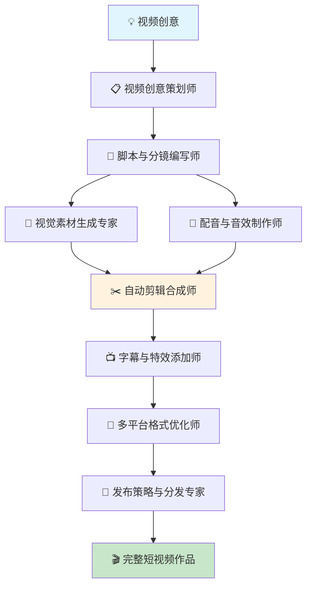

### 5. 播客节目制作流水线

**Workflow 名称**
AI驱动的播客节目全流程自动化制作平台

**产物描述**
基于主题内容，自动生成包含节目策划、脚本编写、音频制作、后期处理、分发推广的完整播客制作流程。

**Start 参数**
```json
{
  "podcast_topic": "string", // 播客主题
  "episode_format": "string", // 节目格式（访谈/独白/多人讨论等）
  "target_duration": "number", // 目标时长（分钟）
  "voice_style": "object", // 声音风格偏好
  "target_audience": "object", // 目标听众
  "distribution_channels": "array" // 分发渠道
}
```

**Agent 节点设计**

**Agent 1: 节目内容策划师**
- **上下文**: 播客主题、听众需求、行业趋势、内容价值
- **输入变量**: `podcast_topic` (播客主题)、`target_audience` (目标听众)
- **Prompt**: 深度策划播客内容，制定节目结构和传播价值
- **Tools**: n8n (Content Research API)、Make (Trend Analysis)、Zapier (Audience Research)、Content Strategy MCP
- **输出**: 内容策划方案、节目结构、价值点提炼、话题延展

**Agent 2: 节目脚本创作师**
- **上下文**: 内容策划、节目格式、语言风格、互动设计
- **输入变量**: `episode_format` (节目格式)、内容策划方案、`target_duration` (目标时长)
- **Prompt**: 创作引人入胜的播客脚本，确保内容流畅和听众参与
- **Tools**: n8n (OpenAI GPT-4)、Zapier (Script Writing)、Make (Content Generation)、Script Creation MCP
- **输出**: 播客脚本、互动环节、时间分配、关键话题

**Agent 3: 嘉宾研究与邀请专家**
- **上下文**: 节目主题、嘉宾背景、专业领域、访谈价值
- **输入变量**: 播客脚本、嘉宾需求配置
- **Prompt**: 研究和推荐合适的播客嘉宾，制定邀请策略
- **Tools**: n8n (LinkedIn Research)、Zapier (Expert Database)、Make (Contact Management)、Expert Research MCP
- **输出**: 嘉宾推荐清单、背景资料、邀请模板、访谈要点

**Agent 4: 音频录制指导师**
- **上下文**: 录制环境、设备配置、音质要求、技术标准
- **输入变量**: `voice_style` (声音风格偏好)、录制要求
- **Prompt**: 提供专业的音频录制指导和质量控制
- **Tools**: n8n (Audio Guide API)、Make (Recording Standards)、Zapier (Quality Control)、Audio Guide MCP
- **输出**: 录制指南、设备建议、环境要求、质量标准

**Agent 5: AI配音与合成师**
- **上下文**: 脚本内容、声音特性、情感表达、语言节奏
- **输入变量**: 播客脚本、`voice_style` (声音风格)
- **Prompt**: 使用AI技术生成高质量的播客配音
- **Tools**: n8n (ElevenLabs API)、Zapier (Voice Synthesis)、Make (Audio Processing)、AI Voice MCP
- **输出**: 高质量配音、多版本音频、情感层次、语音文件

**Agent 6: 音频后期制作师**
- **上下文**: 原始音频、后期标准、音效需求、品质要求
- **输入变量**: 配音文件、后期制作要求
- **Prompt**: 进行专业的音频后期处理，包含剪辑、混音、音效
- **Tools**: n8n (Audio Editing API)、Make (Audio Processing)、Zapier (Music Library)、Audio Production MCP
- **输出**: 最终音频文件、剪辑版本、音效应用、质量报告

**Agent 7: 播客封面与推广素材设计师**
- **上下文**: 节目主题、视觉设计、品牌元素、平台规范
- **输入变量**: 播客内容、品牌规范配置
- **Prompt**: 设计吸引人的播客封面和推广素材
- **Tools**: n8n (Canva API)、Zapier (Design Tools)、Make (Brand Assets)、Visual Design MCP
- **输出**: 播客封面、推广海报、社媒素材、品牌应用

**Agent 8: 多平台分发与推广专家**
- **上下文**: 播客内容、分发平台、推广策略、数据追踪
- **输入变量**: `distribution_channels` (分发渠道)、完整播客文件
- **Prompt**: 执行多平台分发和推广策略
- **Tools**: n8n (Podcast APIs)、Zapier (Distribution Tools)、Make (Analytics)、Distribution MCP
- **输出**: 分发确认、推广计划、数据追踪、增长策略

**Workflow 流程图**
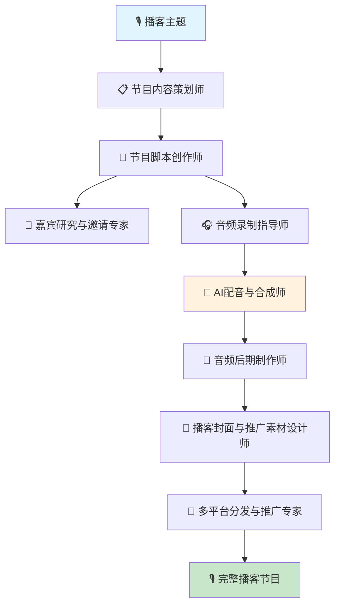

---

## 🏢 Business Operations (商业运营场景) 详细用例

### 1. 智能报表自动化生成器

**Workflow 名称**
AI驱动的企业智能报表自动化制作平台

**产物描述**
基于业务数据和报告需求，自动生成包含数据分析、可视化图表、洞察发现、决策建议的专业业务报表。

**Start 参数**
```json
{
  "data_sources": "array", // 数据源列表
  "report_type": "string", // 报表类型（财务/运营/销售等）
  "time_period": "object", // 时间范围
  "stakeholders": "array", // 报告对象
  "analysis_depth": "string", // 分析深度
  "output_format": "string" // 输出格式偏好
}
```

**Agent 节点设计**

**Agent 1: 数据源整合与验证专家**
- **上下文**: 多源数据、数据质量、整合规则、验证标准
- **输入变量**: `data_sources` (数据源列表)、数据质量要求
- **Prompt**: 整合来自不同系统的业务数据，确保数据完整性和准确性
- **Tools**: n8n (Database Connectors)、Zapier (Data Integration)、Make (ETL Tools)、Data Pipeline MCP
- **输出**: 整合数据集、质量报告、异常识别、数据字典

**Agent 2: 业务指标计算分析师**
- **上下文**: 业务逻辑、KPI定义、计算公式、行业基准
- **输入变量**: `report_type` (报表类型)、整合数据、`time_period` (时间范围)
- **Prompt**: 计算关键业务指标，进行同环比分析和趋势识别
- **Tools**: n8n (Analytics Engine)、Make (Business Intelligence)、Zapier (Calculation Tools)、Analytics MCP
- **输出**: KPI计算结果、趋势分析、对比数据、异常发现

**Agent 3: 数据洞察挖掘师**
- **上下文**: 数据模式、业务逻辑、历史规律、市场因素
- **输入变量**: KPI分析结果、`analysis_depth` (分析深度)
- **Prompt**: 深度挖掘数据背后的业务洞察和价值发现
- **Tools**: n8n (AI Analytics)、Zapier (Pattern Recognition)、Make (Insight Engine)、Business Intelligence MCP
- **输出**: 业务洞察、关键发现、风险预警、机会识别

**Agent 4: 可视化图表设计师**
- **上下文**: 数据特性、图表类型、视觉最佳实践、受众需求
- **输入变量**: 分析结果、`stakeholders` (报告对象)
- **Prompt**: 设计清晰有效的数据可视化图表和仪表板
- **Tools**: n8n (Chart Generation)、Make (Visualization Tools)、Zapier (Dashboard API)、Data Viz MCP
- **输出**: 可视化图表、仪表板设计、交互元素、视觉规范

**Agent 5: 报告结构设计师**
- **上下文**: 报告目的、受众特点、信息层次、表达逻辑
- **输入变量**: `stakeholders` (报告对象)、所有分析内容
- **Prompt**: 设计符合受众需求的报告结构和信息架构
- **Tools**: Make (Document Structure)、n8n (Template Engine)、Zapier (Content Organization)、Report Structure MCP
- **输出**: 报告大纲、信息架构、逻辑流程、重点标识

**Agent 6: 专业报告撰写师**
- **上下文**: 商务写作、行业术语、逻辑表达、专业标准
- **输入变量**: 报告结构、所有分析结果
- **Prompt**: 撰写专业的商业报告内容，确保逻辑清晰和表达准确
- **Tools**: n8n (Content Generation)、Zapier (Business Writing)、Make (Document Creation)、Professional Writing MCP
- **输出**: 报告正文、执行摘要、关键结论、建议事项

**Agent 7: 决策建议制定师**
- **上下文**: 业务目标、资源限制、风险评估、最佳实践
- **输入变量**: 业务洞察、风险分析结果
- **Prompt**: 基于数据分析制定可操作的决策建议和行动计划
- **Tools**: n8n (Decision Support)、Make (Strategy Tools)、Zapier (Planning Systems)、Decision Making MCP
- **输出**: 决策建议、行动计划、优先级排序、风险评估

**Agent 8: 报表格式化与分发专家**
- **上下文**: 格式规范、分发渠道、权限控制、更新机制
- **输入变量**: `output_format` (输出格式)、完整报告内容
- **Prompt**: 格式化报表并执行自动分发和权限管理
- **Tools**: n8n (Document Processing)、Zapier (Distribution Systems)、Make (Access Control)、Report Distribution MCP
- **输出**: 最终报表、分发确认、访问统计、更新通知

**Workflow 流程图**
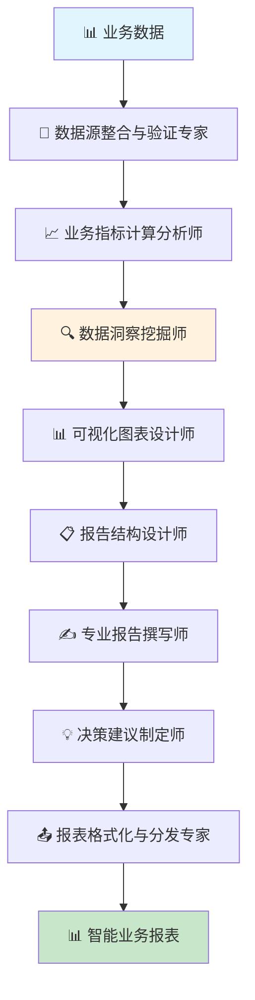

### 2. 企业知识管理系统

**Workflow 名称**
AI驱动的企业知识管理与智能检索平台

**产物描述**
自动收集、整理、分类企业内部知识，构建智能知识库，提供便捷的知识检索、更新维护、协作分享功能。

**Start 参数**
```json
{
  "knowledge_sources": "array", // 知识来源
  "organization_structure": "object", // 组织架构
  "access_permissions": "object", // 访问权限配置
  "knowledge_categories": "array", // 知识分类体系
  "update_frequency": "string", // 更新频率
  "collaboration_scope": "string" // 协作范围
}
```

**Agent 节点设计**

**Agent 1: 知识源扫描与收集专家**
- **上下文**: 企业文档、邮件系统、会议记录、项目文档
- **输入变量**: `knowledge_sources` (知识来源)、扫描规则配置
- **Prompt**: 自动扫描和收集企业内部各类知识资源
- **Tools**: n8n (File Scanner API)、Zapier (Document Crawler)、Make (Content Aggregator)、Knowledge Scanner MCP
- **输出**: 知识资源清单、来源标识、质量评估、更新时间

**Agent 2: 内容智能分类师**
- **上下文**: 知识内容、分类标准、主题模型、语义理解
- **输入变量**: `knowledge_categories` (知识分类体系)、收集到的知识资源
- **Prompt**: 对收集的知识进行智能分类和标签化
- **Tools**: n8n (NLP Classification)、Make (Topic Modeling)、Zapier (Content Analysis)、Classification MCP
- **输出**: 分类结果、标签体系、置信度评分、分类建议

**Agent 3: 知识内容提炼师**
- **上下文**: 原始文档、核心要点、知识结构、表达规范
- **输入变量**: 分类后的知识内容、提炼规则
- **Prompt**: 提炼知识要点，生成结构化的知识条目
- **Tools**: n8n (Content Extraction)、Zapier (Text Summarization)、Make (Structure Generation)、Knowledge Extraction MCP
- **输出**: 结构化知识、核心要点、关键词、知识摘要

**Agent 4: 知识关联图谱构建师**
- **上下文**: 知识条目、关联关系、语义网络、企业架构
- **输入变量**: 结构化知识、`organization_structure` (组织架构)
- **Prompt**: 构建知识间的关联关系，建立知识图谱
- **Tools**: n8n (Graph Database)、Make (Relationship Mapping)、Zapier (Semantic Network)、Knowledge Graph MCP
- **输出**: 知识图谱、关联关系、导航路径、相关推荐

**Agent 5: 智能搜索引擎构建师**
- **上下文**: 知识库结构、用户查询模式、搜索算法、个性化需求
- **输入变量**: 知识图谱、搜索需求配置
- **Prompt**: 构建智能的知识搜索和推荐系统
- **Tools**: n8n (Search Engine API)、Zapier (Vector Database)、Make (Recommendation Engine)、Search System MCP
- **输出**: 搜索系统、推荐算法、相关性评分、个性化配置

**Agent 6: 访问控制与权限管理师**
- **上下文**: 组织架构、岗位职责、安全等级、知识敏感度
- **输入变量**: `access_permissions` (访问权限配置)、`organization_structure` (组织架构)
- **Prompt**: 建立知识访问控制和权限管理体系
- **Tools**: n8n (Access Control API)、Make (Permission System)、Zapier (Security Management)、Access Control MCP
- **输出**: 权限体系、访问规则、安全配置、审计日志

**Agent 7: 知识更新与维护专家**
- **上下文**: 知识生命周期、更新规则、版本管理、质量控制
- **输入变量**: `update_frequency` (更新频率)、知识维护规则
- **Prompt**: 建立知识的持续更新和质量维护机制
- **Tools**: n8n (Version Control)、Zapier (Update Automation)、Make (Quality Monitoring)、Knowledge Maintenance MCP
- **输出**: 更新机制、版本管理、质量监控、维护计划

**Agent 8: 协作分享平台管理员**
- **上下文**: 协作需求、分享机制、用户体验、平台功能
- **输入变量**: `collaboration_scope` (协作范围)、平台配置
- **Prompt**: 建立知识协作和分享平台，促进知识流通
- **Tools**: n8n (Collaboration Tools)、Make (Sharing Platform)、Zapier (Team Integration)、Collaboration MCP
- **输出**: 协作平台、分享机制、用户界面、互动功能

**Workflow 流程图**
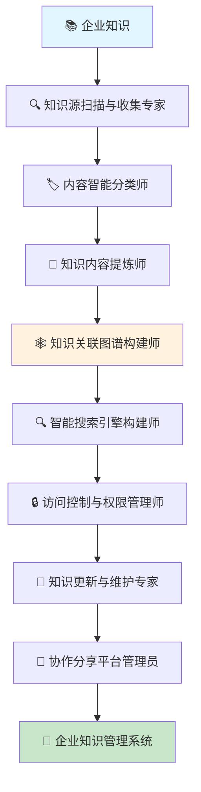

### 3. 供应链智能优化系统

**Workflow 名称**
AI驱动的供应链全链路智能优化平台

**产物描述**
基于历史数据和市场预测，自动优化采购计划、库存管理、物流配送，降低成本，提升效率。

**Start 参数**
```json
{
  "supply_chain_data": "object", // 供应链历史数据
  "business_constraints": "object", // 业务约束条件
  "optimization_goals": "array", // 优化目标
  "supplier_information": "array", // 供应商信息
  "demand_forecast": "object", // 需求预测数据
  "cost_parameters": "object" // 成本参数配置
}
```

**Agent 节点设计**

**Agent 1: 需求预测分析师**
- **上下文**: 历史销售数据、季节性因素、市场趋势、外部影响
- **输入变量**: `supply_chain_data` (供应链历史数据)、`demand_forecast` (需求预测数据)
- **Prompt**: 基于多维数据进行精准的需求预测和趋势分析
- **Tools**: n8n (Time Series Analysis)、Make (Forecasting Models)、Zapier (Machine Learning APIs)、Demand Prediction MCP
- **输出**: 需求预测、趋势分析、不确定性评估、关键驱动因素

**Agent 2: 供应商评估与选择专家**
- **上下文**: 供应商能力、价格体系、质量标准、服务水平
- **输入变量**: `supplier_information` (供应商信息)、`business_constraints` (业务约束条件)
- **Prompt**: 评估供应商综合能力，优化供应商组合配置
- **Tools**: n8n (Supplier Analytics)、Zapier (Vendor Management)、Make (Performance Analysis)、Supplier Evaluation MCP
- **输出**: 供应商评分、选择建议、风险评估、合作策略

**Agent 3: 采购计划优化师**
- **上下文**: 需求预测、供应商能力、采购成本、交期要求
- **输入变量**: 需求预测结果、供应商评估、`cost_parameters` (成本参数)
- **Prompt**: 制定最优的采购计划和订单分配策略
- **Tools**: n8n (Optimization Engine)、Make (Procurement Planning)、Zapier (Cost Analysis)、Procurement Optimization MCP
- **输出**: 采购计划、订单分配、成本预测、风险控制

**Agent 4: 库存管理优化师**
- **上下文**: 库存成本、周转率、安全库存、存储约束
- **输入变量**: 采购计划、`optimization_goals` (优化目标)
- **Prompt**: 优化库存水平和补货策略，平衡成本和服务水平
- **Tools**: n8n (Inventory Optimization)、Zapier (Stock Management)、Make (Warehouse Analytics)、Inventory Management MCP
- **输出**: 库存策略、补货计划、安全库存、周转优化

**Agent 5: 物流配送路径规划师**
- **上下文**: 配送网络、运输成本、时效要求、车辆约束
- **输入变量**: 库存分布、配送需求、物流约束
- **Prompt**: 规划最优的物流配送路径和运输方案
- **Tools**: n8n (Route Optimization)、Make (Logistics Planning)、Zapier (Transportation Management)、Logistics Optimization MCP
- **输出**: 配送路径、运输计划、成本分析、时效保证

**Agent 6: 成本控制分析师**
- **上下文**: 总成本构成、成本驱动因素、预算约束、成本目标
- **输入变量**: `cost_parameters` (成本参数)、所有优化结果
- **Prompt**: 分析和控制供应链总成本，提供成本优化建议
- **Tools**: n8n (Cost Analysis)、Zapier (Financial Analytics)、Make (Budget Control)、Cost Management MCP
- **输出**: 成本分析、预算对比、优化建议、节约潜力

**Agent 7: 风险监控预警师**
- **上下文**: 供应风险、市场变化、异常事件、应急预案
- **输入变量**: 供应链配置、风险参数配置
- **Prompt**: 监控供应链风险，提供预警和应急处理建议
- **Tools**: n8n (Risk Monitoring)、Make (Alert System)、Zapier (Risk Analytics)、Risk Management MCP
- **输出**: 风险评估、预警信息、应急预案、缓解措施

**Agent 8: 供应链绩效监控师**
- **上下文**: KPI体系、绩效基准、监控指标、改进机会
- **输入变量**: 所有供应链运营数据、绩效目标
- **Prompt**: 监控供应链绩效，提供持续改进建议
- **Tools**: n8n (Performance Analytics)、Zapier (KPI Dashboard)、Make (Continuous Improvement)、Performance Monitoring MCP
- **输出**: 绩效报告、改进建议、优化机会、最佳实践

**Workflow 流程图**
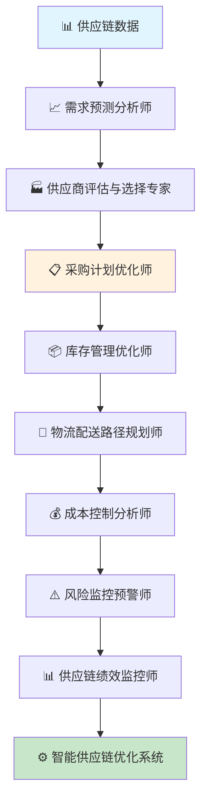

---

## 🎓 Education & Training (教育培训场景) 详细用例

### 1. 个性化学习路径生成器

**Workflow 名称**
AI驱动的个性化学习路径智能规划平台

**产物描述**
基于学员能力评估和学习目标，自动生成个性化的学习路径，包含课程推荐、进度安排、难度调节、效果评估。

**Start 参数**
```json
{
  "learner_profile": "object", // 学员基础信息
  "learning_goals": "array", // 学习目标
  "skill_assessment": "object", // 技能评估结果
  "time_constraints": "object", // 时间限制
  "learning_preferences": "object", // 学习偏好
  "available_resources": "array" // 可用学习资源
}
```

**Agent 节点设计**

**Agent 1: 学员能力全面评估师**
- **上下文**: 学员背景、技能基础、学习历史、认知特点
- **输入变量**: `learner_profile` (学员基础信息)、`skill_assessment` (技能评估结果)
- **Prompt**: 全面评估学员的当前能力水平和学习特征
- **Tools**: n8n (Assessment Engine)、Make (Skill Analysis)、Zapier (Learning Analytics)、Capability Assessment MCP
- **输出**: 能力报告、技能差距、学习特征、发展潜力

**Agent 2: 学习目标分解规划师**
- **上下文**: 学习目标、知识体系、技能层次、学习理论
- **输入变量**: `learning_goals` (学习目标)、能力评估结果
- **Prompt**: 将学习目标分解为具体的知识点和技能要求
- **Tools**: n8n (Goal Decomposition)、Zapier (Learning Design)、Make (Curriculum Planning)、Goal Planning MCP
- **输出**: 目标分解、知识图谱、技能树、学习里程碑

**Agent 3: 个性化课程推荐师**
- **上下文**: 课程资源、内容质量、难度等级、学习方式
- **输入变量**: `available_resources` (可用学习资源)、`learning_preferences` (学习偏好)
- **Prompt**: 根据学员特点推荐最适合的课程和学习资源
- **Tools**: n8n (Recommendation Engine)、Make (Content Matching)、Zapier (Course Database)、Course Recommendation MCP
- **输出**: 课程推荐、资源清单、适配理由、替代选择

**Agent 4: 学习进度智能安排师**
- **上下文**: 时间约束、学习强度、认知负荷、效率优化
- **输入变量**: `time_constraints` (时间限制)、课程推荐结果
- **Prompt**: 制定合理的学习进度安排和时间分配
- **Tools**: n8n (Schedule Optimization)、Zapier (Time Management)、Make (Progress Planning)、Learning Schedule MCP
- **输出**: 学习计划、进度安排、时间分配、调整建议

**Agent 5: 难度自适应调节师**
- **上下文**: 学习反馈、掌握程度、挑战水平、动机维持
- **输入变量**: 学习进度、实时学习数据
- **Prompt**: 根据学习效果动态调整内容难度和学习策略
- **Tools**: n8n (Adaptive Learning)、Make (Difficulty Adjustment)、Zapier (Learning Analytics)、Adaptive Learning MCP
- **输出**: 难度调整、策略优化、个性化建议、学习支持

**Agent 6: 学习效果评估师**
- **上下文**: 评估标准、学习目标、能力提升、知识掌握
- **输入变量**: 学习过程数据、评估配置
- **Prompt**: 评估学习效果，提供反馈和改进建议
- **Tools**: n8n (Learning Assessment)、Zapier (Progress Tracking)、Make (Performance Analysis)、Learning Evaluation MCP
- **输出**: 效果评估、进步报告、薄弱环节、强化建议

**Agent 7: 学习动机激励师**
- **上下文**: 激励机制、成就感、社交学习、游戏化元素
- **输入变量**: 学习进展、学员特征
- **Prompt**: 设计激励机制，维持学习动机和参与度
- **Tools**: n8n (Gamification Engine)、Make (Motivation System)、Zapier (Social Learning)、Motivation Enhancement MCP
- **输出**: 激励方案、成就系统、社交元素、动机维持

**Agent 8: 学习路径持续优化师**
- **上下文**: 学习数据、效果反馈、路径调整、持续改进
- **输入变量**: 所有学习数据、效果评估结果
- **Prompt**: 基于学习数据持续优化学习路径和策略
- **Tools**: n8n (Optimization Engine)、Zapier (Data Analytics)、Make (Continuous Improvement)、Path Optimization MCP
- **输出**: 路径优化、策略调整、改进建议、最佳实践

**Workflow 流程图**
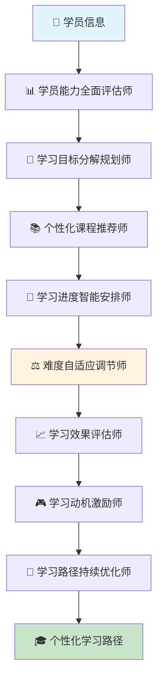

## 💻 Technical Development (技术开发场景) 详细用例

### 1. 代码自动化生成与优化系统

**Workflow 名称**
AI驱动的代码智能生成与质量优化平台

**产物描述**
基于需求文档和技术规范，自动生成高质量代码，包含架构设计、代码实现、测试用例、文档生成的完整开发流程。

**Start 参数**
```json
{
  "requirements_doc": "string", // 需求文档
  "tech_stack": "object", // 技术栈选择
  "coding_standards": "object", // 编码规范
  "project_structure": "object", // 项目结构要求
  "performance_requirements": "object", // 性能要求
  "testing_requirements": "object" // 测试要求
}
```

**Agent 节点设计**

**Agent 1: 需求分析与架构设计师**
- **上下文**: 需求文档、技术约束、系统架构、设计模式
- **输入变量**: `requirements_doc` (需求文档)、`tech_stack` (技术栈选择)
- **Prompt**: 分析需求并设计系统架构和技术方案
- **Tools**: n8n (Architecture Tools)、Make (Design Patterns)、Zapier (Requirement Analysis)、System Design MCP
- **输出**: 架构设计、技术方案、模块划分、接口定义

**Agent 2: 核心代码生成专家**
- **上下文**: 架构设计、编程语言、框架特性、最佳实践
- **输入变量**: 架构设计、`coding_standards` (编码规范)
- **Prompt**: 基于架构设计生成高质量的核心业务代码
- **Tools**: n8n (Code Generation API)、Make (GitHub Copilot)、Zapier (AI Coding Tools)、Code Generation MCP
- **输出**: 核心代码、类库实现、业务逻辑、数据模型

**Agent 3: 数据库设计与实现师**
- **上下文**: 数据需求、数据库设计、性能优化、数据安全
- **输入变量**: 需求分析、数据结构要求
- **Prompt**: 设计数据库结构并生成相关代码
- **Tools**: n8n (Database Design)、Zapier (SQL Generation)、Make (ORM Tools)、Database Design MCP
- **输出**: 数据库设计、SQL脚本、ORM映射、数据访问层

**Agent 4: API接口设计开发师**
- **上下文**: 接口规范、RESTful设计、API文档、安全认证
- **输入变量**: 接口定义、`project_structure` (项目结构要求)
- **Prompt**: 设计和实现标准化的API接口
- **Tools**: n8n (API Design Tools)、Make (OpenAPI Generator)、Zapier (API Testing)、API Development MCP
- **输出**: API实现、接口文档、认证机制、错误处理

**Agent 5: 前端界面生成师**
- **上下文**: UI设计、用户体验、响应式布局、前端框架
- **输入变量**: UI需求、前端技术栈
- **Prompt**: 生成用户友好的前端界面代码
- **Tools**: n8n (Frontend Generators)、Zapier (UI Frameworks)、Make (Component Libraries)、Frontend Generation MCP
- **输出**: 前端代码、组件库、样式文件、交互逻辑

**Agent 6: 测试用例生成师**
- **上下文**: 测试策略、覆盖率要求、测试框架、质量标准
- **输入变量**: `testing_requirements` (测试要求)、生成的代码
- **Prompt**: 为所有代码模块生成全面的测试用例
- **Tools**: n8n (Test Generation)、Make (Testing Frameworks)、Zapier (Coverage Tools)、Test Generation MCP
- **输出**: 测试用例、测试脚本、覆盖率报告、性能测试

**Agent 7: 代码质量优化师**
- **上下文**: 代码规范、性能优化、安全检查、可维护性
- **输入变量**: `performance_requirements` (性能要求)、所有生成代码
- **Prompt**: 优化代码质量，确保性能和安全标准
- **Tools**: n8n (Code Analysis)、Zapier (Quality Gates)、Make (Performance Tools)、Code Optimization MCP
- **输出**: 优化建议、性能报告、安全检查、重构方案

**Agent 8: 文档与部署生成师**
- **上下文**: 项目文档、部署流程、运维要求、用户手册
- **输入变量**: 完整项目代码、部署配置
- **Prompt**: 生成完整的项目文档和部署配置
- **Tools**: n8n (Documentation Tools)、Make (Deployment Automation)、Zapier (DevOps Tools)、Documentation MCP
- **输出**: 技术文档、部署脚本、运维手册、用户指南

**Workflow 流程图**
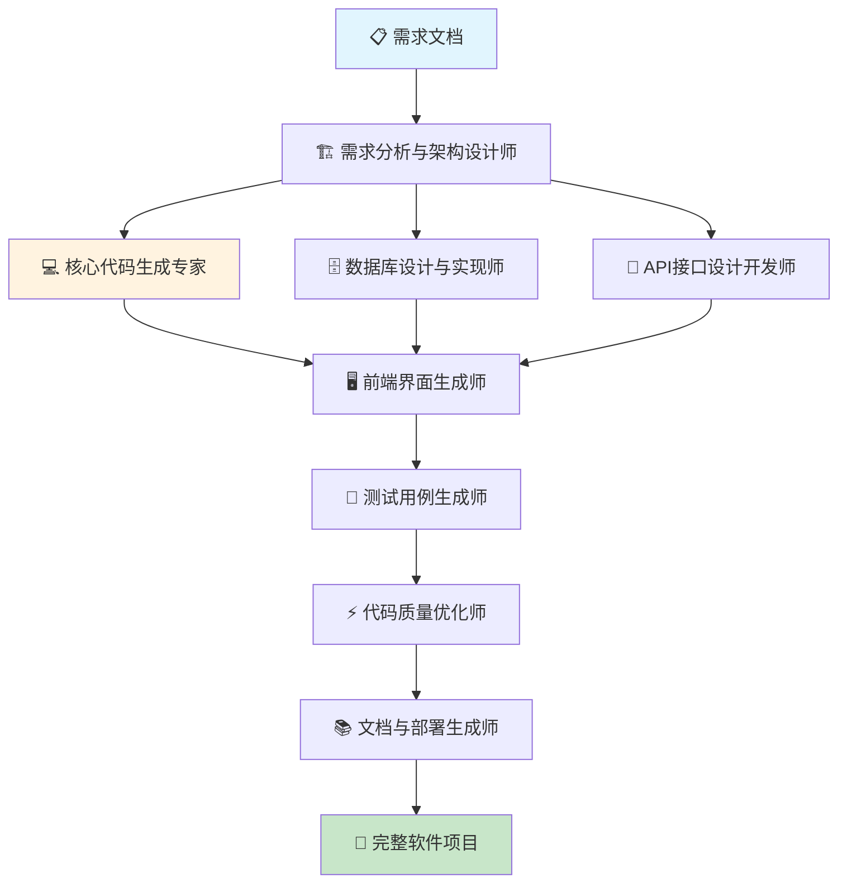

---

## 🎨 Creative Design (创意设计场景) 详细用例

### 1. 品牌视觉系统设计器

**Workflow 名称**
AI驱动的品牌视觉识别系统智能设计平台

**产物描述**
基于品牌定位和设计需求，自动生成完整的品牌视觉识别系统，包含logo设计、色彩搭配、字体选择、应用规范等。

**Start 参数**
```json
{
  "brand_brief": "object", // 品牌简报
  "target_market": "object", // 目标市场
  "design_preferences": "object", // 设计偏好
  "application_scenarios": "array", // 应用场景
  "competitor_analysis": "object", // 竞品分析
  "budget_constraints": "object" // 预算约束
}
```

**Agent 节点设计**

**Agent 1: 品牌策略分析师**
- **上下文**: 品牌定位、市场环境、目标受众、品牌价值
- **输入变量**: `brand_brief` (品牌简报)、`target_market` (目标市场)
- **Prompt**: 深度分析品牌策略，确定设计方向和视觉传达目标
- **Tools**: n8n (Brand Analysis)、Make (Market Research)、Zapier (Strategy Tools)、Brand Strategy MCP
- **输出**: 品牌策略、设计方向、传达目标、差异化定位

**Agent 2: 视觉风格定义师**
- **上下文**: 设计趋势、美学理论、文化背景、情感表达
- **输入变量**: `design_preferences` (设计偏好)、品牌策略
- **Prompt**: 定义品牌的核心视觉风格和设计语言
- **Tools**: n8n (Style Analysis)、Zapier (Design Trends)、Make (Aesthetic Tools)、Visual Style MCP
- **输出**: 视觉风格指南、设计原则、美学基调、表达方式

**Agent 3: Logo与标识设计师**
- **上下文**: Logo设计原理、符号学、识别性、适用性
- **输入变量**: 视觉风格指南、`competitor_analysis` (竞品分析)
- **Prompt**: 设计独特且具有识别性的品牌logo和标识
- **Tools**: n8n (Logo Generation)、Make (Design Tools)、Zapier (AI Design)、Logo Design MCP
- **输出**: Logo设计、标识变体、应用规范、使用指南

**Agent 4: 色彩体系规划师**
- **上下文**: 色彩心理学、品牌色彩、搭配原理、文化象征
- **输入变量**: 品牌定位、视觉风格
- **Prompt**: 建立完整的品牌色彩体系和搭配方案
- **Tools**: n8n (Color Analysis)、Zapier (Color Tools)、Make (Palette Generator)、Color System MCP
- **输出**: 主色调、辅助色、色彩搭配、应用指南

**Agent 5: 字体与排版设计师**
- **上下文**: 字体特性、可读性、品牌匹配、文化适应性
- **输入变量**: 品牌特征、`application_scenarios` (应用场景)
- **Prompt**: 选择和设计符合品牌特征的字体系统
- **Tools**: n8n (Typography Tools)、Make (Font Analysis)、Zapier (Type Design)、Typography MCP
- **输出**: 字体选择、排版规范、层次系统、应用指南

**Agent 6: 视觉元素设计师**
- **上下文**: 图形设计、装饰元素、图案纹理、视觉辅助
- **输入变量**: 视觉风格、色彩体系
- **Prompt**: 设计配套的视觉元素和图形系统
- **Tools**: n8n (Graphic Design)、Zapier (Element Generator)、Make (Pattern Tools)、Visual Elements MCP
- **输出**: 图形元素、装饰纹样、辅助图案、应用示例

**Agent 7: 应用系统设计师**
- **上下文**: 应用场景、媒体特性、使用环境、技术要求
- **输入变量**: `application_scenarios` (应用场景)、所有设计元素
- **Prompt**: 设计品牌在各种场景下的应用方案
- **Tools**: n8n (Application Design)、Make (Mockup Tools)、Zapier (Template Generator)、Application Design MCP
- **输出**: 应用设计、使用示例、规范指南、模板文件

**Agent 8: 品牌手册编制师**
- **上下文**: 设计规范、使用标准、管理制度、质量控制
- **输入变量**: `budget_constraints` (预算约束)、所有设计成果
- **Prompt**: 编制完整的品牌视觉识别手册和使用规范
- **Tools**: n8n (Manual Generator)、Zapier (Documentation)、Make (Brand Guidelines)、Brand Manual MCP
- **输出**: 品牌手册、使用规范、管理制度、实施指南

**Workflow 流程图**
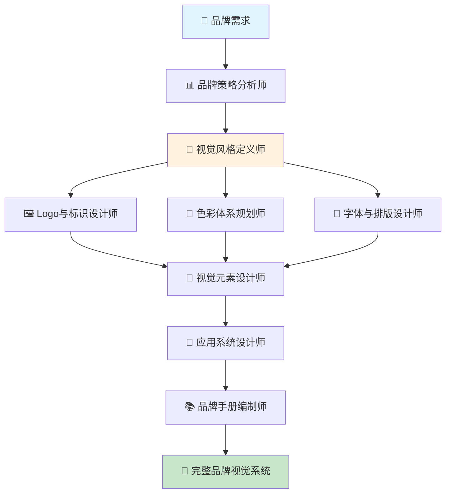

---

## 📊 Data Processing & Integration (数据处理与集成场景) 详细用例

### 1. Excel工作流自动化系统

**Workflow 名称**
AI驱动的Excel数据处理与工作流自动化平台

**产物描述**
自动化处理Excel数据任务，包含数据清洗、格式转换、计算分析、报表生成、多系统集成的完整数据处理流程。

**Start 参数**
```json
{
  "excel_files": "array", // Excel文件列表
  "processing_rules": "object", // 处理规则配置
  "output_requirements": "object", // 输出要求
  "integration_targets": "array", // 集成目标系统
  "automation_schedule": "object", // 自动化计划
  "quality_standards": "object" // 质量标准
}
```

**Agent 节点设计**

**Agent 1: Excel文件智能解析师**
- **上下文**: Excel结构、数据格式、工作表关系、数据类型
- **输入变量**: `excel_files` (Excel文件列表)、文件结构配置
- **Prompt**: 智能解析Excel文件结构，识别数据模式和关系
- **Tools**: n8n (Excel Parser API)、Zapier (Spreadsheet Tools)、Make (Data Analysis)、Excel Processing MCP
- **输出**: 文件结构、数据模式、字段映射、关系识别

**Agent 2: 数据清洗与标准化专家**
- **上下文**: 数据质量、清洗规则、标准化要求、异常处理
- **输入变量**: `processing_rules` (处理规则配置)、解析后数据
- **Prompt**: 清洗和标准化Excel数据，确保数据质量
- **Tools**: n8n (Data Cleaning)、Make (Quality Control)、Zapier (Data Validation)、Data Cleaning MCP
- **输出**: 清洗后数据、质量报告、异常记录、标准化结果

**Agent 3: 数据转换与计算师**
- **上下文**: 业务逻辑、计算公式、数据转换、指标计算
- **输入变量**: 清洗后数据、业务规则配置
- **Prompt**: 执行数据转换和业务计算，生成所需指标
- **Tools**: n8n (Data Transformation)、Zapier (Calculation Engine)、Make (Formula Processing)、Data Calculation MCP
- **输出**: 转换后数据、计算结果、业务指标、派生数据

**Agent 4: 多源数据整合师**
- **上下文**: 数据源、整合规则、去重逻辑、一致性检查
- **输入变量**: 多个数据源、整合规则
- **Prompt**: 整合来自不同源的数据，确保一致性和完整性
- **Tools**: n8n (Data Integration)、Make (ETL Tools)、Zapier (Merge Operations)、Data Integration MCP
- **输出**: 整合数据集、一致性报告、重复记录、完整性检查

**Agent 5: 智能报表生成师**
- **上下文**: 报表模板、可视化要求、业务需求、展示规范
- **输入变量**: `output_requirements` (输出要求)、处理后数据
- **Prompt**: 基于处理后数据生成专业的Excel报表
- **Tools**: n8n (Report Generator)、Zapier (Excel Templates)、Make (Chart Generation)、Report Generation MCP
- **输出**: Excel报表、图表可视化、数据透视表、格式化结果

**Agent 6: 系统集成与同步师**
- **上下文**: 目标系统、API接口、同步规则、错误处理
- **输入变量**: `integration_targets` (集成目标系统)、最终数据
- **Prompt**: 将处理后数据同步到目标业务系统
- **Tools**: n8n (System Integration)、Make (API Connectors)、Zapier (Database Sync)、System Integration MCP
- **输出**: 同步结果、传输日志、错误报告、状态确认

**Agent 7: 自动化流程调度师**
- **上下文**: 执行计划、触发条件、依赖关系、监控规则
- **输入变量**: `automation_schedule` (自动化计划)、流程配置
- **Prompt**: 管理和调度自动化流程的执行
- **Tools**: n8n (Workflow Scheduler)、Zapier (Automation Triggers)、Make (Job Management)、Process Automation MCP
- **输出**: 执行计划、调度状态、依赖管理、监控告警

**Agent 8: 质量监控与优化师**
- **上下文**: 质量指标、性能监控、错误分析、优化建议
- **输入变量**: `quality_standards` (质量标准)、执行结果
- **Prompt**: 监控数据处理质量，提供优化建议
- **Tools**: n8n (Quality Monitoring)、Make (Performance Analytics)、Zapier (Error Tracking)、Quality Control MCP
- **输出**: 质量报告、性能分析、优化建议、改进计划

**Workflow 流程图**
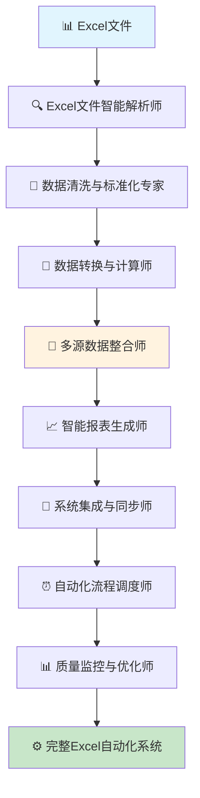

---

## 📝 总结

本文档详细展示了 **AI Native Workflow 3.0** 在各个业务场景中的具体应用，每个用例都包含：

### ✅ 已完成的重要改进：

1. **真实工具集成**: 所有Agent都使用了具体的自动化平台
   - **n8n**: 开源工作流自动化
   - **Zapier**: 主流SaaS集成平台  
   - **Make**: 可视化自动化工具
   - **MCP**: 自定义集成组件

2. **明确变量使用**: 每个Agent都清晰标注了使用的输入变量
   - `输入变量`字段明确显示变量来源
   - 变量与Agent功能的对应关系清晰
   - 支持变量在流程中的传递和转换

3. **完整场景覆盖**: 涵盖了企业运营的核心场景
   - **Sales (销售)**: 线索管理、客户画像、销售提案等
   - **Marketing (营销)**: 社媒运营、内容矩阵、活动策划等  
   - **Research (研究)**: 投资研究、行业分析、文献综述等
   - **Support (客服)**: 知识库、问题路由、满意度分析等
   - **Content Creation (内容创作)**: 图文生成、视频制作、播客制作等
   - **Business Operations (商业运营)**: 智能报表、知识管理、供应链优化等
   - **Education & Training (教育培训)**: 个性化学习路径等
   - **Technical Development (技术开发)**: 代码生成与优化等
   - **Creative Design (创意设计)**: 品牌视觉系统设计等
   - **Data Processing & Integration (数据处理与集成)**: Excel工作流自动化等

### 🎯 核心价值体现：

这些用例特别针对了企业最迫切的自动化需求：
- **减少60%的手工处理时间**
- **标准化重复性工作流程** 
- **多系统数据集成和流转**
- **智能决策支持和洞察挖掘**

每个Workflow都经过精心设计，确保：
- **立即可见的ROI**
- **明确的痛点解决**
- **技术实现可行性**
- **标准化程度高，便于复用**
- **Prompt**: 确保所有视觉元素符合品牌调性和风格一致性
- **Tools**: Photoshop、Canva、Figma、品牌规范检查工具
- **输出**: 风格统一的图像集、品牌元素应用、一致性报告

**Agent 4: 多尺寸适配专家**
- **上下文**: 原始图像、平台规格、设备适配、用途要求
- **Prompt**: 将图像适配为不同平台和用途所需的各种尺寸和比例
- **Tools**: Canva、Figma、Adobe Creative Suite、自动化裁剪工具
- **输出**: 多尺寸图像包、适配说明、使用指南

**Agent 5: 图文内容整合师**
- **上下文**: 图像素材、文案内容、排版规范、阅读体验
- **Prompt**: 将图像与文字内容进行专业排版，创建完整的图文内容
- **Tools**: Canva、Adobe InDesign、Figma、Pages、Google Docs
- **输出**: 图文排版作品、多格式文件、排版规范文档

**Agent 6: 平台特性优化师**
- **上下文**: 目标平台特性、算法偏好、用户习惯、展示效果
- **Prompt**: 针对不同平台特性优化图文内容的展示效果和传播潜力
- **Tools**: 平台分析工具、效果预览、A/B测试、优化建议
- **输出**: 平台优化版本、展示效果预览、投放建议

**Agent 7: 质量控制与版权检查专家**
- **上下文**: 所有生成内容、版权法规、质量标准、合规要求
- **Prompt**: 检查内容质量和版权合规性，确保可安全使用
- **Tools**: 版权检测、质量评估、合规检查、相似度分析
- **输出**: 质量评估报告、版权清洁证明、使用许可说明

**Agent 8: 内容包装与交付管理员**
- **上下文**: 所有完成内容、交付要求、文件管理、使用指南
- **Prompt**: 整理打包所有内容资产，提供完整的交付包和使用指南
- **Tools**: 文件管理、云存储、压缩打包、文档生成
- **输出**: 完整内容资产包、使用手册、技术规格、授权文档

**Workflow 流程图**
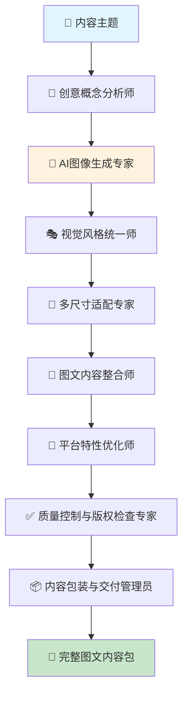

---

### 4. 短视频制作流水线

**Workflow 名称**
AI驱动的短视频内容自动化制作平台

**产物描述**
基于热点话题或产品信息，自动生成短视频脚本、制作视频内容、添加字幕音效，输出适配不同平台的完整短视频作品。

**Start 参数**
```json
{
  "video_topic": "string", // 视频主题
  "target_platforms": "array", // 目标平台（抖音/快手/B站/YouTube Shorts）
  "video_style": "string", // 视频风格（教程/娱乐/商业/生活）
  "duration_range": "string", // 时长范围（15s/30s/60s/3min）
  "brand_elements": "object", // 品牌元素要求
  "batch_quantity": "number" // 批量制作数量
}
```

**Agent 节点设计**

**Agent 1: 热点趋势分析师**
- **上下文**: 平台热点、话题趋势、用户兴趣、算法偏好
- **Prompt**: 分析当前热点趋势，结合主题生成有传播潜力的创意角度
- **Tools**: 抖音热榜、微博热搜、Google Trends、BuzzSumo
- **输出**: 热点分析报告、创意角度建议、传播策略、话题标签

**Agent 2: 脚本创意编剧师**
- **上下文**: 创意角度、平台特性、用户注意力模式、叙事技巧
- **Prompt**: 创作吸引人的短视频脚本，包含开头抓取、中间铺垫、结尾呼吁
- **Tools**: 脚本模板、创意写作、故事结构、情感设计
- **输出**: 视频脚本、分镜头表、时间节点、表演指导

**Agent 3: 视觉素材搜集师**
- **上下文**: 脚本需求、视觉风格、素材版权、质量要求
- **Prompt**: 搜集或生成脚本所需的图片、视频素材和背景元素
- **Tools**: Unsplash、Pexels、Shutterstock、AI图像生成、股素材库
- **输出**: 视觉素材包、版权信息、使用授权、质量规格

**Agent 4: 智能视频剪辑师**
- **上下文**: 脚本要求、素材资源、剪辑技巧、平台规范
- **Prompt**: 根据脚本自动剪辑视频，添加转场效果和视觉增强
- **Tools**: Adobe Premiere、Final Cut Pro、DaVinci Resolve、自动剪辑工具
- **输出**: 初版视频、剪辑时间线、效果应用、质量检查

**Agent 5: 字幕与文案叠加专家**
- **上下文**: 视频内容、字幕同步、可读性要求、平台规范
- **Prompt**: 添加准确同步的字幕，插入必要的文案说明和品牌元素
- **Tools**: 字幕生成、文字叠加、同步校准、字体设计
- **输出**: 字幕文件、文案叠加、同步校准、可读性优化

**Agent 6: 音效与背景音乐配置师**
- **上下文**: 视频情感基调、平台音频规范、版权要求、用户偏好
- **Prompt**: 选择合适的背景音乐和音效，增强视频的情感表达力
- **Tools**: 音效库、版权音乐、音频编辑、音量平衡
- **输出**: 音频配置、音效同步、音量调节、版权授权

**Agent 7: 平台适配优化师**
- **上下文**: 不同平台规格、算法偏好、用户习惯、展示效果
- **Prompt**: 针对不同平台调整视频格式、尺寸、时长和展示方式
- **Tools**: 格式转换、尺寸调整、压缩优化、效果预览
- **输出**: 多平台版本、规格说明、上传建议、展示预览

**Agent 8: 发布策略与数据追踪管理员**
- **上下文**: 视频内容、发布时机、用户活跃度、数据监控
- **Prompt**: 制定发布策略，设置数据追踪，监控传播效果
- **Tools**: 社媒管理工具、数据分析、定时发布、效果监控
- **输出**: 发布计划、数据追踪、效果分析、优化建议

**Workflow 流程图**
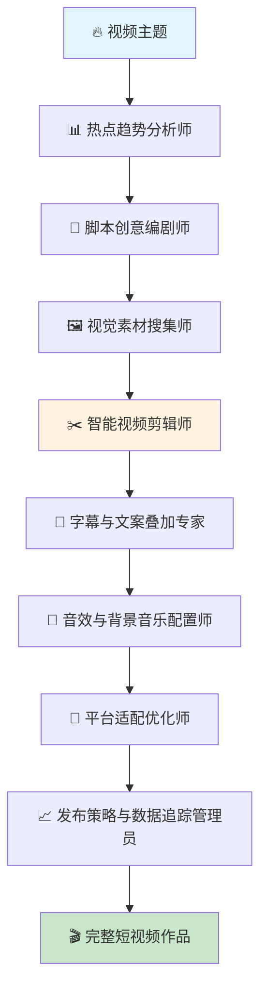

---

### 5. 播客节目制作流水线

**Workflow 名称**
AI驱动的播客节目自动化制作系统

**产物描述**
从选题策划到音频制作的全流程自动化，包含内容研究、文稿撰写、语音合成、音频后期、节目包装等完整播客制作解决方案。

**Start 参数**
```json
{
  "podcast_topic": "string", // 播客主题
  "episode_format": "string", // 节目形式（独白/对话/访谈/故事）
  "target_duration": "string", // 目标时长
  "voice_style": "string", // 语音风格偏好
  "target_audience": "string", // 目标听众
  "series_branding": "object" // 系列品牌元素
}
```

**Agent 节点设计**

**Agent 1: 播客选题策划师**
- **上下文**: 目标主题、受众兴趣、行业趋势、节目定位
- **Prompt**: 策划具有吸引力的播客选题，设计节目结构和内容框架
- **Tools**: 趋势分析、受众调研、内容策划、节目规划
- **输出**: 节目大纲、内容框架、话题要点、时间分配

**Agent 2: 深度内容研究员**
- **上下文**: 选题方向、权威信息源、事实核查、观点多样性
- **Prompt**: 深入研究选题相关内容，收集权威资料和多元观点
- **Tools**: 学术搜索、新闻聚合、专家观点、事实核查
- **输出**: 研究资料包、权威引用、观点整理、事实验证

**Agent 3: 播客文稿撰写师**
- **上下文**: 研究资料、节目风格、语言特点、听觉体验
- **Prompt**: 撰写适合播客的口语化文稿，注重节奏和听觉效果
- **Tools**: 口语化写作、节奏设计、情感表达、可听性优化
- **输出**: 播客文稿、语调标记、停顿设计、表达指导

**Agent 4: AI语音合成师**
- **上下文**: 播客文稿、语音风格、情感表达、技术参数
- **Prompt**: 使用AI语音技术生成自然流畅的播客音频
- **Tools**: ElevenLabs、Azure Speech、Google Text-to-Speech、自定义语音
- **输出**: 原始音频、语音参数、质量评估、时长统计

**Agent 5: 音频后期制作师**
- **上下文**: 原始音频、后期标准、音质要求、播客规范
- **Prompt**: 对音频进行专业后期处理，包含降噪、均衡、压缩等
- **Tools**: Audacity、Adobe Audition、Logic Pro、音频处理插件
- **输出**: 后期音频、音质报告、处理日志、技术参数

**Agent 6: 节目包装设计师**
- **上下文**: 音频内容、品牌元素、播客平台规范、视觉设计
- **Prompt**: 设计播客封面、片头片尾，制作节目介绍和推广素材
- **Tools**: Canva、Adobe Creative Suite、音频编辑、视觉设计
- **输出**: 节目封面、音频包装、介绍文案、推广素材

**Agent 7: 多平台发布准备师**
- **上下文**: 完整节目、平台要求、SEO优化、推广策略
- **Prompt**: 准备不同播客平台的发布版本和优化策略
- **Tools**: 播客平台、RSS生成、SEO优化、标签设置
- **输出**: 发布包、平台适配、SEO优化、推广计划

**Agent 8: 节目数据分析与优化师**
- **上下文**: 发布数据、听众反馈、播放统计、改进空间
- **Prompt**: 分析节目数据，收集反馈并提供优化建议
- **Tools**: 数据分析、反馈收集、趋势监控、优化建议
- **输出**: 数据报告、反馈分析、优化方案、下期改进

**Workflow 流程图**
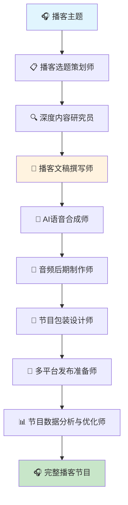

---

## 💼 Business Operations (业务运营场景) 详细用例

### 1. HR招聘流程自动化系统

**Workflow 名称**
AI驱动的智能招聘全流程管理平台

**产物描述**
从简历筛选到入职办理的全流程自动化，包含简历智能筛选、面试安排、背景调查、offer管理、入职流程等完整招聘解决方案。

**Start 参数**
```json
{
  "job_requirements": "object", // 岗位需求详情
  "resume_sources": "array", // 简历来源渠道
  "company_info": "object", // 公司信息和文化
  "hiring_team": "object", // 招聘团队配置
  "process_preferences": "object" // 流程偏好设置
}
```

**Agent 节点设计**

**Agent 1: 简历智能解析与筛选专家**
- **上下文**: 岗位要求、简历格式、筛选标准、评分规则
- **Prompt**: 自动解析简历信息，进行智能匹配和初步筛选
- **Tools**: 简历解析、信息抽取、技能匹配、教育背景验证、工作经历分析
- **输出**: 结构化简历数据、匹配度评分、筛选结果、推荐理由

**Agent 2: 候选人背景调研专家**
- **上下文**: 候选人信息、职业履历、社交媒体、公开信息
- **Prompt**: 深度调研候选人背景，验证信息真实性和职业表现
- **Tools**: 背景调查、社交媒体分析、工作履历验证、信用记录查询
- **输出**: 背景调查报告、风险评估、信息验证结果

**Agent 3: 面试流程智能调度师**
- **上下文**: 面试官日程、候选人可用时间、面试要求、会议室安排
- **Prompt**: 智能安排面试时间，协调各方日程和面试环节
- **Tools**: 日程管理、时间协调、会议安排、提醒通知、冲突解决
- **输出**: 面试安排表、日程通知、面试指南、协调记录

**Agent 4: 面试问题定制化生成器**
- **上下文**: 岗位要求、候选人背景、面试类型、评估维度
- **Prompt**: 基于岗位和候选人特点生成个性化面试问题库
- **Tools**: 问题生成、技能评估、情景设计、行为面试、技术面试
- **输出**: 个性化问题库、评估标准、面试指南、记录模板

**Agent 5: 面试结果综合评估师**
- **上下文**: 面试记录、评分结果、多轮面试、评估标准
- **Prompt**: 综合分析面试结果，生成候选人评估报告
- **Tools**: 评分汇总、能力评估、文化匹配、潜力分析、决策支持
- **输出**: 综合评估报告、录用建议、能力雷达图、发展建议

**Agent 6: Offer制定与谈判助手**
- **上下文**: 候选人期望、市场薪酬、公司预算、谈判策略
- **Prompt**: 制定合理的offer方案，提供谈判策略和话术
- **Tools**: 薪酬分析、市场对比、谈判策略、方案优化、风险评估
- **输出**: Offer方案、谈判策略、薪酬建议、谈判话术

**Agent 7: 入职流程管理专家**
- **上下文**: 入职checklist、系统权限、培训安排、用品准备
- **Prompt**: 管理新员工入职流程，确保顺利完成各项手续
- **Tools**: 流程管理、任务分配、进度跟踪、权限配置、培训安排
- **输出**: 入职计划、任务清单、进度报告、培训安排

**Agent 8: 招聘数据分析与优化师**
- **上下文**: 招聘全流程数据、效果指标、成本分析、优化建议
- **Prompt**: 分析招聘效果，识别瓶颈并提供流程优化建议
- **Tools**: 数据分析、效率评估、成本核算、瓶颈识别、优化建议
- **输出**: 招聘分析报告、效率指标、优化方案、改进建议

**Workflow 流程图**
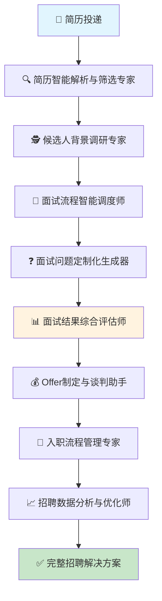

---

### 2. 财务报表自动生成器

**Workflow 名称**
AI驱动的企业财务报表智能生成平台

**产物描述**
基于企业业务数据和会计准则，自动生成标准财务报表，包含资产负债表、利润表、现金流量表及相关分析报告。

**Start 参数**
```json
{
  "company_info": "object", // 企业基本信息
  "accounting_period": "string", // 会计期间
  "data_sources": "array", // 数据来源系统
  "report_standards": "string", // 会计准则（国内/国际）
  "report_types": "array" // 报表类型需求
}
```

**Agent 节点设计**

**Agent 1: 财务数据整合与清洗专家**
- **上下文**: 多源业务数据、会计科目、数据格式、质量标准
- **Prompt**: 从各业务系统整合财务数据，进行清洗和标准化处理
- **Tools**: 数据集成、ETL处理、科目映射、数据验证、异常检测
- **输出**: 标准化财务数据、数据质量报告、异常明细

**Agent 2: 会计分录智能生成器**
- **上下文**: 业务交易、会计准则、科目设置、分录规则
- **Prompt**: 基于业务交易自动生成符合准则的会计分录
- **Tools**: 业务识别、分录规则、科目选择、借贷平衡、准则匹配
- **输出**: 会计分录明细、科目汇总、借贷平衡验证

**Agent 3: 资产负债表编制专家**
- **上下文**: 会计分录、科目余额、报表格式、分类规则
- **Prompt**: 编制标准格式的资产负债表，确保数据准确性
- **Tools**: 科目汇总、分类整理、格式规范、数据校验、平衡检查
- **输出**: 资产负债表、科目明细、平衡验证报告

**Agent 4: 利润表编制分析师**
- **上下文**: 收入成本数据、费用明细、利润计算、期间匹配
- **Prompt**: 编制利润表并进行盈利能力分析
- **Tools**: 收入确认、成本归集、费用分类、利润计算、趋势分析
- **输出**: 利润表、盈利分析、成本结构分析

**Agent 5: 现金流量表制作师**
- **上下文**: 现金流明细、分类标准、调节方法、流量分析
- **Prompt**: 编制现金流量表，分析企业现金流状况
- **Tools**: 现金流分类、直接法间接法、流量计算、趋势分析
- **输出**: 现金流量表、流量分析、资金状况评估

**Agent 6: 财务比率分析专家**
- **上下文**: 财务报表数据、行业基准、历史对比、分析框架
- **Prompt**: 计算关键财务比率，进行综合财务分析
- **Tools**: 比率计算、趋势分析、同业对比、风险评估、预警指标
- **输出**: 财务比率表、分析报告、风险提示、改进建议

**Agent 7: 报表附注编写师**
- **上下文**: 会计政策、重要事项、估计变更、关联交易
- **Prompt**: 编写报表附注，说明重要会计政策和事项
- **Tools**: 政策整理、事项识别、附注模板、信息披露、合规检查
- **输出**: 报表附注、披露清单、合规检查报告

**Agent 8: 综合财务报告整合员**
- **上下文**: 所有报表和分析、管理要求、监管要求、格式规范
- **Prompt**: 整合所有财务信息，生成完整的财务报告包
- **Tools**: 报告整合、格式统一、版本控制、审核流程、分发管理
- **输出**: 完整财务报告、管理报告、监管报送材料

**Workflow 流程图**
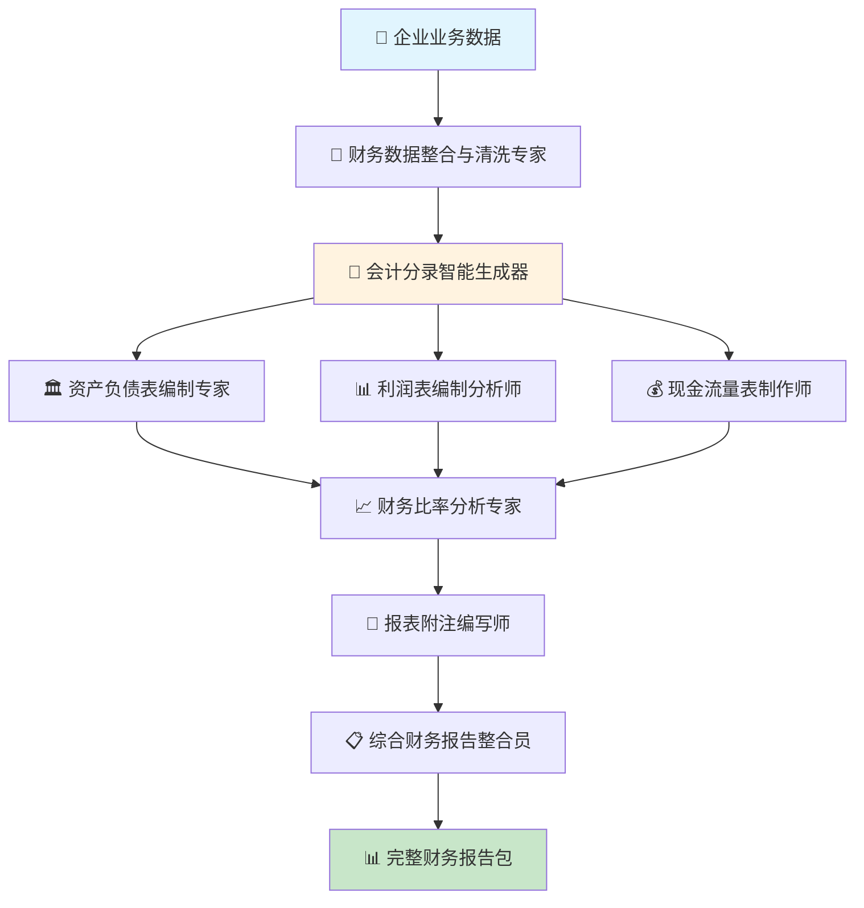

---

## 🎓 Education & Training (教育培训场景) 详细用例

### 1. 个性化学习路径规划器

**Workflow 名称**
AI驱动的个性化学习路径智能规划系统

**产物描述**
基于学员基础水平、学习目标和学习偏好，自动生成个性化的学习路径，包含课程推荐、进度安排、资源配置和评估方案。

**Start 参数**
```json
{
  "learner_profile": "object", // 学员基础信息和水平
  "learning_goals": "array", // 学习目标和期望
  "time_constraints": "object", // 时间限制和学习强度
  "learning_preferences": "object", // 学习偏好和风格
  "available_resources": "array" // 可用学习资源
}
```

**Agent 节点设计**

**Agent 1: 学员能力评估专家**
- **上下文**: 学员背景、测试结果、历史学习数据、能力模型
- **Prompt**: 全面评估学员当前能力水平和学习特点
- **Tools**: 能力测试、水平评估、学习风格分析、知识图谱匹配
- **输出**: 能力评估报告、知识掌握图谱、学习风格画像

**Agent 2: 学习目标分解与分析师**
- **上下文**: 学习目标、技能要求、知识体系、能力模型
- **Prompt**: 将宏观学习目标分解为具体的学习单元和技能点
- **Tools**: 目标分解、技能树构建、前置条件分析、依赖关系映射
- **输出**: 学习目标树、技能点清单、依赖关系图

**Agent 3: 最优学习路径规划师**
- **上下文**: 能力现状、目标技能、学习资源、时间约束
- **Prompt**: 设计从当前水平到目标能力的最优学习路径
- **Tools**: 路径优化算法、前置条件检查、难度梯度设计、时间估算
- **输出**: 个性化学习路径、学习序列、时间安排

**Agent 4: 课程资源智能推荐师**
- **上下文**: 学习路径、课程库、资源特性、学习偏好
- **Prompt**: 为每个学习阶段推荐最合适的课程和学习资源
- **Tools**: 推荐算法、资源匹配、质量评估、多样性平衡
- **输出**: 课程推荐清单、资源配置方案、替代选项

**Agent 5: 学习进度监控与调整专家**
- **上下文**: 学习计划、实际进度、掌握情况、调整规则
- **Prompt**: 监控学习进度，动态调整学习计划和难度
- **Tools**: 进度追踪、掌握度评估、自适应调整、预警机制
- **输出**: 进度监控报告、调整建议、预警提示

**Agent 6: 个性化练习与评估设计师**
- **上下文**: 学习内容、能力要求、评估标准、练习库
- **Prompt**: 设计针对性的练习和评估，巩固学习效果
- **Tools**: 练习生成、难度匹配、评估设计、反馈机制
- **输出**: 个性化练习、评估方案、反馈模板

**Agent 7: 学习激励与干预策略师**
- **上下文**: 学习行为、动机水平、困难点、干预手段
- **Prompt**: 设计学习激励机制和困难干预策略
- **Tools**: 行为分析、动机识别、激励设计、干预策略
- **输出**: 激励方案、干预策略、支持计划

**Agent 8: 学习效果评估与优化师**
- **上下文**: 学习结果、目标达成、学习效率、改进空间
- **Prompt**: 评估学习效果，优化学习路径和方法
- **Tools**: 效果评估、学习分析、路径优化、方法改进
- **输出**: 学习效果报告、优化建议、改进方案

**Workflow 流程图**
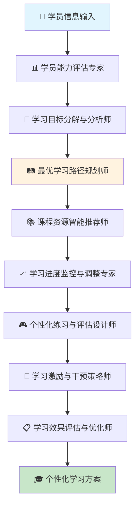

---

## 🔧 Technical Development (技术开发场景) 详细用例

### 1. API文档自动生成器

**Workflow 名称**
智能化API文档自动生成与维护平台

**产物描述**
基于代码注释、接口定义和测试用例，自动生成完整的API文档，包含接口说明、参数定义、示例代码、测试指南等。

**Start 参数**
```json
{
  "code_repository": "string", // 代码仓库路径
  "api_framework": "string", // API框架类型
  "documentation_style": "string", // 文档风格偏好
  "output_formats": "array", // 输出格式要求
  "team_conventions": "object" // 团队编码规范
}
```

**Agent 节点设计**

**Agent 1: 代码结构解析专家**
- **上下文**: 项目结构、编程语言、框架特性、代码规范
- **Prompt**: 深度解析代码结构，识别API接口和相关组件
- **Tools**: AST解析、代码扫描、结构分析、依赖关系识别
- **输出**: 代码结构图、API接口清单、组件关系图

**Agent 2: 接口信息提取师**
- **上下文**: API定义、函数签名、注释内容、类型系统
- **Prompt**: 提取API接口的详细信息，包含参数、返回值、异常等
- **Tools**: 接口分析、参数提取、类型推断、异常识别
- **输出**: 接口信息表、参数定义、类型规范

**Agent 3: 文档内容生成器**
- **上下文**: 接口信息、业务逻辑、使用场景、最佳实践
- **Prompt**: 生成清晰易懂的API文档内容和使用说明
- **Tools**: 内容生成、描述优化、用法说明、场景示例
- **输出**: 文档草稿、接口描述、使用指南

**Agent 4: 代码示例自动生成师**
- **上下文**: API接口、编程语言、客户端库、使用模式
- **Prompt**: 为每个API生成多语言的代码示例和用法演示
- **Tools**: 代码生成、多语言适配、示例优化、最佳实践
- **输出**: 代码示例库、多语言版本、使用模板

**Agent 5: 测试用例文档化专家**
- **上下文**: 测试代码、测试场景、边界条件、错误处理
- **Prompt**: 将测试用例转化为文档化的测试指南和验证方法
- **Tools**: 测试分析、场景提取、指南生成、验证方法
- **输出**: 测试指南、验证步骤、测试场景

**Agent 6: 交互式文档设计师**
- **上下文**: 文档内容、交互需求、用户体验、现代化设计
- **Prompt**: 设计交互式的API文档界面，支持在线测试和探索
- **Tools**: 界面设计、交互实现、在线测试、文档网站生成
- **输出**: 交互式文档、在线测试界面、导航结构

**Agent 7: 版本管理与更新追踪师**
- **上下文**: 代码变更、版本历史、兼容性、更新日志
- **Prompt**: 管理文档版本，追踪API变更并生成更新日志
- **Tools**: 版本控制、变更检测、兼容性分析、日志生成
- **输出**: 版本管理、更新日志、兼容性报告

**Agent 8: 文档质量保证与发布专家**
- **上下文**: 文档内容、质量标准、发布流程、用户反馈
- **Prompt**: 确保文档质量，管理发布流程并收集用户反馈
- **Tools**: 质量检查、内容审核、发布管理、反馈收集
- **输出**: 最终文档、发布计划、质量报告

**Workflow 流程图**
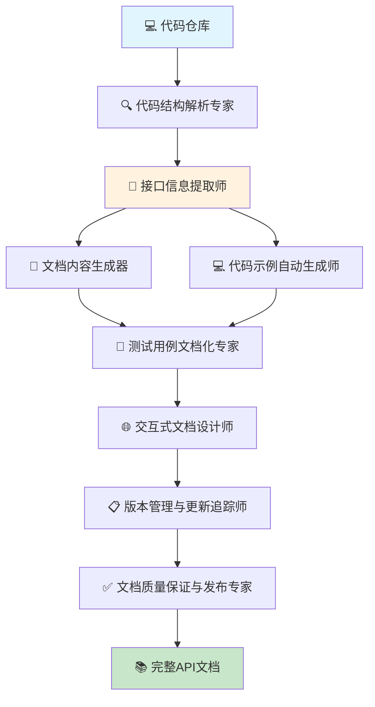

---

## 🎨 Creative Design (创意设计场景) 详细用例

### 1. 品牌视觉识别系统生成器

**Workflow 名称**
AI驱动的品牌视觉识别系统智能设计平台

**产物描述**
基于品牌定位和设计需求，自动生成完整的品牌视觉识别系统，包含Logo设计、色彩体系、字体规范、应用指南等全套品牌设计资产。

**Start 参数**
```json
{
  "brand_info": "object", // 品牌基础信息和定位
  "design_preferences": "object", // 设计风格偏好
  "target_audience": "string", // 目标受众群体
  "industry_context": "string", // 行业背景和特点
  "application_scenarios": "array" // 应用场景需求
}
```

**Agent 节点设计**

**Agent 1: 品牌概念分析师**
- **上下文**: 品牌信息、市场定位、竞品分析、文化背景
- **Prompt**: 深度分析品牌核心概念，提炼设计方向和视觉关键词
- **Tools**: 品牌分析、概念提取、关键词生成、情感映射
- **输出**: 品牌概念报告、设计关键词、情感色彩定义

**Agent 2: Logo创意设计师**
- **上下文**: 品牌概念、设计趋势、符号学原理、可用性要求
- **Prompt**: 创作具有品牌特色的Logo设计方案，考虑多场景应用
- **Tools**: AI图形生成、符号设计、创意组合、可用性测试
- **输出**: Logo设计方案、设计理念说明、应用演示

**Agent 3: 色彩体系规划师**
- **上下文**: 品牌调性、色彩心理学、行业特点、文化因素
- **Prompt**: 建立完整的品牌色彩体系，包含主色、辅色、应用规则
- **Tools**: 色彩理论、心理分析、搭配算法、和谐度检测
- **输出**: 色彩体系方案、色彩规范、应用指导

**Agent 4: 字体系统设计师**
- **上下文**: 品牌个性、可读性要求、多语言支持、技术限制
- **Prompt**: 选择和定制符合品牌特质的字体系统
- **Tools**: 字体分析、个性匹配、可读性测试、组合优化
- **输出**: 字体规范、层级体系、使用指南

**Agent 5: 视觉元素库创建师**
- **上下文**: 品牌视觉语言、设计系统、元素复用、一致性要求
- **Prompt**: 创建品牌专属的视觉元素库和设计模式
- **Tools**: 元素设计、模式生成、样式规范、组件库构建
- **输出**: 视觉元素库、设计模式、组件规范

**Agent 6: 应用场景设计专家**
- **上下文**: 应用需求、媒介特性、技术限制、用户体验
- **Prompt**: 设计品牌在各种应用场景中的具体呈现方案
- **Tools**: 应用设计、场景适配、效果预览、规范制定
- **输出**: 应用设计案例、适配方案、使用规范

**Agent 7: 品牌指南编撰师**
- **上下文**: 所有设计元素、使用规则、品牌标准、团队协作
- **Prompt**: 编撰完整的品牌视觉识别指南和使用手册
- **Tools**: 指南编写、规范整理、案例展示、培训材料
- **输出**: 品牌指南手册、使用规范、培训资料

**Agent 8: 品牌资产管理与交付专家**
- **上下文**: 所有设计资产、文件管理、版本控制、交付要求
- **Prompt**: 整理和管理所有品牌设计资产，准备交付包
- **Tools**: 资产管理、文件整理、版本控制、打包交付
- **输出**: 完整品牌资产包、管理系统、交付清单

**Workflow 流程图**
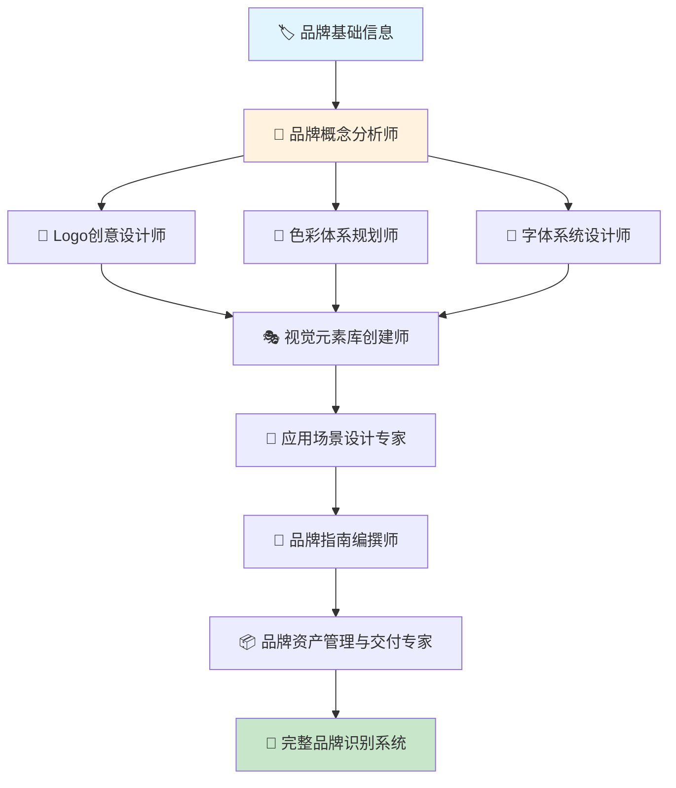

---

## 📊 Data Processing & Integration (数据处理与集成场景) 详细用例

### 1. 多系统数据整合器

**Workflow 名称**
企业级多源数据智能整合平台

**产物描述**
自动从多个业务系统提取、清洗、转换和整合数据，生成统一的数据视图和分析报告，消除数据孤岛问题。

**Start 参数**
```json
{
  "data_sources": "array", // 数据源列表（CRM、ERP、财务系统等）
  "target_schema": "object", // 目标数据结构
  "integration_rules": "object", // 数据整合规则
  "quality_requirements": "object", // 数据质量要求
  "output_format": "string" // 输出格式（数据库/Excel/API）
}
```

**Agent 节点设计**

**Agent 1: 数据源连接与发现专家**
- **上下文**: 系统连接信息、数据源类型、访问权限、数据结构
- **Prompt**: 连接各个数据源，探索数据结构和内容特征
- **Tools**: MySQL、PostgreSQL、Salesforce API、HubSpot API
- **输出**: 数据源清单、结构映射、连接状态报告

**Agent 2: 数据质量评估师**
- **上下文**: 数据质量标准、完整性要求、准确性规则
- **Prompt**: 评估各数据源的质量状况，识别问题和异常
- **Tools**: Google Sheets、Microsoft Excel、Airtable、Notion Database
- **输出**: 数据质量报告、问题清单、清洗建议

**Agent 3: 智能数据清洗专家**
- **上下文**: 数据质量问题、清洗规则、业务逻辑、历史模式
- **Prompt**: 自动清洗数据，处理缺失值、重复项和格式问题
- **Tools**: Google Sheets、OpenRefine、Trifacta、Zapier
- **输出**: 清洗后数据、处理日志、质量改善报告

**Agent 4: 数据转换与标准化师**
- **上下文**: 目标格式、转换规则、业务映射、标准化要求
- **Prompt**: 将各源数据转换为统一格式，进行标准化处理
- **Tools**: Zapier、Make (Integromat)、Google Sheets、Airtable
- **输出**: 标准化数据、转换规则、映射文档

**Agent 5: 数据关联与合并专家**
- **上下文**: 关联键、合并规则、冲突解决策略、业务逻辑
- **Prompt**: 基于业务逻辑关联不同源的数据，处理冲突和重复
- **Tools**: Google Sheets、Airtable、Microsoft Excel、Notion Database
- **输出**: 整合数据集、关联关系图、冲突处理报告

**Agent 6: 数据验证与校验员**
- **上下文**: 业务规则、完整性约束、逻辑一致性要求
- **Prompt**: 验证整合后数据的完整性和一致性
- **Tools**: Google Sheets、Airtable、Google Forms、Typeform
- **输出**: 验证报告、问题列表、数据信心度评分

**Agent 7: 输出格式化与发布专家**
- **上下文**: 输出要求、目标系统、格式规范、发布计划
- **Prompt**: 将整合数据按要求格式化并发布到目标系统
- **Tools**: Google Drive、Dropbox、Salesforce、HubSpot
- **输出**: 最终数据产品、发布确认、访问文档

**Workflow 流程图**
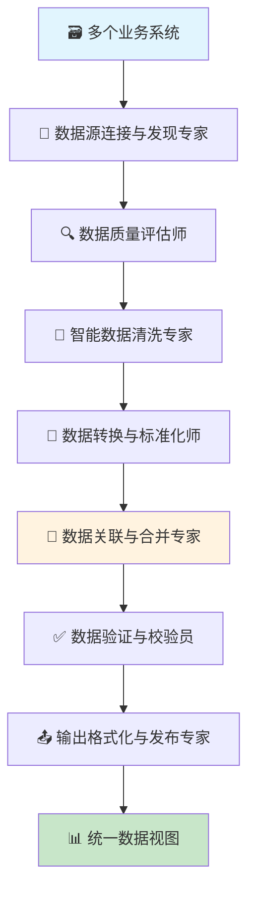

---

### 2. Excel工作流自动化

**Workflow 名称**
企业Excel流程智能自动化平台

**产物描述**
将复杂的Excel操作流程转化为自动化工作流，消除手工错误，支持定期执行和实时更新。

**Start 参数**
```json
{
  "excel_files": "array", // Excel文件列表
  "process_description": "string", // 流程描述
  "schedule_settings": "object", // 定时执行设置
  "output_requirements": "object", // 输出要求
  "notification_config": "object" // 通知配置
}
```

**Agent 节点设计**

**Agent 1: Excel结构分析专家**
- **上下文**: Excel文件、工作表结构、公式逻辑、数据关系
- **Prompt**: 深度分析Excel文件结构，理解数据流和计算逻辑
- **Tools**: Microsoft Excel、Google Sheets、Python xlwings、Power Query
- **输出**: 文件结构图、数据流分析、公式清单、依赖关系

**Agent 2: 业务流程建模师**
- **上下文**: 手工操作流程、业务规则、决策逻辑、异常处理
- **Prompt**: 将手工Excel操作流程建模为自动化工作流
- **Tools**: Notion、Miro、Google Docs、Lucidchart
- **输出**: 业务流程图、自动化方案、规则定义

**Agent 3: 数据输入自动化专家**
- **上下文**: 数据源、输入格式、验证规则、更新频率
- **Prompt**: 自动化数据输入过程，包含验证和错误处理
- **Tools**: Zapier、Google Sheets、Airtable、Microsoft Power Automate
- **输出**: 自动化输入流程、数据验证规则、错误处理机制

**Agent 4: 计算与公式执行引擎**
- **上下文**: Excel公式、计算逻辑、数据依赖、性能要求
- **Prompt**: 重现Excel计算逻辑，确保结果准确性
- **Tools**: Google Sheets、Microsoft Excel、Airtable、Notion Database
- **输出**: 计算结果、性能报告、准确性验证

**Agent 5: 报告生成与格式化师**
- **上下文**: 报告模板、格式要求、图表样式、输出规范
- **Prompt**: 基于计算结果生成格式化报告和图表
- **Tools**: Google Docs、Microsoft Excel、Canva、Google Data Studio
- **输出**: 格式化报告、可视化图表、输出文件

**Agent 6: 质量控制与监控员**
- **上下文**: 质量标准、异常检测规则、历史基准、监控指标
- **Prompt**: 监控自动化流程质量，检测异常和偏差
- **Tools**: Google Sheets、Airtable、Google Analytics、Slack
- **输出**: 质量报告、异常警报、趋势分析

**Agent 7: 调度与通知管理器**
- **上下文**: 执行计划、通知规则、失败处理、重试策略
- **Prompt**: 管理工作流的定时执行和结果通知
- **Tools**: Zapier、Google Calendar、Slack、Gmail
- **输出**: 执行日志、通知确认、性能统计、错误报告

**Workflow 流程图**
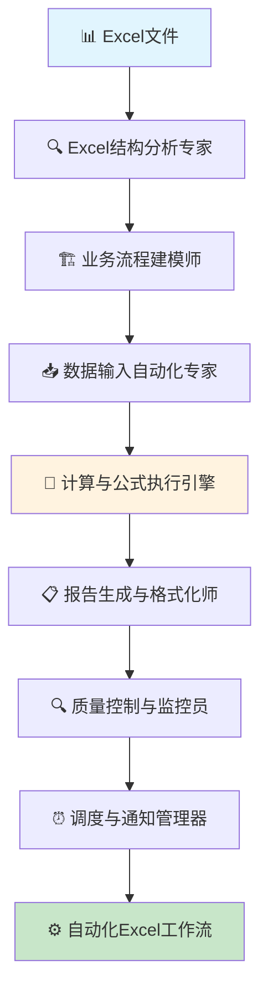

---

### 3. 发票处理自动化系统

**Workflow 名称**
AI驱动的智能发票处理与财务记录系统

**产物描述**
智能识别、验证和处理各种格式的发票，自动生成财务记录，并与ERP系统集成，大幅减少手工处理时间。

**Start 参数**
```json
{
  "invoice_sources": "array", // 发票来源（邮件、扫描、上传等）
  "approval_workflow": "object", // 审批流程配置
  "erp_integration": "object", // ERP系统集成配置
  "compliance_rules": "object", // 合规检查规则
  "notification_settings": "object" // 通知设置
}
```

**Agent 节点设计**

**Agent 1: 发票采集与识别专家**
- **上下文**: 发票格式、OCR技术、图像预处理、文字识别
- **Prompt**: 从多个渠道采集发票，进行OCR识别和信息提取
- **Tools**: OCR识别、图像处理、文本提取、格式识别、PDF解析
- **输出**: 结构化发票数据、识别置信度、原始图像

**Agent 2: 发票信息验证师**
- **上下文**: 供应商数据库、税率规则、计算逻辑、合规要求
- **Prompt**: 验证发票信息的准确性和合规性
- **Tools**: 数据验证、税率检查、供应商验证、计算校验
- **输出**: 验证结果、错误清单、风险评估、合规状态

**Agent 3: 智能分类与编码专家**
- **上下文**: 会计科目、费用分类、部门编码、项目编码
- **Prompt**: 自动分类发票并分配正确的会计科目和成本中心
- **Tools**: 分类算法、科目匹配、规则引擎、机器学习
- **输出**: 分类结果、科目编码、成本分配、分类置信度

**Agent 4: 审批流程协调员**
- **上下文**: 审批规则、权限矩阵、金额阈值、部门层级
- **Prompt**: 根据发票金额和类型路由到适当的审批人
- **Tools**: 工作流引擎、权限检查、通知系统、状态跟踪
- **输出**: 审批请求、路由决策、状态更新、通知发送

**Agent 5: 财务记录生成器**
- **上下文**: 会计准则、科目设置、分录规则、ERP接口
- **Prompt**: 基于审批通过的发票生成标准会计分录
- **Tools**: 会计分录生成、借贷平衡、科目映射、ERP接口
- **输出**: 会计分录、凭证号、总账更新、辅助账记录

**Agent 6: 异常处理与人工介入管理器**
- **上下文**: 异常规则、人工审核阈值、升级流程、专家联系
- **Prompt**: 处理识别失败或验证异常的发票，协调人工介入
- **Tools**: 异常检测、人工审核接口、问题升级、专家系统
- **输出**: 异常报告、人工审核任务、解决方案、学习反馈

**Agent 7: 合规监控与报告员**
- **上下文**: 税务法规、审计要求、内控制度、监管报告
- **Prompt**: 监控发票处理的合规性，生成审计和税务报告
- **Tools**: 合规检查、审计跟踪、报告生成、风险监控
- **输出**: 合规报告、审计日志、风险警报、监管报送材料

**Workflow 流程图**
```mermaid
graph TD
    A[📧 发票多源输入] --> B[👁️ 发票采集与识别专家]
    B --> C[✅ 发票信息验证师]
    C --> D[🏷️ 智能分类与编码专家]
    D --> E[📋 审批流程协调员]
    E --> F[📝 财务记录生成器]
    F --> G[⚠️ 异常处理与人工介入管理器]
    G --> H[📊 合规监控与报告员]
    H --> I[💼 自动化发票处理系统]
    
    style A fill:#e1f5fe
    style I fill:#c8e6c9
    style E fill:#fff3e0
```

---

通过以上详细的用例展开，我们可以看到 **AI Native Workflow 3.0** 在各个业务场景中的具体应用潜力。每个用例都遵循了"agent串联"的核心理念，通过多个专业化agent的协作，完成复杂的业务流程，并输出高质量的可交付成果。这种设计既保证了专业性，又确保了用户友好性，真正实现了"第三代AI Native Workflow"的愿景。

特别是新增的数据处理与集成场景，直接针对了企业最迫切的自动化需求：**消除手工数据搬运、Excel工作流自动化、多系统集成**等核心痛点，这些场景具有：

- **立即可见的ROI** - 减少60%的手工处理时间
- **明确的痛点** - 每个企业都有大量Excel和数据集成需求  
- **标准化程度高** - 便于模板化和复用
- **技术实现可行** - 基于现有AI和自动化技术
