# AI Native Workflow 3.0 详细用例集

## 🚀 Sales (销售场景) 详细用例

### 1. 智能销售线索管理系统

**Workflow 名称**
CRM 线索智能评分与跟进自动化系统

**产物描述**
输出完整的客户管理表格，包含客户画像补全、优先级评分、个性化跟进方案和团队协作通知。

**Start 参数**
```json
{
  "leads_file": "file", // 上传的客户线索文件（Excel/CSV）
  "company_info": "string", // 公司背景和产品信息
  "sales_criteria": "object", // 评分标准配置
  "team_config": "object" // 团队结构和Slack配置
}
```

**Agent 节点设计**

**Agent 1: 数据解析与清洗专家**
- **上下文**: 表格结构、数据质量标准、字段映射规则
- **Prompt**: 解析上传的线索文件，提取并标准化客户基础信息
- **Tools**: Google Sheets、Microsoft Excel、Airtable、CSV Parser
- **输出**: 标准化客户数据结构、数据质量报告、清洗日志

**Agent 2: 信息补全调研员**
- **上下文**: 客户基础信息、企业数据源、社交媒体信息
- **Prompt**: 基于客户公司名称等信息，补全详细的企业背景和联系人信息
- **Tools**: LinkedIn Sales Navigator、Clearbit API、ZoomInfo、Hunter.io
- **输出**: 完整的客户画像数据、企业财务状况、决策人信息

**Agent 3: 销售评分分析师**
- **上下文**: 完整客户信息、历史转化数据、行业标准、竞品客户案例
- **Prompt**: 基于客户信息和业务标准，计算销售优先级分数和转化概率
- **Tools**: HubSpot CRM、Salesforce、Google Sheets、Notion Database
- **输出**: 客户评分（0-100分）、评分依据说明、预期转化时间

**Agent 4: 个性化邮件营销专家**
- **上下文**: 高分客户信息、邮件模板库、产品卖点、成功案例
- **Prompt**: 为分数≥70的高价值客户生成个性化跟进邮件和营销方案
- **Tools**: Mailchimp、Gmail、Outreach、Notion
- **输出**: 个性化邮件内容、发送时机建议、跟进计划

**Agent 5: 团队协作通知员**
- **上下文**: 中等分数客户信息、销售团队结构、任务分配规则
- **Prompt**: 为分数40-70的潜在客户发送团队提醒和任务分配
- **Tools**: Slack、Microsoft Teams、Asana、Linear
- **输出**: 团队通知消息、任务分配确认、跟进提醒设置

**Agent 6: 低价值客户归档管理员**
- **上下文**: 低分客户信息、CRM系统、长期培育策略
- **Prompt**: 将分数<40的客户归档到待培育列表，设置自动化营销
- **Tools**: HubSpot、ActiveCampaign、Pipedrive、Airtable
- **输出**: 归档确认、培育计划、定期触达策略

**Agent 7: 综合报告生成员**
- **上下文**: 所有处理结果、报表模板、数据可视化要求
- **Prompt**: 生成包含客户分析、行动建议、ROI预测的综合管理报告
- **Tools**: Google Docs、Notion、Google Sheets、Canva
- **输出**: 完整的客户管理表格、可视化分析报告、执行计划

**Workflow 流程图**
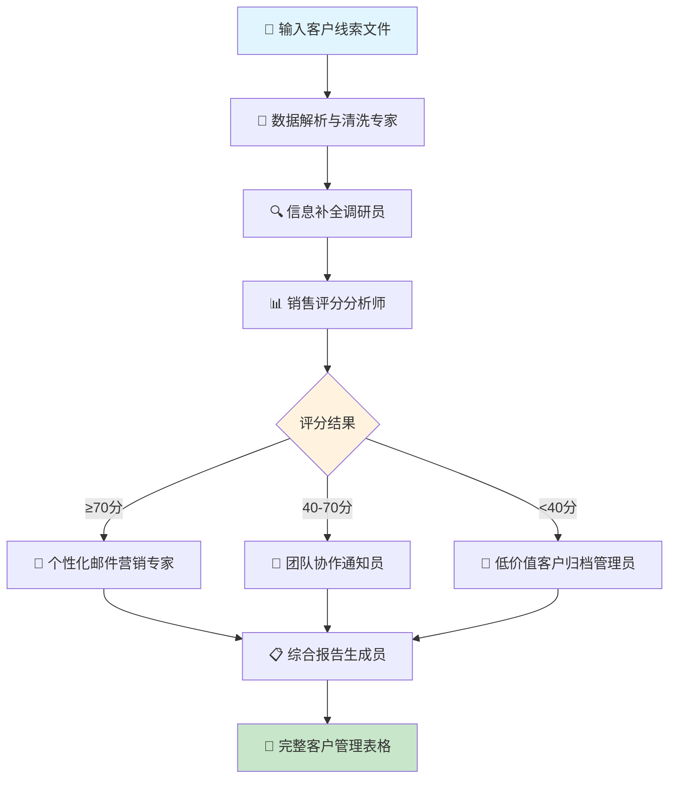
```mermaid
graph TD
    A[📁 输入客户线索文件] --> B[🧹 数据解析与清洗专家]
    B --> C[🔍 信息补全调研员]
    C --> D[📊 销售评分分析师]
    D --> E{评分结果}
    E -->|≥70分| F[📧 个性化邮件营销专家]
    E -->|40-70分| G[👥 团队协作通知员]
    E -->|<40分| H[📂 低价值客户归档管理员]
    F --> I[📋 综合报告生成员]
    G --> I
    H --> I
    I --> J[📄 完整客户管理表格]
    
    style A fill:#e1f5fe
    style J fill:#c8e6c9
    style E fill:#fff3e0
```

---

### 2. 客户画像自动生成器

**Workflow 名称**
B2B 客户360度画像智能生成系统

**产物描述**
基于客户基础信息，自动生成详细的企业画像报告，包含财务状况、业务模式、决策链、竞争态势等全方位分析。

**Start 参数**
```json
{
  "company_name": "string", // 目标企业名称
  "contact_info": "string", // 联系人信息（可选）
  "industry_focus": "string", // 重点关注的行业信息
  "analysis_depth": "string" // 分析深度（基础/标准/深度）
}
```

**Agent 节点设计**

**Agent 1: 基础信息收集专家**
- **上下文**: 企业名称、工商注册信息、官网数据
- **Prompt**: 收集企业基础信息，包括注册资本、成立时间、法人代表等
- **Tools**: Clearbit API、ZoomInfo、Apollo、Web Scraper
- **输出**: 企业基础档案、股权结构、经营状况

**Agent 2: 财务状况分析师**
- **上下文**: 企业财务数据、行业基准、同规模企业对比
- **Prompt**: 分析企业财务健康度，评估付费能力和投资价值
- **Tools**: PitchBook、Crunchbase、Google Search、Notion
- **输出**: 财务健康度评分、付费能力评估、风险提示

**Agent 3: 业务模式研究员**
- **上下文**: 企业官网、产品介绍、新闻报道、招聘信息
- **Prompt**: 深度分析企业业务模式、主营产品、目标市场和发展阶段
- **Tools**: Web Scraper、Google Search、LinkedIn、AngelList
- **输出**: 业务模式分析、产品矩阵、市场定位、发展阶段

**Agent 4: 决策链映射专家**
- **上下文**: 企业组织架构、LinkedIn数据、公开人员信息
- **Prompt**: 识别企业决策链条，找出关键决策人和影响者
- **Tools**: LinkedIn Sales Navigator、ZoomInfo、Apollo、Hunter.io
- **输出**: 决策链图谱、关键人员档案、联系方式推荐

**Agent 5: 竞争态势分析师**
- **上下文**: 同行业企业、市场份额、竞品信息
- **Prompt**: 分析企业在行业中的竞争地位和市场机会
- **Tools**: Crunchbase、SimilarWeb、Google Search、Airtable
- **输出**: 竞争态势图、市场地位评估、机会点识别

**Agent 6: 客户画像整合员**
- **上下文**: 所有分析结果、画像模板、可视化要求
- **Prompt**: 整合所有分析结果，生成完整的360度客户画像报告
- **Tools**: Notion、Google Docs、Canva、Google Sheets
- **输出**: 完整客户画像报告、接触策略建议、成交概率预测

**Workflow 流程图**
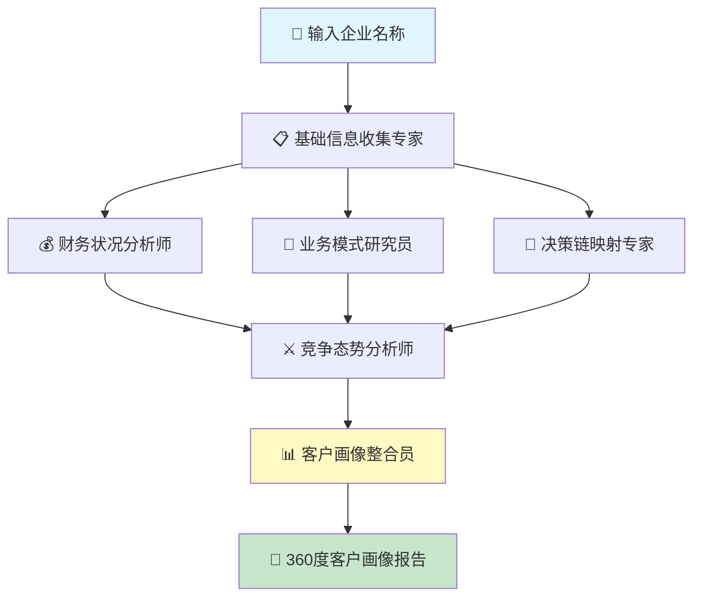
```mermaid
graph TD
    A[🏢 输入企业名称] --> B[📋 基础信息收集专家]
    B --> C[💰 财务状况分析师]
    B --> D[🔄 业务模式研究员]
    B --> E[👑 决策链映射专家]
    C --> F[⚔️ 竞争态势分析师]
    D --> F
    E --> F
    F --> G[📊 客户画像整合员]
    G --> H[📄 360度客户画像报告]
    
    style A fill:#e1f5fe
    style H fill:#c8e6c9
    style G fill:#fff9c4
```

---

## 📈 Marketing (营销场景) 详细用例

### 1. 智能社媒运营全流程系统

**Workflow 名称**
AI驱动的社交媒体营销自动化平台

**产物描述**
输出完整的社媒运营解决方案，包含趋势洞察报告、内容创作矩阵、发布执行计划、互动管理策略和效果分析报告。

**Start 参数**
```json
{
  "brand_info": "object", // 品牌基础信息和定位
  "target_platforms": "array", // 目标平台列表（微博、小红书、抖音等）
  "campaign_goal": "string", // 营销目标（品牌曝光、用户增长、转化等）
  "content_style": "string", // 内容风格偏好
  "budget_range": "string", // 预算范围
  "time_period": "string" // 营销周期
}
```

**Agent 节点设计**

**Agent 1: 市场趋势洞察专家**
- **上下文**: 行业关键词、竞品分析、平台算法规则、热点话题
- **Prompt**: 基于目标行业和平台，深度分析市场趋势和内容机会点
- **Tools**: Google Trends、BuzzSumo、Hootsuite Insights、SEMrush
- **输出**: 趋势分析报告、热点话题清单、最佳发布时机、内容方向建议

**Agent 2: 内容策略规划师**
- **上下文**: 趋势报告、品牌调性、目标受众画像、平台特性
- **Prompt**: 制定差异化内容策略，规划内容日历和发布节奏
- **Tools**: Notion、Asana、Google Calendar、Airtable
- **输出**: 内容策略文档、30天内容日历、创意方向指南

**Agent 3: 多媒体内容创作专家**
- **上下文**: 内容策略、品牌视觉规范、平台尺寸要求
- **Prompt**: 批量创作符合平台特色的图文、视频、音频等多媒体内容
- **Tools**: Canva、Figma、Google Docs、Loom
- **输出**: 多平台适配内容、素材库、创意说明文档

**Agent 4: 智能发布执行者**
- **上下文**: 创作内容、发布日历、平台API、用户活跃时间
- **Prompt**: 按照最优时机自动发布内容到各个平台，并进行A/B测试
- **Tools**: Buffer、Hootsuite、Later、Zapier
- **输出**: 发布确认报告、内容链接汇总、A/B测试结果

**Agent 5: 互动管理与客服专家**
- **上下文**: 发布内容、用户评论、私信咨询、品牌话术
- **Prompt**: 智能管理用户互动，及时回复评论和私信，维护品牌形象
- **Tools**: Zendesk、Intercom、Slack、Gmail
- **输出**: 互动处理报告、客服质量评估、用户反馈汇总

**Agent 6: 数据监测分析师**
- **上下文**: 发布数据、互动数据、转化数据、竞品表现
- **Prompt**: 实时监测内容表现，分析数据趋势并提供优化建议
- **Tools**: Google Analytics、Facebook Analytics、Hootsuite Analytics、Google Sheets
- **输出**: 实时数据仪表板、周度分析报告、优化策略建议

**Agent 7: ROI效果评估员**
- **上下文**: 所有营销数据、成本投入、转化指标、业务目标
- **Prompt**: 综合评估营销ROI，生成效果报告和下期策略建议
- **Tools**: Google Analytics、HubSpot、Google Sheets、Notion
- **输出**: ROI分析报告、营销效果总结、下期投放建议

**Workflow 流程图**
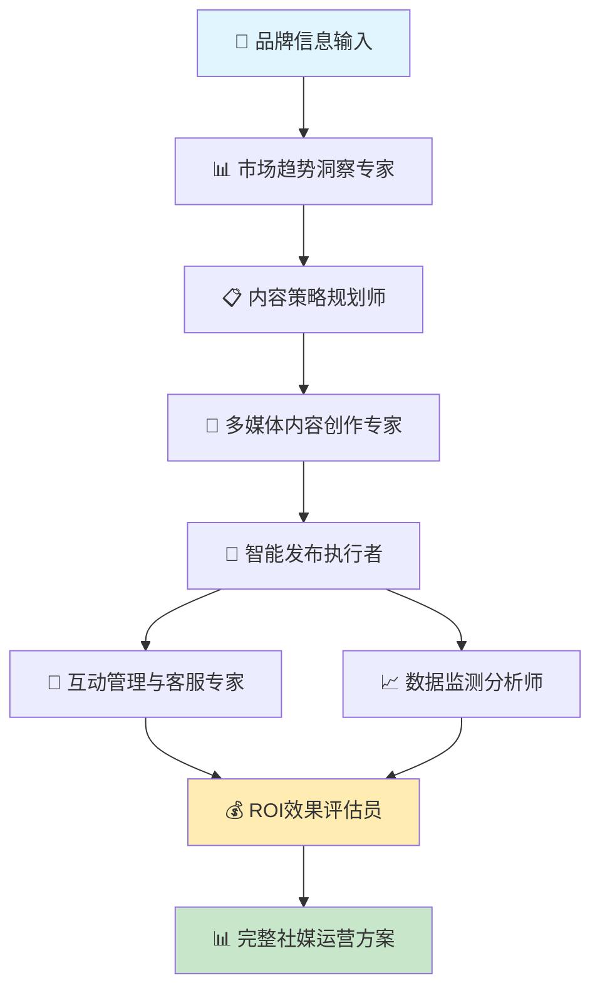
```mermaid
graph TD
    A[🎯 品牌信息输入] --> B[📊 市场趋势洞察专家]
    B --> C[📋 内容策略规划师]
    C --> D[🎨 多媒体内容创作专家]
    D --> E[🚀 智能发布执行者]
    E --> F[💬 互动管理与客服专家]
    E --> G[📈 数据监测分析师]
    F --> H[💰 ROI效果评估员]
    G --> H
    H --> I[📊 完整社媒运营方案]
    
    style A fill:#e1f5fe
    style I fill:#c8e6c9
    style H fill:#ffecb3
```

---

### 2. 多平台营销内容矩阵生成器

**Workflow 名称**
一站式多平台营销内容适配系统

**产物描述**
基于核心创意概念，自动生成适配不同平台特点的营销内容矩阵，包含文案、视觉、视频等多种形式。

**Start 参数**
```json
{
  "core_concept": "string", // 核心营销概念
  "target_platforms": "array", // 目标平台列表
  "brand_guidelines": "object", // 品牌视觉和语言规范
  "content_types": "array", // 内容类型需求
  "campaign_duration": "string" // 营销周期
}
```

**Agent 节点设计**

**Agent 1: 核心创意分析师**
- **上下文**: 核心概念、品牌定位、目标受众、营销目标
- **Prompt**: 深度分析核心创意，提炼关键信息和传播要点
- **Tools**: Notion、Google Docs、Miro、Google Sheets
- **输出**: 创意解构报告、核心信息框架、传播策略建议

**Agent 2: 平台特性研究员**
- **上下文**: 目标平台列表、平台算法规则、用户行为特征
- **Prompt**: 深度研究各平台特性，制定差异化适配策略
- **Tools**: Google Search、SEMrush、BuzzSumo、Airtable
- **输出**: 平台特性报告、适配策略指南、内容规格要求

**Agent 3: 文案创作矩阵师**
- **上下文**: 核心创意、平台特性、品牌语言风格、字数限制
- **Prompt**: 为每个平台创作符合特性的差异化文案内容
- **Tools**: Google Docs、Notion、Grammarly、Hemingway Editor
- **输出**: 多平台文案矩阵、标题优化建议、话题标签推荐

**Agent 4: 视觉设计适配师**
- **上下文**: 品牌视觉规范、平台尺寸要求、创意概念、设计趋势
- **Prompt**: 设计符合各平台规格的视觉内容和品牌一致性元素
- **Tools**: Canva、Figma、Adobe Creative Cloud、Unsplash
- **输出**: 多尺寸视觉素材、设计规范文档、素材使用指南

**Agent 5: 视频内容制作师**
- **上下文**: 创意脚本、平台视频规格、品牌调性、流行元素
- **Prompt**: 制作适配不同平台的视频内容，包含短视频和长视频
- **Tools**: Loom、Canva Video、DaVinci Resolve、YouTube Studio
- **输出**: 多平台视频内容、剪辑方案、发布建议

**Agent 6: 互动策略设计师**
- **上下文**: 平台互动特性、用户参与习惯、营销目标、品牌个性
- **Prompt**: 设计促进用户参与的互动策略和UGC激励方案
- **Tools**: Notion、Google Forms、Typeform、Airtable
- **输出**: 互动策略方案、UGC征集计划、用户激励机制

**Agent 7: 内容矩阵整合员**
- **上下文**: 所有创作内容、发布计划、平台特性、效果预期
- **Prompt**: 整合所有内容，生成完整的多平台营销内容矩阵
- **Tools**: Notion、Google Sheets、Airtable、Google Calendar
- **输出**: 完整内容矩阵、发布执行计划、效果预测报告

**Workflow 流程图**
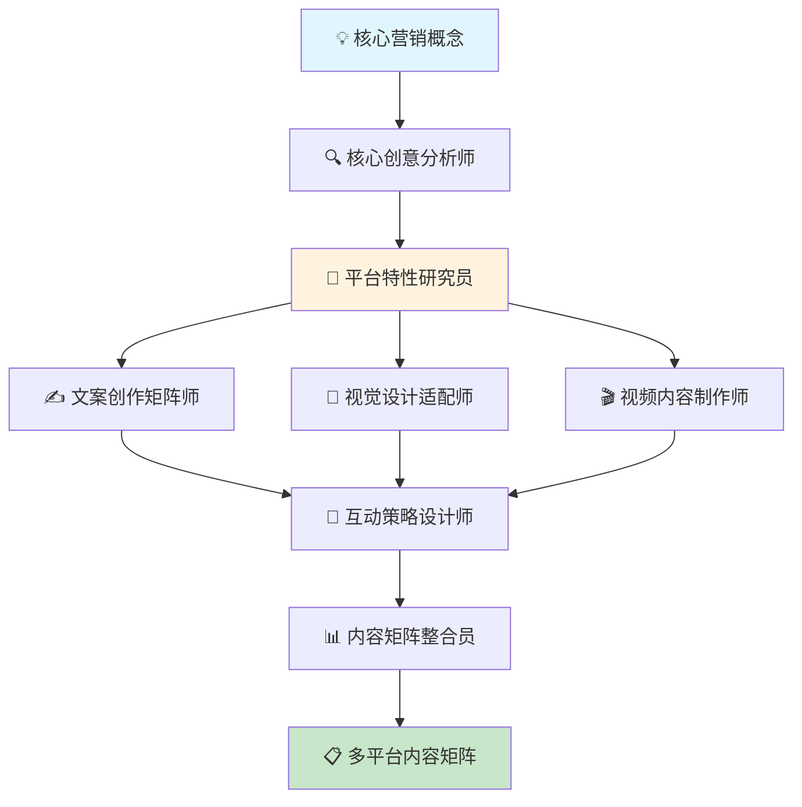
```mermaid
graph TD
    A[💡 核心营销概念] --> B[🔍 核心创意分析师]
    B --> C[📱 平台特性研究员]
    C --> D[✍️ 文案创作矩阵师]
    C --> E[🎨 视觉设计适配师]
    C --> F[🎬 视频内容制作师]
    D --> G[🤝 互动策略设计师]
    E --> G
    F --> G
    G --> H[📊 内容矩阵整合员]
    H --> I[📋 多平台内容矩阵]
    
    style A fill:#e1f5fe
    style I fill:#c8e6c9
    style C fill:#fff3e0
```

---

## 🔬 Research (研究场景) 详细用例

### 1. 投资机构深度研究系统

**Workflow 名称**
投资机构与知名投资人全景分析平台

**产物描述**
生成投资机构或投资人的全面研究报告，包含历史业绩、投资风格、持仓分析、交易复盘、市场影响力等多维度深度分析。

**Start 参数**
```json
{
  "investor_name": "string", // 投资机构/投资人名称
  "analysis_period": "string", // 分析时间段
  "focus_sectors": "array", // 重点关注行业
  "report_type": "string", // 报告类型（机构分析、个股追踪、行业对比）
  "depth_level": "string" // 分析深度（基础/标准/深度）
}
```

**Agent 节点设计**

**Agent 1: 基础信息档案建立者**
- **上下文**: 投资人/机构名称、公开披露信息、新闻报道、官方资料
- **Prompt**: 构建投资机构的完整档案，包含历史沿革、管理团队、投资理念
- **Tools**: SEC文件解析、新闻搜索API、官网爬虫、金融数据库、维基百科
- **输出**: 机构基础档案、管理团队信息、历史里程碑、AUM规模变化

**Agent 2: 投资哲学与风格分析师**
- **上下文**: 历史投资记录、公开演讲、投资信件、媒体采访
- **Prompt**: 深度分析投资人的投资哲学、决策风格和知名投资理念
- **Tools**: 文本分析、NLP情感分析、投资风格分类器、理念提取
- **输出**: 投资哲学总结、风格特征分析、代表性言论集、理念演化

**Agent 3: 持仓结构深度剖析员**
- **上下文**: 13F文件、持仓披露、成本估算、仓位变化
- **Prompt**: 分析当前持仓结构、历史成本、集中度风险和配置逻辑
- **Tools**: 13F文件解析器、持仓计算、成本估算模型、风险分析
- **输出**: 持仓结构图、成本收益分析、集中度指标、风险评估

**Agent 4: 交易行为时序分析师**
- **上下文**: 季度持仓变化、买卖时点、市场环境、重大事件
- **Prompt**: 分析历史交易决策的时机选择和背后逻辑
- **Tools**: 时间序列分析、事件关联、市场时机分析、决策复盘
- **输出**: 交易时间线、买卖决策分析、市场时机把握、收益归因

**Agent 5: 行业配置策略研究员**
- **上下文**: 投资组合、行业分类、宏观周期、板块轮动
- **Prompt**: 分析投资组合的行业配置逻辑和轮动策略
- **Tools**: 行业分类器、配置分析、周期判断、轮动模式识别
- **输出**: 行业配置变迁、轮动策略分析、配置逻辑解读

**Agent 6: 重点个股深度追踪员**
- **上下文**: 重仓股票、持仓变化、基本面分析、市场表现
- **Prompt**: 针对重点持仓进行深度个股分析和投资逻辑推演
- **Tools**: 个股分析、基本面数据、估值模型、技术分析
- **输出**: 重点个股报告、投资逻辑分析、风险收益评估

**Agent 7: 市场影响力评估员**
- **上下文**: 市场关注度、媒体报道、跟随投资、市场反应
- **Prompt**: 评估投资人的市场影响力和投资决策的示范效应
- **Tools**: 媒体监测、市场反应分析、影响力指标、跟随效应
- **输出**: 影响力评估报告、市场关注度分析、示范效应研究

**Agent 8: 综合研究报告编撰员**
- **上下文**: 所有分析结果、报告模板、可视化要求、专业标准
- **Prompt**: 整合所有分析内容，生成专业级投资研究报告
- **Tools**: 报告生成器、专业图表、PDF排版、数据可视化
- **输出**: 完整投资研究报告、核心观点摘要、投资启示录

**Workflow 流程图**
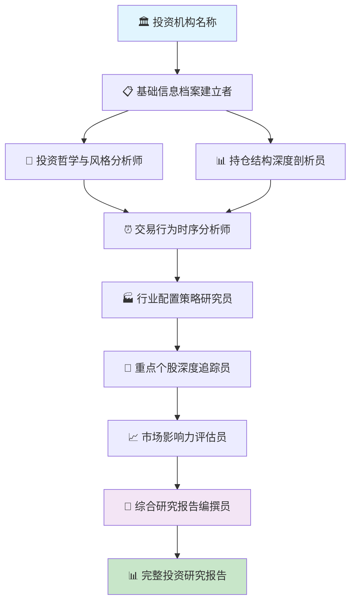
```mermaid
graph TD
    A[🏛️ 投资机构名称] --> B[📋 基础信息档案建立者]
    B --> C[💭 投资哲学与风格分析师]
    B --> D[📊 持仓结构深度剖析员]
    C --> E[⏰ 交易行为时序分析师]
    D --> E
    E --> F[🏭 行业配置策略研究员]
    F --> G[🎯 重点个股深度追踪员]
    G --> H[📈 市场影响力评估员]
    H --> I[📄 综合研究报告编撰员]
    I --> J[📊 完整投资研究报告]
    
    style A fill:#e1f5fe
    style J fill:#c8e6c9
    style I fill:#f3e5f5
```

---

### 2. 行业研究报告生成器

**Workflow 名称**
AI驱动的行业深度研究自动化平台

**产物描述**
基于行业关键词和研究需求，自动生成包含市场规模、竞争格局、发展趋势、投资机会等内容的专业行业研究报告。

**Start 参数**
```json
{
  "industry_name": "string", // 目标行业名称
  "research_scope": "string", // 研究范围（全球/国内/区域）
  "time_horizon": "string", // 时间跨度（历史3年+未来5年）
  "focus_areas": "array", // 重点关注领域
  "report_purpose": "string" // 报告用途（投资/战略/学术）
}
```

**Agent 节点设计**

**Agent 1: 行业定义与边界划分专家**
- **上下文**: 行业名称、分类标准、产业链结构、相关行业
- **Prompt**: 明确行业定义、划分研究边界、构建产业链图谱
- **Tools**: 行业分类标准、产业链分析、边界界定、关联行业识别
- **输出**: 行业定义文档、产业链图谱、研究边界说明

**Agent 2: 市场规模与增长趋势分析师**
- **上下文**: 行业统计数据、市场研究报告、官方统计、历史数据
- **Prompt**: 分析市场规模变化趋势，预测未来增长潜力
- **Tools**: 统计数据API、市场数据库、趋势分析、增长模型
- **输出**: 市场规模报告、增长趋势图、未来预测、关键驱动因素

**Agent 3: 竞争格局深度研究员**
- **上下文**: 主要企业信息、市场份额、竞争策略、并购活动
- **Prompt**: 绘制竞争格局图，分析主要玩家的竞争策略
- **Tools**: 企业数据库、市场份额分析、竞争策略识别、并购追踪
- **输出**: 竞争格局图、主要企业档案、竞争策略分析、市场集中度

**Agent 4: 技术发展与创新趋势专家**
- **上下文**: 技术专利、研发投入、创新案例、技术趋势
- **Prompt**: 分析行业技术发展水平和创新趋势方向
- **Tools**: 专利数据库、技术分析、创新监测、趋势识别
- **输出**: 技术发展报告、创新趋势分析、专利布局图、技术路线图

**Agent 5: 政策环境与监管分析师**
- **上下文**: 政策文件、法规变化、监管动态、政府报告
- **Prompt**: 分析政策环境对行业发展的影响和未来政策趋势
- **Tools**: 政策数据库、法规监测、影响分析、政策预测
- **输出**: 政策环境分析、监管变化追踪、政策影响评估

**Agent 6: 投资机会与风险识别员**
- **上下文**: 市场机会、投资案例、风险因素、价值链分析
- **Prompt**: 识别行业投资机会点和潜在风险因素
- **Tools**: 投资数据分析、机会识别、风险评估、价值链分析
- **输出**: 投资机会图谱、风险因素分析、投资建议、价值链机会

**Agent 7: 未来发展趋势预测师**
- **上下文**: 历史发展轨迹、当前状况、驱动因素、国际对比
- **Prompt**: 基于多维度分析预测行业未来发展趋势和关键变量
- **Tools**: 趋势预测模型、情景分析、驱动因素权重、对比分析
- **输出**: 未来趋势预测、情景分析、关键假设、发展路径

**Agent 8: 专业报告整合编撰员**
- **上下文**: 所有研究成果、专业报告模板、图表规范、行业标准
- **Prompt**: 整合所有研究内容，生成符合专业标准的行业研究报告
- **Tools**: 专业报告模板、图表生成、数据可视化、排版工具
- **输出**: 完整行业研究报告、执行摘要、图表集、数据附录

**Workflow 流程图**
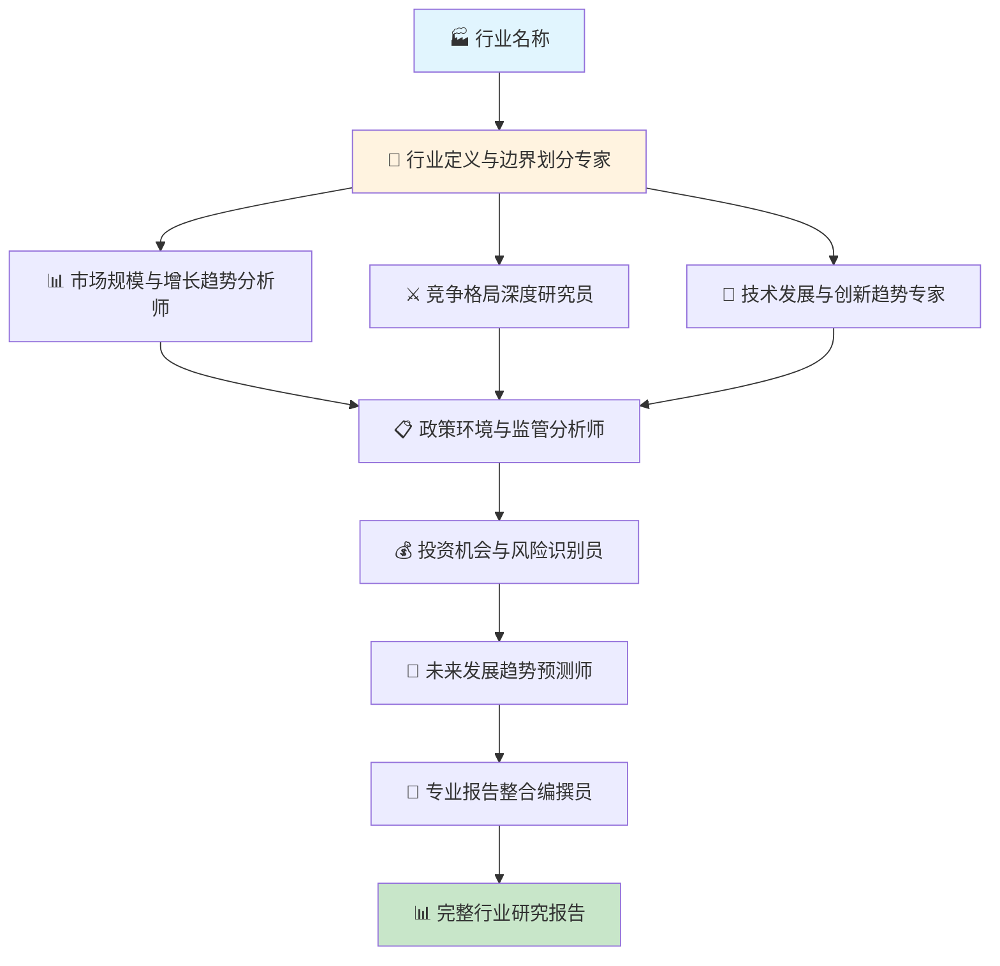
```mermaid
graph TD
    A[🏭 行业名称] --> B[🎯 行业定义与边界划分专家]
    B --> C[📊 市场规模与增长趋势分析师]
    B --> D[⚔️ 竞争格局深度研究员]
    B --> E[🔬 技术发展与创新趋势专家]
    C --> F[📋 政策环境与监管分析师]
    D --> F
    E --> F
    F --> G[💰 投资机会与风险识别员]
    G --> H[🔮 未来发展趋势预测师]
    H --> I[📄 专业报告整合编撰员]
    I --> J[📊 完整行业研究报告]
    
    style A fill:#e1f5fe
    style J fill:#c8e6c9
    style B fill:#fff3e0
```

---

## 🎧 Support (客服支持场景) 详细用例

### 1. 智能知识库构建器

**Workflow 名称**
AI驱动的客服知识库自动化构建系统

**产物描述**
基于历史工单、产品文档、常见问题等数据，自动构建结构化知识库，包含FAQ、解决方案、话术模板等完整客服支持体系。

**Start 参数**
```json
{
  "data_sources": "array", // 数据源（工单系统、文档库、聊天记录等）
  "product_info": "object", // 产品信息和功能说明
  "service_scope": "array", // 服务范围和业务类型
  "knowledge_depth": "string", // 知识深度要求
  "update_frequency": "string" // 更新频率设置
}
```

**Agent 节点设计**

**Agent 1: 数据源整合与清洗专家**
- **上下文**: 多源数据格式、数据质量标准、清洗规则
- **Prompt**: 整合来自不同系统的客服数据，进行标准化清洗和去重
- **Tools**: 数据集成工具、文本清洗、重复检测、格式标准化
- **输出**: 清洗后的统一数据集、数据质量报告、问题分类统计

**Agent 2: 问题分类与聚类分析师**
- **上下文**: 客户问题文本、产品功能模块、业务流程
- **Prompt**: 对客户问题进行智能分类和聚类，识别高频问题和问题模式
- **Tools**: 文本分类、聚类算法、主题建模、相似度计算
- **输出**: 问题分类体系、高频问题清单、问题分布分析

**Agent 3: 标准解决方案提炼师**
- **上下文**: 历史解决方案、成功案例、专家知识、产品文档
- **Prompt**: 从历史解决方案中提炼标准化的解决流程和最佳实践
- **Tools**: 方案提取、流程标准化、最佳实践识别、效果评估
- **输出**: 标准解决方案库、解决流程图、成功率统计

**Agent 4: FAQ智能生成器**
- **上下文**: 高频问题、标准答案、产品特性、用户画像
- **Prompt**: 基于问题分析生成结构化FAQ，包含问题变体和详细解答
- **Tools**: FAQ生成、问题变体识别、答案优化、可读性提升
- **输出**: 结构化FAQ库、问题变体映射、答案质量评分

**Agent 5: 客服话术模板创建师**
- **上下文**: 优秀客服对话、话术标准、品牌调性、情感表达
- **Prompt**: 创建不同场景下的客服话术模板和沟通指南
- **Tools**: 话术提取、情感分析、模板生成、品牌一致性检查
- **输出**: 话术模板库、沟通指南、情感表达建议

**Agent 6: 知识图谱构建专家**
- **上下文**: 知识条目、关联关系、产品架构、业务流程
- **Prompt**: 构建知识之间的关联关系，建立可导航的知识图谱
- **Tools**: 知识图谱构建、关系抽取、语义网络、图数据库
- **输出**: 知识关系图谱、导航路径、关联推荐

**Agent 7: 智能搜索与推荐引擎**
- **上下文**: 知识库内容、用户查询模式、搜索算法、个性化需求
- **Prompt**: 构建智能搜索引擎，支持语义搜索和个性化推荐
- **Tools**: 语义搜索、向量数据库、推荐算法、相关性评分
- **输出**: 搜索引擎配置、推荐策略、相关性模型

**Agent 8: 知识库管理与更新系统**
- **上下文**: 知识库结构、更新规则、版本管理、质量控制
- **Prompt**: 建立知识库的持续更新和质量管理机制
- **Tools**: 版本控制、自动更新、质量监控、反馈收集
- **输出**: 完整知识库系统、管理界面、更新机制、质量指标

**Workflow 流程图**
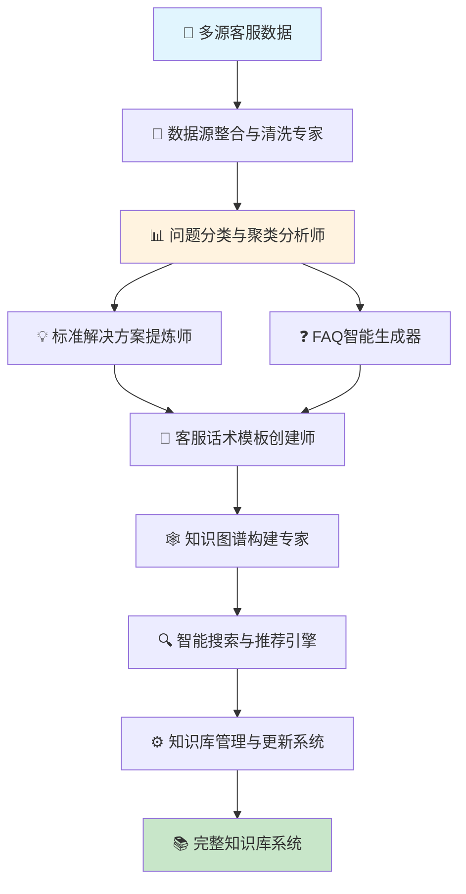
```mermaid
graph TD
    A[📂 多源客服数据] --> B[🧹 数据源整合与清洗专家]
    B --> C[📊 问题分类与聚类分析师]
    C --> D[💡 标准解决方案提炼师]
    C --> E[❓ FAQ智能生成器]
    D --> F[💬 客服话术模板创建师]
    E --> F
    F --> G[🕸️ 知识图谱构建专家]
    G --> H[🔍 智能搜索与推荐引擎]
    H --> I[⚙️ 知识库管理与更新系统]
    I --> J[📚 完整知识库系统]
    
    style A fill:#e1f5fe
    style J fill:#c8e6c9
    style C fill:#fff3e0
```

---

### 2. 客户问题自动分类路由系统

**Workflow 名称**
智能客服问题分类与处理路由平台

**产物描述**
自动分析客户咨询内容，进行智能分类并路由到最合适的处理团队，提供处理优先级和解决建议。

**Start 参数**
```json
{
  "input_channels": "array", // 输入渠道（邮件、在线客服、电话等）
  "team_structure": "object", // 团队结构和专业领域
  "priority_rules": "object", // 优先级判断规则
  "escalation_rules": "object", // 升级处理规则
  "sla_requirements": "object" // 服务水平协议要求
}
```

**Agent 节点设计**

**Agent 1: 多渠道信息汇聚专家**
- **上下文**: 不同渠道的数据格式、客户身份识别、历史记录
- **Prompt**: 从多个渠道收集客户问题，进行统一格式化和客户识别
- **Tools**: 多渠道集成、身份识别、格式转换、重复检测
- **输出**: 统一格式的问题记录、客户身份确认、历史关联

**Agent 2: 问题内容智能解析师**
- **上下文**: 客户问题文本、语言模式、情感表达、关键信息
- **Prompt**: 深度解析客户问题的核心内容、情感状态和紧急程度
- **Tools**: NLP文本分析、意图识别、情感分析、关键信息抽取
- **输出**: 问题核心内容、客户情感状态、关键信息标签

**Agent 3: 智能分类与标签专家**
- **上下文**: 问题分类体系、产品功能模块、业务流程、历史分类
- **Prompt**: 对客户问题进行精确分类，添加相关标签和属性
- **Tools**: 文本分类模型、多标签分类、置信度评估、分类验证
- **输出**: 问题分类结果、相关标签、分类置信度

**Agent 4: 紧急程度与优先级评估师**
- **上下文**: 客户等级、问题类型、业务影响、SLA要求
- **Prompt**: 评估问题的紧急程度和处理优先级，确定响应时限
- **Tools**: 优先级算法、风险评估、客户价值评估、SLA计算
- **输出**: 优先级评分、紧急程度标识、建议响应时间

**Agent 5: 团队匹配与路由专家**
- **上下文**: 团队专业领域、当前工作负载、技能匹配、可用性
- **Prompt**: 根据问题特性和团队能力进行最优匹配和路由
- **Tools**: 技能匹配算法、负载均衡、可用性检查、路由优化
- **输出**: 最佳处理团队、路由决策、负载分配

**Agent 6: 预处理建议生成器**
- **上下文**: 问题类型、历史解决方案、知识库、最佳实践
- **Prompt**: 为处理团队提供预处理建议和相关资源推荐
- **Tools**: 解决方案匹配、资源推荐、最佳实践检索、预处理模板
- **输出**: 处理建议、相关资源、预处理步骤

**Agent 7: 质量监控与反馈收集员**
- **上下文**: 处理结果、客户满意度、处理时效、质量标准
- **Prompt**: 监控处理质量，收集反馈并持续优化分类路由规则
- **Tools**: 质量监控、满意度调查、反馈分析、规则优化
- **输出**: 质量报告、改进建议、规则更新、性能指标

**Workflow 流程图**
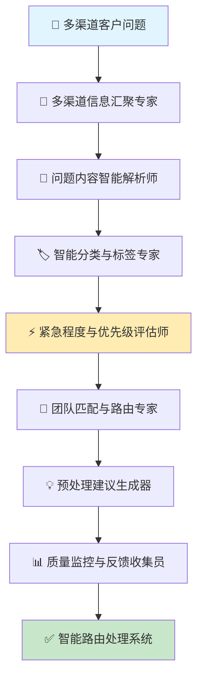
```mermaid
graph TD
    A[📧 多渠道客户问题] --> B[🔗 多渠道信息汇聚专家]
    B --> C[🧠 问题内容智能解析师]
    C --> D[🏷️ 智能分类与标签专家]
    D --> E[⚡ 紧急程度与优先级评估师]
    E --> F[🎯 团队匹配与路由专家]
    F --> G[💡 预处理建议生成器]
    G --> H[📊 质量监控与反馈收集员]
    H --> I[✅ 智能路由处理系统]
    
    style A fill:#e1f5fe
    style I fill:#c8e6c9
    style E fill:#ffecb3
```

---

### 3. 智能客服问答系统

**Workflow 名称**
AI驱动的智能客服实时问答与解决方案推荐平台

**产物描述**
基于客户问题实时提供准确答案和解决方案，包含意图识别、知识匹配、个性化回复、满意度跟踪等完整智能客服体验。

**Start 参数**
```json
{
  "customer_query": "string", // 客户问题
  "customer_context": "object", // 客户背景信息
  "product_info": "object", // 相关产品信息
  "service_level": "string", // 服务等级要求
  "interaction_history": "array", // 历史交互记录
  "urgency_level": "string" // 紧急程度
}
```

**Agent 节点设计**

**Agent 1: 问题意图识别专家**
- **上下文**: 客户问题、语言模式、意图分类、上下文理解
- **Prompt**: 深度理解客户问题的真实意图和潜在需求
- **Tools**: NLP意图识别、语义分析、上下文理解、情感分析
- **输出**: 意图分类、置信度评分、潜在需求、情感状态

**Agent 2: 知识库智能匹配师**
- **上下文**: 问题意图、知识库内容、相似度算法、历史成功案例
- **Prompt**: 从知识库中精确匹配最相关的解决方案和参考信息
- **Tools**: 向量搜索、语义匹配、相似度计算、知识图谱查询
- **输出**: 匹配结果、相关度评分、多个候选方案、参考链接

**Agent 3: 个性化回复生成师**
- **上下文**: 匹配结果、客户信息、品牌语调、服务标准
- **Prompt**: 生成符合客户特点和品牌调性的个性化回复内容
- **Tools**: 文本生成、个性化定制、语调调整、模板应用
- **输出**: 个性化回复、多版本选择、语调适配、表达优化

**Agent 4: 解决方案步骤规划师**
- **上下文**: 问题类型、解决流程、操作复杂度、客户技能水平
- **Prompt**: 将解决方案分解为清晰的操作步骤和指导
- **Tools**: 流程分解、步骤规划、难度评估、可视化指导
- **输出**: 操作步骤、图文指导、视频链接、检查要点

**Agent 5: 相关问题预测师**
- **上下文**: 当前问题、客户行为模式、常见关联问题、预防性建议
- **Prompt**: 预测客户可能遇到的相关问题，提供预防性解决方案
- **Tools**: 问题关联分析、预测模型、用户行为分析、预防建议
- **输出**: 相关问题预测、预防建议、扩展信息、主动服务

**Agent 6: 实时质量监控员**
- **上下文**: 回复质量、客户反应、服务标准、改进机会
- **Prompt**: 实时监控服务质量，识别问题并触发改进机制
- **Tools**: 质量监控、反馈分析、实时调整、警报系统
- **输出**: 质量评估、实时反馈、改进建议、服务调整

**Agent 7: 满意度追踪与优化师**
- **上下文**: 客户满意度、服务效果、后续跟进、持续改进
- **Prompt**: 追踪客户满意度，收集反馈并优化服务流程
- **Tools**: 满意度调查、反馈收集、数据分析、流程优化
- **输出**: 满意度报告、反馈汇总、优化方案、跟进计划

**Workflow 流程图**
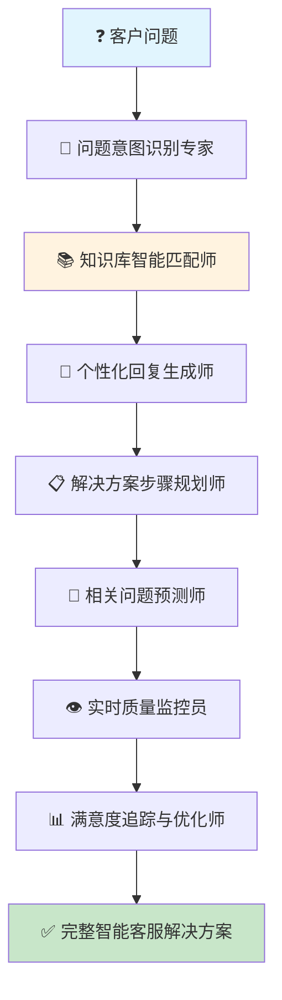
```mermaid
graph TD
    A[❓ 客户问题] --> B[🧠 问题意图识别专家]
    B --> C[📚 知识库智能匹配师]
    C --> D[👤 个性化回复生成师]
    D --> E[📋 解决方案步骤规划师]
    E --> F[🔮 相关问题预测师]
    F --> G[👁️ 实时质量监控员]
    G --> H[📊 满意度追踪与优化师]
    H --> I[✅ 完整智能客服解决方案]
    
    style A fill:#e1f5fe
    style I fill:#c8e6c9
    style C fill:#fff3e0
```

---

### 4. 客户满意度分析器

**Workflow 名称**
客户满意度智能分析与改进建议系统

**产物描述**
自动收集、分析客户满意度数据，生成详细分析报告和改进建议，帮助企业持续提升客户服务质量。

**Start 参数**
```json
{
  "feedback_sources": "array", // 反馈来源（邮件/电话/在线调查等）
  "analysis_period": "string", // 分析时间段
  "service_categories": "array", // 服务类别
  "customer_segments": "array", // 客户细分
  "benchmark_data": "object" // 行业基准数据
}
```

**Agent 节点设计**

**Agent 1: 多渠道反馈收集专家**
- **上下文**: 反馈渠道、数据格式、收集规则、质量标准
- **Prompt**: 从多个渠道自动收集客户满意度反馈数据
- **Tools**: API集成、数据爬取、调查平台、邮件解析
- **输出**: 统一反馈数据、来源标识、质量评估、时间戳

**Agent 2: 情感分析与评分师**
- **上下文**: 反馈文本、情感词典、评分标准、上下文语境
- **Prompt**: 对客户反馈进行情感分析和满意度评分
- **Tools**: 情感分析、文本挖掘、评分算法、语义理解
- **输出**: 情感评分、满意度等级、关键词提取、情感趋势

**Agent 3: 问题分类与根因分析师**
- **上下文**: 客户抱怨、问题分类、根因分析框架、历史模式
- **Prompt**: 对客户不满意的问题进行分类和根因分析
- **Tools**: 文本分类、根因分析、问题聚类、模式识别
- **输出**: 问题分类、根因识别、频次统计、影响评估

**Agent 4: 趋势与模式识别专家**
- **上下文**: 历史数据、时间序列、客户行为、季节性因素
- **Prompt**: 识别满意度变化趋势和模式，预测未来走向
- **Tools**: 趋势分析、模式识别、预测模型、统计分析
- **输出**: 趋势报告、模式识别、预测分析、变化原因

**Agent 5: 客户细分洞察师**
- **上下文**: 客户画像、细分标准、满意度差异、行为特征
- **Prompt**: 按客户细分分析满意度差异，发现洞察机会
- **Tools**: 客户细分、对比分析、洞察挖掘、差异识别
- **输出**: 细分分析、差异报告、洞察发现、优化机会

**Agent 6: 竞争对比与基准分析师**
- **上下文**: 行业基准、竞争对手数据、标杆实践、差距分析
- **Prompt**: 对比行业基准和竞争对手，识别改进空间
- **Tools**: 基准对比、竞争分析、差距识别、最佳实践
- **输出**: 对比分析、差距报告、基准位置、改进目标

**Agent 7: 改进建议与行动计划师**
- **上下文**: 分析结果、改进机会、资源限制、优先级原则
- **Prompt**: 基于分析结果制定具体的改进建议和行动计划
- **Tools**: 方案规划、优先级排序、资源评估、计划制定
- **输出**: 改进方案、行动计划、优先级排序、资源需求

**Agent 8: 报告生成与可视化专家**
- **上下文**: 所有分析结果、报告模板、可视化要求、受众需求
- **Prompt**: 生成专业的满意度分析报告和可视化图表
- **Tools**: 报告生成、数据可视化、图表制作、演示文稿
- **输出**: 完整分析报告、可视化图表、执行摘要、演示文稿

**Workflow 流程图**
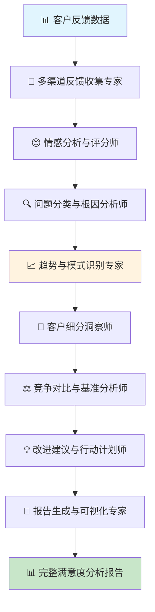
```mermaid
graph TD
    A[📊 客户反馈数据] --> B[📡 多渠道反馈收集专家]
    B --> C[😊 情感分析与评分师]
    C --> D[🔍 问题分类与根因分析师]
    D --> E[📈 趋势与模式识别专家]
    E --> F[👥 客户细分洞察师]
    F --> G[⚖️ 竞争对比与基准分析师]
    G --> H[💡 改进建议与行动计划师]
    H --> I[📄 报告生成与可视化专家]
    I --> J[📊 完整满意度分析报告]
    
    style A fill:#e1f5fe
    style J fill:#c8e6c9
    style E fill:#fff3e0
```

---

### 5. 产品使用指南生成器

**Workflow 名称**
AI驱动的多格式产品使用指南自动化生成平台

**产物描述**
基于产品功能和特点，自动生成包含文字教程、视频指南、交互演示、FAQ等多种格式的完整产品使用指南。

**Start 参数**
```json
{
  "product_info": "object", // 产品基础信息
  "target_users": "array", // 目标用户群体
  "complexity_level": "string", // 复杂度级别
  "output_formats": "array", // 输出格式（文档/视频/交互等）
  "language_requirements": "array", // 语言要求
  "update_frequency": "string" // 更新频率
}
```

**Agent 节点设计**

**Agent 1: 产品功能结构分析师**
- **上下文**: 产品信息、功能模块、用户流程、技术架构
- **Prompt**: 深度分析产品功能结构，建立完整的功能地图
- **Tools**: 功能分析、流程梳理、结构建模、用户旅程
- **输出**: 功能地图、用户流程、操作路径、复杂度评估

**Agent 2: 用户场景与需求分析师**
- **上下文**: 目标用户、使用场景、技能水平、学习偏好
- **Prompt**: 分析不同用户群体的使用场景和指南需求
- **Tools**: 用户研究、场景分析、需求挖掘、偏好识别
- **输出**: 用户画像、场景清单、需求分析、学习路径

**Agent 3: 教程内容策划师**
- **上下文**: 功能分析、用户需求、教学理论、内容结构
- **Prompt**: 策划教程内容结构，设计学习路径和知识点
- **Tools**: 内容策划、教学设计、知识点分解、路径规划
- **输出**: 内容大纲、学习路径、知识点树、难度梯度

**Agent 4: 多格式文档撰写师**
- **上下文**: 内容大纲、写作规范、可读性要求、技术准确性
- **Prompt**: 撰写清晰易懂的多格式文档教程
- **Tools**: 技术写作、多格式输出、可读性优化、准确性检查
- **输出**: 文档教程、多格式版本、结构化内容、检查清单

**Agent 5: 视频脚本与制作师**
- **上下文**: 教程内容、视频规范、演示技巧、后期要求
- **Prompt**: 制作清晰的视频教程和操作演示
- **Tools**: 脚本撰写、屏幕录制、视频编辑、字幕添加
- **输出**: 视频教程、操作演示、分镜脚本、后期文件

**Agent 6: 交互演示设计师**
- **上下文**: 产品界面、交互流程、演示技术、用户体验
- **Prompt**: 设计交互式的产品演示和操作指导
- **Tools**: 交互设计、原型工具、演示制作、用户测试
- **输出**: 交互演示、操作指导、用户界面、体验流程

**Agent 7: FAQ与问题解答师**
- **上下文**: 常见问题、用户困惑、解决方案、支持历史
- **Prompt**: 整理常见问题和解答，建立完整的FAQ体系
- **Tools**: 问题收集、分类整理、解答撰写、搜索优化
- **输出**: FAQ列表、问题分类、解答内容、搜索索引

**Agent 8: 指南整合与发布管理员**
- **上下文**: 所有教程内容、发布平台、版本管理、用户反馈
- **Prompt**: 整合所有指南内容，管理发布和持续更新
- **Tools**: 内容管理、版本控制、发布平台、反馈收集
- **输出**: 完整指南包、发布计划、版本管理、更新机制

**Workflow 流程图**
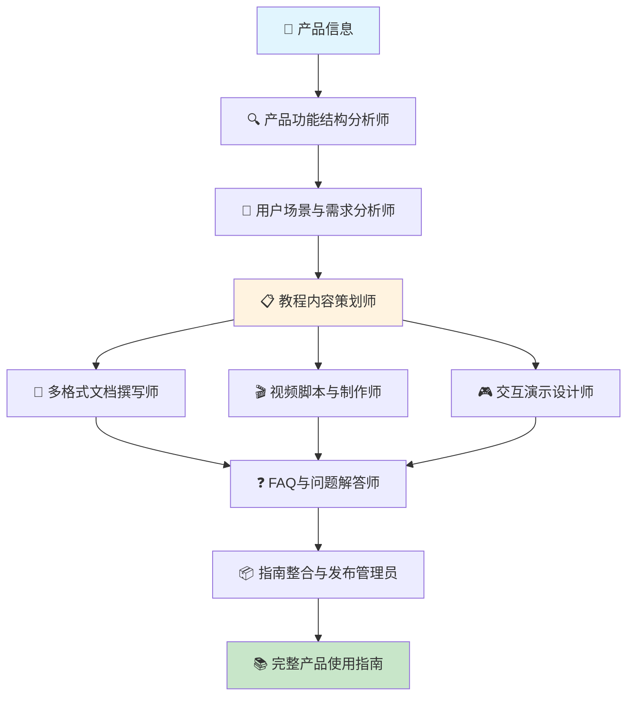
```mermaid
graph TD
    A[📱 产品信息] --> B[🔍 产品功能结构分析师]
    B --> C[👥 用户场景与需求分析师]
    C --> D[📋 教程内容策划师]
    D --> E[📝 多格式文档撰写师]
    D --> F[🎬 视频脚本与制作师]
    D --> G[🎮 交互演示设计师]
    E --> H[❓ FAQ与问题解答师]
    F --> H
    G --> H
    H --> I[📦 指南整合与发布管理员]
    I --> J[📚 完整产品使用指南]
    
    style A fill:#e1f5fe
    style J fill:#c8e6c9
    style D fill:#fff3e0
```

---

### 6. 客服培训资料制作器

**Workflow 名称**
AI驱动的客服培训资料自动化制作系统

**产物描述**
根据产品更新、常见问题和服务标准，自动生成完整的客服培训资料，包含知识手册、案例库、培训课程、考核题库等。

**Start 参数**
```json
{
  "product_updates": "array", // 产品更新内容
  "service_standards": "object", // 服务标准要求
  "common_issues": "array", // 常见问题集
  "training_objectives": "array", // 培训目标
  "staff_levels": "array", // 员工技能级别
  "training_formats": "array" // 培训形式偏好
}
```

**Agent 节点设计**

**Agent 1: 培训需求分析师**
- **上下文**: 产品变化、服务标准、员工能力、培训目标
- **Prompt**: 分析培训需求，识别知识差距和技能提升点
- **Tools**: 需求分析、差距识别、能力评估、目标设定
- **输出**: 培训需求报告、技能差距、学习目标、优先级排序

**Agent 2: 知识内容整理师**
- **上下文**: 产品知识、服务流程、最佳实践、更新内容
- **Prompt**: 整理和更新客服所需的完整知识体系
- **Tools**: 知识整理、内容更新、结构化存储、版本管理
- **输出**: 知识手册、更新内容、结构化知识、版本对比

**Agent 3: 案例库构建师**
- **上下文**: 真实客服案例、问题解决方案、成功经验、失败教训
- **Prompt**: 构建丰富的客服案例库，包含各种情况的处理示例
- **Tools**: 案例收集、场景分类、解决方案、经验提炼
- **输出**: 案例库、场景分类、处理流程、经验总结

**Agent 4: 培训课程设计师**
- **上下文**: 学习目标、课程结构、教学方法、互动设计
- **Prompt**: 设计结构化的培训课程和学习路径
- **Tools**: 课程设计、教学规划、互动设计、进度安排
- **输出**: 课程大纲、教学计划、互动环节、时间安排

**Agent 5: 培训材料制作师**
- **上下文**: 课程内容、视觉设计、多媒体要求、可读性标准
- **Prompt**: 制作专业的培训材料，包含PPT、手册、视频等
- **Tools**: 内容制作、视觉设计、多媒体制作、格式转换
- **输出**: 培训PPT、培训手册、视频教程、音频文件

**Agent 6: 模拟演练设计师**
- **上下文**: 真实场景、角色扮演、技能练习、反馈机制
- **Prompt**: 设计客服模拟演练和角色扮演活动
- **Tools**: 场景设计、角色定义、练习设计、评估标准
- **输出**: 演练方案、角色脚本、评估标准、反馈模板

**Agent 7: 考核题库创建师**
- **上下文**: 学习内容、考核标准、题型设计、难度分级
- **Prompt**: 创建完整的考核题库和评估体系
- **Tools**: 题目设计、答案编写、难度分级、评分标准
- **输出**: 考核题库、评估标准、难度分级、答案解析

**Agent 8: 培训效果评估与优化师**
- **上下文**: 培训效果、学员反馈、技能提升、持续改进
- **Prompt**: 评估培训效果，收集反馈并持续优化培训内容
- **Tools**: 效果评估、反馈收集、数据分析、内容优化
- **输出**: 效果报告、反馈汇总、优化建议、改进计划

**Workflow 流程图**
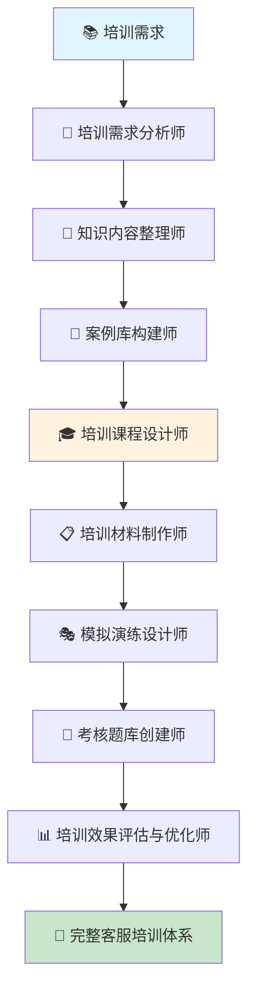
```mermaid
graph TD
    A[📚 培训需求] --> B[🎯 培训需求分析师]
    B --> C[📖 知识内容整理师]
    C --> D[💼 案例库构建师]
    D --> E[🎓 培训课程设计师]
    E --> F[📋 培训材料制作师]
    F --> G[🎭 模拟演练设计师]
    G --> H[📝 考核题库创建师]
    H --> I[📊 培训效果评估与优化师]
    I --> J[🎯 完整客服培训体系]
    
    style A fill:#e1f5fe
    style J fill:#c8e6c9
    style E fill:#fff3e0
```

---

## ✍️ Content Creation (内容创作场景) 详细用例

### 1. Product Hunt 全媒体内容生产器

**Workflow 名称**
Product Hunt 热门产品全媒体内容自动化生产平台

**产物描述**
基于当日 Product Hunt Top 10 产品，自动生成包含深度文章、可视化网页、音频播客、社媒内容的完整内容矩阵，并统一发送汇总。

**Start 参数**
```json
{
  "target_date": "string", // 目标日期（默认今日）
  "content_language": "string", // 内容语言（中文/英文/双语）
  "content_style": "string", // 内容风格（科技资讯/创业观察/产品评测）
  "output_channels": "array", // 输出渠道（邮箱/微信/网站等）
  "depth_level": "string" // 内容深度（简要/标准/深度）
}
```

**Agent 节点设计**

**Agent 1: Product Hunt 数据采集专家**
- **上下文**: Product Hunt API、排行榜规则、产品信息结构
- **Prompt**: 抓取指定日期的热门产品完整信息，包含产品详情、用户反馈等
- **Tools**: Product Hunt API、Web Scraper、Google Sheets、Airtable
- **输出**: 产品数据清单、官网截图、用户评论汇总、基础信息结构

**Agent 2: 产品深度分析研究员**
- **上下文**: 产品信息、竞品对比、市场定位、技术特点
- **Prompt**: 对每个产品进行深度分析，包含商业模式、技术亮点、市场价值
- **Tools**: Google Search、Crunchbase、SimilarWeb、Notion
- **输出**: 产品深度分析报告、亮点提炼、市场定位分析

**Agent 3: 多格式文章创作编辑**
- **上下文**: 产品分析、目标读者、内容风格、文章结构
- **Prompt**: 创作适合不同平台的文章内容，包含公众号、博客、newsletter等
- **Tools**: Google Docs、Notion、Grammarly、Hemingway Editor
- **输出**: 多格式文章内容、标题优化建议、SEO关键词

**Agent 4: 可视化网页设计师**
- **上下文**: 产品信息、视觉设计趋势、用户体验最佳实践
- **Prompt**: 创建美观的可视化网页展示产品信息和分析内容
- **Tools**: Webflow、Framer、Figma、Canva
- **输出**: 完整网页文件、移动端适配、可视化图表、交互元素

**Agent 5: 音频播客制作人**
- **上下文**: 文章内容、播客格式、语音风格、背景音乐
- **Prompt**: 将产品介绍转化为音频播客内容，包含解说和音效
- **Tools**: ElevenLabs、Descript、Audacity、Spotify for Podcasters
- **输出**: 高质量音频文件、播客封面、播放列表、发布指南

**Agent 6: 社媒内容矩阵创作师**
- **上下文**: 核心内容、各平台特性、用户习惯、传播规律
- **Prompt**: 基于核心内容创作适合不同社媒平台的传播内容
- **Tools**: Canva、Buffer、Hootsuite、Google Docs
- **输出**: 多平台社媒内容、发布时机建议、互动策略指南

**Agent 7: 内容质量控制专家**
- **上下文**: 所有产出内容、质量标准、品牌一致性、准确性要求
- **Prompt**: 对所有内容进行质量检查，确保准确性和一致性
- **Tools**: Grammarly、Google Docs、Notion、Google Search
- **输出**: 质量检查报告、修改建议、最终版本确认

**Agent 8: 内容整合与分发员**
- **上下文**: 所有完成内容、分发渠道、接收方信息、发送模板
- **Prompt**: 整合所有内容链接和文件，按要求发送到指定渠道
- **Tools**: Gmail、Mailchimp、Google Drive、Notion
- **输出**: 内容汇总页面、发送确认、访问统计、用户反馈收集

**Workflow 流程图**
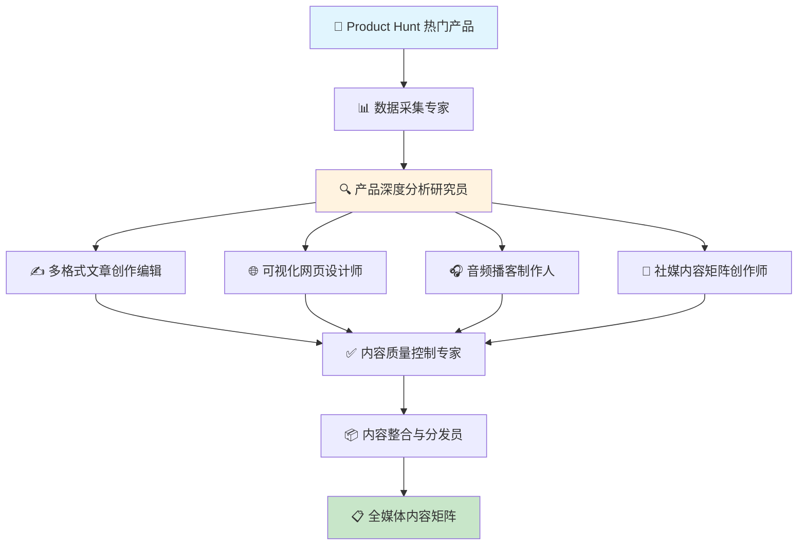
```mermaid
graph TD
    A[🚀 Product Hunt 热门产品] --> B[📊 数据采集专家]
    B --> C[🔍 产品深度分析研究员]
    C --> D[✍️ 多格式文章创作编辑]
    C --> E[🌐 可视化网页设计师]
    C --> F[🎧 音频播客制作人]
    C --> G[📱 社媒内容矩阵创作师]
    D --> H[✅ 内容质量控制专家]
    E --> H
    F --> H
    G --> H
    H --> I[📦 内容整合与分发员]
    I --> J[📋 全媒体内容矩阵]
    
    style A fill:#e1f5fe
    style J fill:#c8e6c9
    style C fill:#fff3e0
```

---

### 2. 多媒体课程制作助手

**Workflow 名称**
AI驱动的在线课程全流程制作平台

**产物描述**
基于课程主题和教学目标，自动生成完整的在线课程内容，包含课程大纲、视频脚本、PPT演示、练习题库、学习资料等。

**Start 参数**
```json
{
  "course_topic": "string", // 课程主题
  "target_audience": "string", // 目标学员群体
  "course_duration": "string", // 课程时长
  "difficulty_level": "string", // 难度级别
  "learning_objectives": "array", // 学习目标
  "preferred_format": "string" // 偏好格式（视频/直播/混合）
}
```

**Agent 节点设计**

**Agent 1: 课程架构设计师**
- **上下文**: 课程主题、学习目标、目标受众、教学理论
- **Prompt**: 设计课程整体架构，制定学习路径和知识体系
- **Tools**: Notion、Miro、Google Docs、Airtable
- **输出**: 课程架构图、学习路径、知识点分解、进度安排

**Agent 2: 详细大纲编写专家**
- **上下文**: 课程架构、教学目标、时间分配、重点难点
- **Prompt**: 编写详细的课程大纲，包含每个章节的目标和重点
- **Tools**: Google Docs、Notion、Microsoft Word、Google Sheets
- **输出**: 详细课程大纲、章节目标、重点难点标识、时间分配表

**Agent 3: 教学内容创作师**
- **上下文**: 课程大纲、专业知识、案例素材、教学方法
- **Prompt**: 创作丰富的教学内容，包含理论讲解、案例分析、实践指导
- **Tools**: Google Docs、Notion、Google Search、Wikipedia
- **输出**: 教学内容文稿、案例库、实践指导、补充资料

**Agent 4: 视频脚本编剧师**
- **上下文**: 教学内容、视频制作要求、表达方式、视觉元素
- **Prompt**: 将教学内容转化为适合视频录制的脚本和分镜
- **Tools**: Google Docs、Notion、Celtx、Final Draft
- **输出**: 视频脚本、分镜头表、视觉设计要求、录制指导

**Agent 5: PPT演示设计师**
- **上下文**: 教学内容、视觉设计规范、信息层次、演示效果
- **Prompt**: 设计专业美观的PPT演示文稿，支持教学和展示
- **Tools**: Microsoft PowerPoint、Google Slides、Canva、Figma
- **输出**: PPT模板、演示文稿、设计规范、使用指南

**Agent 6: 互动练习设计师**
- **上下文**: 学习目标、知识点、评估方式、题型设计
- **Prompt**: 设计多样化的练习题和互动环节，巩固学习效果
- **Tools**: Google Forms、Typeform、Kahoot、Quizizz
- **输出**: 练习题库、互动设计、评估标准、反馈模板

**Agent 7: 学习资料整理师**
- **上下文**: 课程内容、扩展阅读、工具推荐、参考资料
- **Prompt**: 整理和推荐相关学习资料，提供学习支持
- **Tools**: Google Search、Google Scholar、Notion、Google Drive
- **输出**: 学习资料包、推荐清单、工具指南、延伸阅读

**Agent 8: 课程包装与发布专家**
- **上下文**: 所有课程内容、平台要求、营销需求、用户体验
- **Prompt**: 整合所有内容，进行专业包装并准备发布
- **Tools**: Thinkific、Teachable、Google Drive、Canva
- **输出**: 完整课程包、发布计划、推广策略、运营指南

**Workflow 流程图**
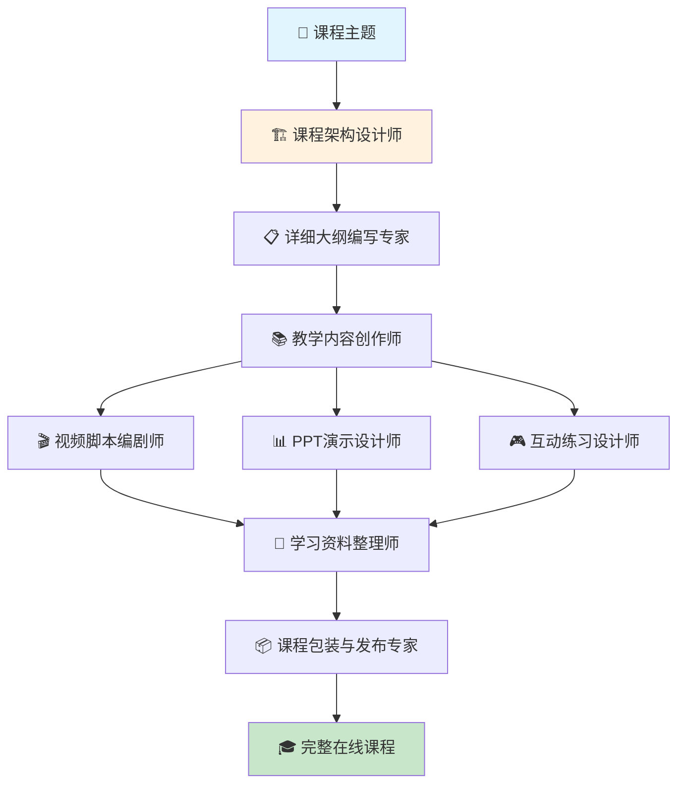
```mermaid
graph TD
    A[🎯 课程主题] --> B[🏗️ 课程架构设计师]
    B --> C[📋 详细大纲编写专家]
    C --> D[📚 教学内容创作师]
    D --> E[🎬 视频脚本编剧师]
    D --> F[📊 PPT演示设计师]
    D --> G[🎮 互动练习设计师]
    E --> H[📖 学习资料整理师]
    F --> H
    G --> H
    H --> I[📦 课程包装与发布专家]
    I --> J[🎓 完整在线课程]
    
    style A fill:#e1f5fe
    style J fill:#c8e6c9
    style B fill:#fff3e0
```

---

### 3. AI插画师与图文内容自动生成器

**Workflow 名称**
AI驱动的多模态创意内容自动化生产系统

**产物描述**
基于文字描述或主题概念，自动生成配套的插画、图片和图文内容，包含多种风格适配、尺寸优化、品牌一致性保证等完整视觉内容解决方案。

**Start 参数**
```json
{
  "content_theme": "string", // 内容主题或描述
  "visual_style": "string", // 视觉风格偏好（插画/摄影/简约/卡通等）
  "brand_guidelines": "object", // 品牌视觉规范
  "output_formats": "array", // 输出格式需求（海报/banner/社交媒体等）
  "target_platforms": "array", // 目标平台（微信/微博/小红书/Instagram等）
  "quantity_requirements": "object" // 数量需求
}
```

**Agent 节点设计**

**Agent 1: 创意概念分析师**
- **上下文**: 内容主题、目标受众、传播目标、文化背景
- **Prompt**: 深度分析创意概念，提炼视觉表达要点和情感传达目标
- **Tools**: 概念分析、关键词提取、情感映射、视觉元素识别
- **输出**: 创意概念报告、视觉关键词、情感色调定义、表达要求

**Agent 2: AI图像生成专家**
- **上下文**: 创意概念、风格要求、技术参数、质量标准
- **Prompt**: 使用AI图像生成技术创作符合要求的原创插画和图片
- **Tools**: DALL-E、Midjourney、Stable Diffusion、Leonardo AI
- **输出**: 多版本原创图像、风格变体、高分辨率文件

**Agent 3: 视觉风格统一师**
- **上下文**: 生成图像、品牌规范、风格一致性要求、平台特征
- **Prompt**: 确保所有视觉元素符合品牌调性和风格一致性
- **Tools**: Photoshop、Canva、Figma、品牌规范检查工具
- **输出**: 风格统一的图像集、品牌元素应用、一致性报告

**Agent 4: 多尺寸适配专家**
- **上下文**: 原始图像、平台规格、设备适配、用途要求
- **Prompt**: 将图像适配为不同平台和用途所需的各种尺寸和比例
- **Tools**: Canva、Figma、Adobe Creative Suite、自动化裁剪工具
- **输出**: 多尺寸图像包、适配说明、使用指南

**Agent 5: 图文内容整合师**
- **上下文**: 图像素材、文案内容、排版规范、阅读体验
- **Prompt**: 将图像与文字内容进行专业排版，创建完整的图文内容
- **Tools**: Canva、Adobe InDesign、Figma、Pages、Google Docs
- **输出**: 图文排版作品、多格式文件、排版规范文档

**Agent 6: 平台特性优化师**
- **上下文**: 目标平台特性、算法偏好、用户习惯、展示效果
- **Prompt**: 针对不同平台特性优化图文内容的展示效果和传播潜力
- **Tools**: 平台分析工具、效果预览、A/B测试、优化建议
- **输出**: 平台优化版本、展示效果预览、投放建议

**Agent 7: 质量控制与版权检查专家**
- **上下文**: 所有生成内容、版权法规、质量标准、合规要求
- **Prompt**: 检查内容质量和版权合规性，确保可安全使用
- **Tools**: 版权检测、质量评估、合规检查、相似度分析
- **输出**: 质量评估报告、版权清洁证明、使用许可说明

**Agent 8: 内容包装与交付管理员**
- **上下文**: 所有完成内容、交付要求、文件管理、使用指南
- **Prompt**: 整理打包所有内容资产，提供完整的交付包和使用指南
- **Tools**: 文件管理、云存储、压缩打包、文档生成
- **输出**: 完整内容资产包、使用手册、技术规格、授权文档

**Workflow 流程图**
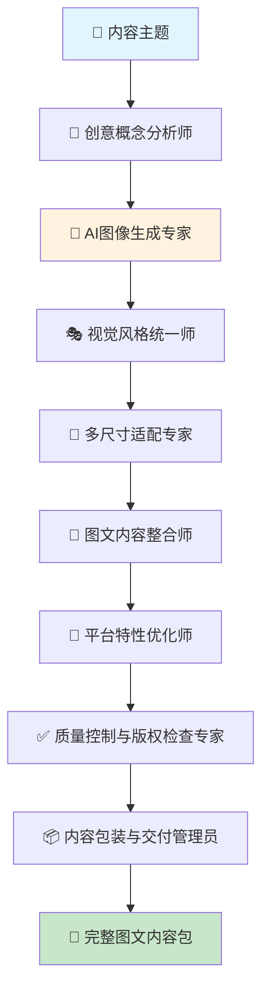
```mermaid
graph TD
    A[📝 内容主题] --> B[💭 创意概念分析师]
    B --> C[🎨 AI图像生成专家]
    C --> D[🎭 视觉风格统一师]
    D --> E[📐 多尺寸适配专家]
    E --> F[📖 图文内容整合师]
    F --> G[📱 平台特性优化师]
    G --> H[✅ 质量控制与版权检查专家]
    H --> I[📦 内容包装与交付管理员]
    I --> J[🎨 完整图文内容包]
    
    style A fill:#e1f5fe
    style J fill:#c8e6c9
    style C fill:#fff3e0
```

---

### 4. 短视频制作流水线

**Workflow 名称**
AI驱动的短视频内容自动化制作平台

**产物描述**
基于热点话题或产品信息，自动生成短视频脚本、制作视频内容、添加字幕音效，输出适配不同平台的完整短视频作品。

**Start 参数**
```json
{
  "video_topic": "string", // 视频主题
  "target_platforms": "array", // 目标平台（抖音/快手/B站/YouTube Shorts）
  "video_style": "string", // 视频风格（教程/娱乐/商业/生活）
  "duration_range": "string", // 时长范围（15s/30s/60s/3min）
  "brand_elements": "object", // 品牌元素要求
  "batch_quantity": "number" // 批量制作数量
}
```

**Agent 节点设计**

**Agent 1: 热点趋势分析师**
- **上下文**: 平台热点、话题趋势、用户兴趣、算法偏好
- **Prompt**: 分析当前热点趋势，结合主题生成有传播潜力的创意角度
- **Tools**: 抖音热榜、微博热搜、Google Trends、BuzzSumo
- **输出**: 热点分析报告、创意角度建议、传播策略、话题标签

**Agent 2: 脚本创意编剧师**
- **上下文**: 创意角度、平台特性、用户注意力模式、叙事技巧
- **Prompt**: 创作吸引人的短视频脚本，包含开头抓取、中间铺垫、结尾呼吁
- **Tools**: 脚本模板、创意写作、故事结构、情感设计
- **输出**: 视频脚本、分镜头表、时间节点、表演指导

**Agent 3: 视觉素材搜集师**
- **上下文**: 脚本需求、视觉风格、素材版权、质量要求
- **Prompt**: 搜集或生成脚本所需的图片、视频素材和背景元素
- **Tools**: Unsplash、Pexels、Shutterstock、AI图像生成、股素材库
- **输出**: 视觉素材包、版权信息、使用授权、质量规格

**Agent 4: 智能视频剪辑师**
- **上下文**: 脚本要求、素材资源、剪辑技巧、平台规范
- **Prompt**: 根据脚本自动剪辑视频，添加转场效果和视觉增强
- **Tools**: Adobe Premiere、Final Cut Pro、DaVinci Resolve、自动剪辑工具
- **输出**: 初版视频、剪辑时间线、效果应用、质量检查

**Agent 5: 字幕与文案叠加专家**
- **上下文**: 视频内容、字幕同步、可读性要求、平台规范
- **Prompt**: 添加准确同步的字幕，插入必要的文案说明和品牌元素
- **Tools**: 字幕生成、文字叠加、同步校准、字体设计
- **输出**: 字幕文件、文案叠加、同步校准、可读性优化

**Agent 6: 音效与背景音乐配置师**
- **上下文**: 视频情感基调、平台音频规范、版权要求、用户偏好
- **Prompt**: 选择合适的背景音乐和音效，增强视频的情感表达力
- **Tools**: 音效库、版权音乐、音频编辑、音量平衡
- **输出**: 音频配置、音效同步、音量调节、版权授权

**Agent 7: 平台适配优化师**
- **上下文**: 不同平台规格、算法偏好、用户习惯、展示效果
- **Prompt**: 针对不同平台调整视频格式、尺寸、时长和展示方式
- **Tools**: 格式转换、尺寸调整、压缩优化、效果预览
- **输出**: 多平台版本、规格说明、上传建议、展示预览

**Agent 8: 发布策略与数据追踪管理员**
- **上下文**: 视频内容、发布时机、用户活跃度、数据监控
- **Prompt**: 制定发布策略，设置数据追踪，监控传播效果
- **Tools**: 社媒管理工具、数据分析、定时发布、效果监控
- **输出**: 发布计划、数据追踪、效果分析、优化建议

**Workflow 流程图**
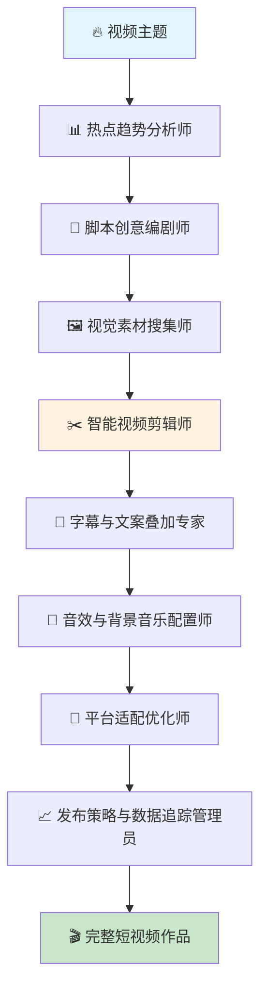
```mermaid
graph TD
    A[🔥 视频主题] --> B[📊 热点趋势分析师]
    B --> C[📝 脚本创意编剧师]
    C --> D[🖼️ 视觉素材搜集师]
    D --> E[✂️ 智能视频剪辑师]
    E --> F[📝 字幕与文案叠加专家]
    F --> G[🎵 音效与背景音乐配置师]
    G --> H[📱 平台适配优化师]
    H --> I[📈 发布策略与数据追踪管理员]
    I --> J[🎬 完整短视频作品]
    
    style A fill:#e1f5fe
    style J fill:#c8e6c9
    style E fill:#fff3e0
```

---

### 5. 播客节目制作流水线

**Workflow 名称**
AI驱动的播客节目自动化制作系统

**产物描述**
从选题策划到音频制作的全流程自动化，包含内容研究、文稿撰写、语音合成、音频后期、节目包装等完整播客制作解决方案。

**Start 参数**
```json
{
  "podcast_topic": "string", // 播客主题
  "episode_format": "string", // 节目形式（独白/对话/访谈/故事）
  "target_duration": "string", // 目标时长
  "voice_style": "string", // 语音风格偏好
  "target_audience": "string", // 目标听众
  "series_branding": "object" // 系列品牌元素
}
```

**Agent 节点设计**

**Agent 1: 播客选题策划师**
- **上下文**: 目标主题、受众兴趣、行业趋势、节目定位
- **Prompt**: 策划具有吸引力的播客选题，设计节目结构和内容框架
- **Tools**: 趋势分析、受众调研、内容策划、节目规划
- **输出**: 节目大纲、内容框架、话题要点、时间分配

**Agent 2: 深度内容研究员**
- **上下文**: 选题方向、权威信息源、事实核查、观点多样性
- **Prompt**: 深入研究选题相关内容，收集权威资料和多元观点
- **Tools**: 学术搜索、新闻聚合、专家观点、事实核查
- **输出**: 研究资料包、权威引用、观点整理、事实验证

**Agent 3: 播客文稿撰写师**
- **上下文**: 研究资料、节目风格、语言特点、听觉体验
- **Prompt**: 撰写适合播客的口语化文稿，注重节奏和听觉效果
- **Tools**: 口语化写作、节奏设计、情感表达、可听性优化
- **输出**: 播客文稿、语调标记、停顿设计、表达指导

**Agent 4: AI语音合成师**
- **上下文**: 播客文稿、语音风格、情感表达、技术参数
- **Prompt**: 使用AI语音技术生成自然流畅的播客音频
- **Tools**: ElevenLabs、Azure Speech、Google Text-to-Speech、自定义语音
- **输出**: 原始音频、语音参数、质量评估、时长统计

**Agent 5: 音频后期制作师**
- **上下文**: 原始音频、后期标准、音质要求、播客规范
- **Prompt**: 对音频进行专业后期处理，包含降噪、均衡、压缩等
- **Tools**: Audacity、Adobe Audition、Logic Pro、音频处理插件
- **输出**: 后期音频、音质报告、处理日志、技术参数

**Agent 6: 节目包装设计师**
- **上下文**: 音频内容、品牌元素、播客平台规范、视觉设计
- **Prompt**: 设计播客封面、片头片尾，制作节目介绍和推广素材
- **Tools**: Canva、Adobe Creative Suite、音频编辑、视觉设计
- **输出**: 节目封面、音频包装、介绍文案、推广素材

**Agent 7: 多平台发布准备师**
- **上下文**: 完整节目、平台要求、SEO优化、推广策略
- **Prompt**: 准备不同播客平台的发布版本和优化策略
- **Tools**: 播客平台、RSS生成、SEO优化、标签设置
- **输出**: 发布包、平台适配、SEO优化、推广计划

**Agent 8: 节目数据分析与优化师**
- **上下文**: 发布数据、听众反馈、播放统计、改进空间
- **Prompt**: 分析节目数据，收集反馈并提供优化建议
- **Tools**: 数据分析、反馈收集、趋势监控、优化建议
- **输出**: 数据报告、反馈分析、优化方案、下期改进

**Workflow 流程图**
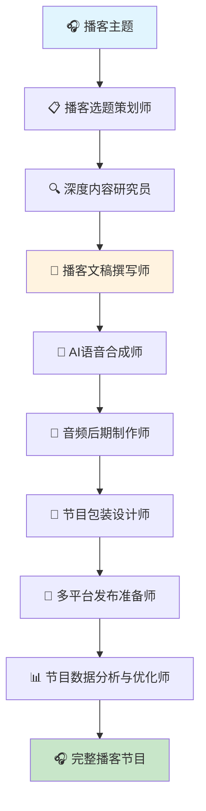
```mermaid
graph TD
    A[🎧 播客主题] --> B[📋 播客选题策划师]
    B --> C[🔍 深度内容研究员]
    C --> D[📝 播客文稿撰写师]
    D --> E[🎤 AI语音合成师]
    E --> F[🎵 音频后期制作师]
    F --> G[🎨 节目包装设计师]
    G --> H[📡 多平台发布准备师]
    H --> I[📊 节目数据分析与优化师]
    I --> J[🎧 完整播客节目]
    
    style A fill:#e1f5fe
    style J fill:#c8e6c9
    style D fill:#fff3e0
```

---

## 💼 Business Operations (业务运营场景) 详细用例

### 1. HR招聘流程自动化系统

**Workflow 名称**
AI驱动的智能招聘全流程管理平台

**产物描述**
从简历筛选到入职办理的全流程自动化，包含简历智能筛选、面试安排、背景调查、offer管理、入职流程等完整招聘解决方案。

**Start 参数**
```json
{
  "job_requirements": "object", // 岗位需求详情
  "resume_sources": "array", // 简历来源渠道
  "company_info": "object", // 公司信息和文化
  "hiring_team": "object", // 招聘团队配置
  "process_preferences": "object" // 流程偏好设置
}
```

**Agent 节点设计**

**Agent 1: 简历智能解析与筛选专家**
- **上下文**: 岗位要求、简历格式、筛选标准、评分规则
- **Prompt**: 自动解析简历信息，进行智能匹配和初步筛选
- **Tools**: 简历解析、信息抽取、技能匹配、教育背景验证、工作经历分析
- **输出**: 结构化简历数据、匹配度评分、筛选结果、推荐理由

**Agent 2: 候选人背景调研专家**
- **上下文**: 候选人信息、职业履历、社交媒体、公开信息
- **Prompt**: 深度调研候选人背景，验证信息真实性和职业表现
- **Tools**: 背景调查、社交媒体分析、工作履历验证、信用记录查询
- **输出**: 背景调查报告、风险评估、信息验证结果

**Agent 3: 面试流程智能调度师**
- **上下文**: 面试官日程、候选人可用时间、面试要求、会议室安排
- **Prompt**: 智能安排面试时间，协调各方日程和面试环节
- **Tools**: 日程管理、时间协调、会议安排、提醒通知、冲突解决
- **输出**: 面试安排表、日程通知、面试指南、协调记录

**Agent 4: 面试问题定制化生成器**
- **上下文**: 岗位要求、候选人背景、面试类型、评估维度
- **Prompt**: 基于岗位和候选人特点生成个性化面试问题库
- **Tools**: 问题生成、技能评估、情景设计、行为面试、技术面试
- **输出**: 个性化问题库、评估标准、面试指南、记录模板

**Agent 5: 面试结果综合评估师**
- **上下文**: 面试记录、评分结果、多轮面试、评估标准
- **Prompt**: 综合分析面试结果，生成候选人评估报告
- **Tools**: 评分汇总、能力评估、文化匹配、潜力分析、决策支持
- **输出**: 综合评估报告、录用建议、能力雷达图、发展建议

**Agent 6: Offer制定与谈判助手**
- **上下文**: 候选人期望、市场薪酬、公司预算、谈判策略
- **Prompt**: 制定合理的offer方案，提供谈判策略和话术
- **Tools**: 薪酬分析、市场对比、谈判策略、方案优化、风险评估
- **输出**: Offer方案、谈判策略、薪酬建议、谈判话术

**Agent 7: 入职流程管理专家**
- **上下文**: 入职checklist、系统权限、培训安排、用品准备
- **Prompt**: 管理新员工入职流程，确保顺利完成各项手续
- **Tools**: 流程管理、任务分配、进度跟踪、权限配置、培训安排
- **输出**: 入职计划、任务清单、进度报告、培训安排

**Agent 8: 招聘数据分析与优化师**
- **上下文**: 招聘全流程数据、效果指标、成本分析、优化建议
- **Prompt**: 分析招聘效果，识别瓶颈并提供流程优化建议
- **Tools**: 数据分析、效率评估、成本核算、瓶颈识别、优化建议
- **输出**: 招聘分析报告、效率指标、优化方案、改进建议

**Workflow 流程图**
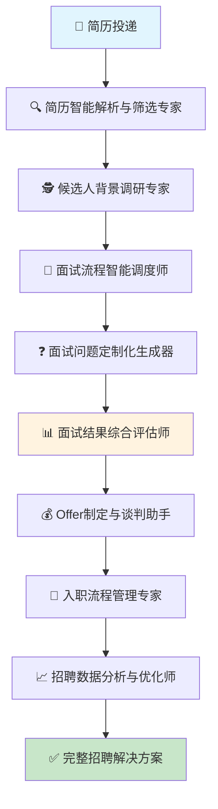
```mermaid
graph TD
    A[📄 简历投递] --> B[🔍 简历智能解析与筛选专家]
    B --> C[🕵️ 候选人背景调研专家]
    C --> D[📅 面试流程智能调度师]
    D --> E[❓ 面试问题定制化生成器]
    E --> F[📊 面试结果综合评估师]
    F --> G[💰 Offer制定与谈判助手]
    G --> H[🎯 入职流程管理专家]
    H --> I[📈 招聘数据分析与优化师]
    I --> J[✅ 完整招聘解决方案]
    
    style A fill:#e1f5fe
    style J fill:#c8e6c9
    style F fill:#fff3e0
```

---

### 2. 财务报表自动生成器

**Workflow 名称**
AI驱动的企业财务报表智能生成平台

**产物描述**
基于企业业务数据和会计准则，自动生成标准财务报表，包含资产负债表、利润表、现金流量表及相关分析报告。

**Start 参数**
```json
{
  "company_info": "object", // 企业基本信息
  "accounting_period": "string", // 会计期间
  "data_sources": "array", // 数据来源系统
  "report_standards": "string", // 会计准则（国内/国际）
  "report_types": "array" // 报表类型需求
}
```

**Agent 节点设计**

**Agent 1: 财务数据整合与清洗专家**
- **上下文**: 多源业务数据、会计科目、数据格式、质量标准
- **Prompt**: 从各业务系统整合财务数据，进行清洗和标准化处理
- **Tools**: 数据集成、ETL处理、科目映射、数据验证、异常检测
- **输出**: 标准化财务数据、数据质量报告、异常明细

**Agent 2: 会计分录智能生成器**
- **上下文**: 业务交易、会计准则、科目设置、分录规则
- **Prompt**: 基于业务交易自动生成符合准则的会计分录
- **Tools**: 业务识别、分录规则、科目选择、借贷平衡、准则匹配
- **输出**: 会计分录明细、科目汇总、借贷平衡验证

**Agent 3: 资产负债表编制专家**
- **上下文**: 会计分录、科目余额、报表格式、分类规则
- **Prompt**: 编制标准格式的资产负债表，确保数据准确性
- **Tools**: 科目汇总、分类整理、格式规范、数据校验、平衡检查
- **输出**: 资产负债表、科目明细、平衡验证报告

**Agent 4: 利润表编制分析师**
- **上下文**: 收入成本数据、费用明细、利润计算、期间匹配
- **Prompt**: 编制利润表并进行盈利能力分析
- **Tools**: 收入确认、成本归集、费用分类、利润计算、趋势分析
- **输出**: 利润表、盈利分析、成本结构分析

**Agent 5: 现金流量表制作师**
- **上下文**: 现金流明细、分类标准、调节方法、流量分析
- **Prompt**: 编制现金流量表，分析企业现金流状况
- **Tools**: 现金流分类、直接法间接法、流量计算、趋势分析
- **输出**: 现金流量表、流量分析、资金状况评估

**Agent 6: 财务比率分析专家**
- **上下文**: 财务报表数据、行业基准、历史对比、分析框架
- **Prompt**: 计算关键财务比率，进行综合财务分析
- **Tools**: 比率计算、趋势分析、同业对比、风险评估、预警指标
- **输出**: 财务比率表、分析报告、风险提示、改进建议

**Agent 7: 报表附注编写师**
- **上下文**: 会计政策、重要事项、估计变更、关联交易
- **Prompt**: 编写报表附注，说明重要会计政策和事项
- **Tools**: 政策整理、事项识别、附注模板、信息披露、合规检查
- **输出**: 报表附注、披露清单、合规检查报告

**Agent 8: 综合财务报告整合员**
- **上下文**: 所有报表和分析、管理要求、监管要求、格式规范
- **Prompt**: 整合所有财务信息，生成完整的财务报告包
- **Tools**: 报告整合、格式统一、版本控制、审核流程、分发管理
- **输出**: 完整财务报告、管理报告、监管报送材料

**Workflow 流程图**
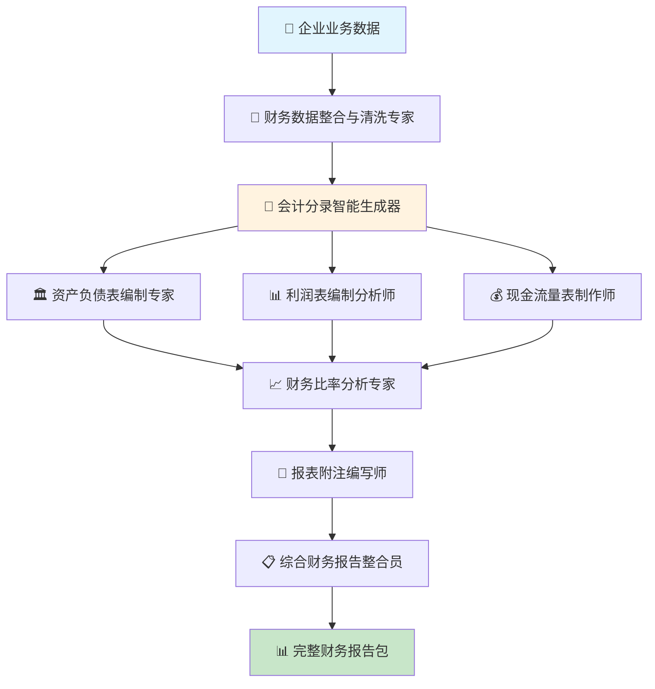
```mermaid
graph TD
    A[💾 企业业务数据] --> B[🧹 财务数据整合与清洗专家]
    B --> C[📝 会计分录智能生成器]
    C --> D[🏛️ 资产负债表编制专家]
    C --> E[📊 利润表编制分析师]
    C --> F[💰 现金流量表制作师]
    D --> G[📈 财务比率分析专家]
    E --> G
    F --> G
    G --> H[📄 报表附注编写师]
    H --> I[📋 综合财务报告整合员]
    I --> J[📊 完整财务报告包]
    
    style A fill:#e1f5fe
    style J fill:#c8e6c9
    style C fill:#fff3e0
```

---

## 🎓 Education & Training (教育培训场景) 详细用例

### 1. 个性化学习路径规划器

**Workflow 名称**
AI驱动的个性化学习路径智能规划系统

**产物描述**
基于学员基础水平、学习目标和学习偏好，自动生成个性化的学习路径，包含课程推荐、进度安排、资源配置和评估方案。

**Start 参数**
```json
{
  "learner_profile": "object", // 学员基础信息和水平
  "learning_goals": "array", // 学习目标和期望
  "time_constraints": "object", // 时间限制和学习强度
  "learning_preferences": "object", // 学习偏好和风格
  "available_resources": "array" // 可用学习资源
}
```

**Agent 节点设计**

**Agent 1: 学员能力评估专家**
- **上下文**: 学员背景、测试结果、历史学习数据、能力模型
- **Prompt**: 全面评估学员当前能力水平和学习特点
- **Tools**: 能力测试、水平评估、学习风格分析、知识图谱匹配
- **输出**: 能力评估报告、知识掌握图谱、学习风格画像

**Agent 2: 学习目标分解与分析师**
- **上下文**: 学习目标、技能要求、知识体系、能力模型
- **Prompt**: 将宏观学习目标分解为具体的学习单元和技能点
- **Tools**: 目标分解、技能树构建、前置条件分析、依赖关系映射
- **输出**: 学习目标树、技能点清单、依赖关系图

**Agent 3: 最优学习路径规划师**
- **上下文**: 能力现状、目标技能、学习资源、时间约束
- **Prompt**: 设计从当前水平到目标能力的最优学习路径
- **Tools**: 路径优化算法、前置条件检查、难度梯度设计、时间估算
- **输出**: 个性化学习路径、学习序列、时间安排

**Agent 4: 课程资源智能推荐师**
- **上下文**: 学习路径、课程库、资源特性、学习偏好
- **Prompt**: 为每个学习阶段推荐最合适的课程和学习资源
- **Tools**: 推荐算法、资源匹配、质量评估、多样性平衡
- **输出**: 课程推荐清单、资源配置方案、替代选项

**Agent 5: 学习进度监控与调整专家**
- **上下文**: 学习计划、实际进度、掌握情况、调整规则
- **Prompt**: 监控学习进度，动态调整学习计划和难度
- **Tools**: 进度追踪、掌握度评估、自适应调整、预警机制
- **输出**: 进度监控报告、调整建议、预警提示

**Agent 6: 个性化练习与评估设计师**
- **上下文**: 学习内容、能力要求、评估标准、练习库
- **Prompt**: 设计针对性的练习和评估，巩固学习效果
- **Tools**: 练习生成、难度匹配、评估设计、反馈机制
- **输出**: 个性化练习、评估方案、反馈模板

**Agent 7: 学习激励与干预策略师**
- **上下文**: 学习行为、动机水平、困难点、干预手段
- **Prompt**: 设计学习激励机制和困难干预策略
- **Tools**: 行为分析、动机识别、激励设计、干预策略
- **输出**: 激励方案、干预策略、支持计划

**Agent 8: 学习效果评估与优化师**
- **上下文**: 学习结果、目标达成、学习效率、改进空间
- **Prompt**: 评估学习效果，优化学习路径和方法
- **Tools**: 效果评估、学习分析、路径优化、方法改进
- **输出**: 学习效果报告、优化建议、改进方案

**Workflow 流程图**
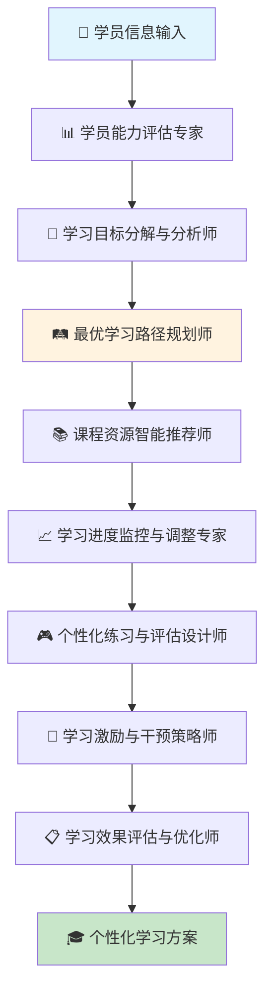
```mermaid
graph TD
    A[👤 学员信息输入] --> B[📊 学员能力评估专家]
    B --> C[🎯 学习目标分解与分析师]
    C --> D[🛤️ 最优学习路径规划师]
    D --> E[📚 课程资源智能推荐师]
    E --> F[📈 学习进度监控与调整专家]
    F --> G[🎮 个性化练习与评估设计师]
    G --> H[🎊 学习激励与干预策略师]
    H --> I[📋 学习效果评估与优化师]
    I --> J[🎓 个性化学习方案]
    
    style A fill:#e1f5fe
    style J fill:#c8e6c9
    style D fill:#fff3e0
```

---

## 🔧 Technical Development (技术开发场景) 详细用例

### 1. API文档自动生成器

**Workflow 名称**
智能化API文档自动生成与维护平台

**产物描述**
基于代码注释、接口定义和测试用例，自动生成完整的API文档，包含接口说明、参数定义、示例代码、测试指南等。

**Start 参数**
```json
{
  "code_repository": "string", // 代码仓库路径
  "api_framework": "string", // API框架类型
  "documentation_style": "string", // 文档风格偏好
  "output_formats": "array", // 输出格式要求
  "team_conventions": "object" // 团队编码规范
}
```

**Agent 节点设计**

**Agent 1: 代码结构解析专家**
- **上下文**: 项目结构、编程语言、框架特性、代码规范
- **Prompt**: 深度解析代码结构，识别API接口和相关组件
- **Tools**: AST解析、代码扫描、结构分析、依赖关系识别
- **输出**: 代码结构图、API接口清单、组件关系图

**Agent 2: 接口信息提取师**
- **上下文**: API定义、函数签名、注释内容、类型系统
- **Prompt**: 提取API接口的详细信息，包含参数、返回值、异常等
- **Tools**: 接口分析、参数提取、类型推断、异常识别
- **输出**: 接口信息表、参数定义、类型规范

**Agent 3: 文档内容生成器**
- **上下文**: 接口信息、业务逻辑、使用场景、最佳实践
- **Prompt**: 生成清晰易懂的API文档内容和使用说明
- **Tools**: 内容生成、描述优化、用法说明、场景示例
- **输出**: 文档草稿、接口描述、使用指南

**Agent 4: 代码示例自动生成师**
- **上下文**: API接口、编程语言、客户端库、使用模式
- **Prompt**: 为每个API生成多语言的代码示例和用法演示
- **Tools**: 代码生成、多语言适配、示例优化、最佳实践
- **输出**: 代码示例库、多语言版本、使用模板

**Agent 5: 测试用例文档化专家**
- **上下文**: 测试代码、测试场景、边界条件、错误处理
- **Prompt**: 将测试用例转化为文档化的测试指南和验证方法
- **Tools**: 测试分析、场景提取、指南生成、验证方法
- **输出**: 测试指南、验证步骤、测试场景

**Agent 6: 交互式文档设计师**
- **上下文**: 文档内容、交互需求、用户体验、现代化设计
- **Prompt**: 设计交互式的API文档界面，支持在线测试和探索
- **Tools**: 界面设计、交互实现、在线测试、文档网站生成
- **输出**: 交互式文档、在线测试界面、导航结构

**Agent 7: 版本管理与更新追踪师**
- **上下文**: 代码变更、版本历史、兼容性、更新日志
- **Prompt**: 管理文档版本，追踪API变更并生成更新日志
- **Tools**: 版本控制、变更检测、兼容性分析、日志生成
- **输出**: 版本管理、更新日志、兼容性报告

**Agent 8: 文档质量保证与发布专家**
- **上下文**: 文档内容、质量标准、发布流程、用户反馈
- **Prompt**: 确保文档质量，管理发布流程并收集用户反馈
- **Tools**: 质量检查、内容审核、发布管理、反馈收集
- **输出**: 最终文档、发布计划、质量报告

**Workflow 流程图**
```mermaid
graph TD
    A[💻 代码仓库] --> B[🔍 代码结构解析专家]
    B --> C[📝 接口信息提取师]
    C --> D[📄 文档内容生成器]
    C --> E[💻 代码示例自动生成师]
    D --> F[🧪 测试用例文档化专家]
    E --> F
    F --> G[🌐 交互式文档设计师]
    G --> H[📋 版本管理与更新追踪师]
    H --> I[✅ 文档质量保证与发布专家]
    I --> J[📚 完整API文档]
    
    style A fill:#e1f5fe
    style J fill:#c8e6c9
    style C fill:#fff3e0
```

---

## 🎨 Creative Design (创意设计场景) 详细用例

### 1. 品牌视觉识别系统生成器

**Workflow 名称**
AI驱动的品牌视觉识别系统智能设计平台

**产物描述**
基于品牌定位和设计需求，自动生成完整的品牌视觉识别系统，包含Logo设计、色彩体系、字体规范、应用指南等全套品牌设计资产。

**Start 参数**
```json
{
  "brand_info": "object", // 品牌基础信息和定位
  "design_preferences": "object", // 设计风格偏好
  "target_audience": "string", // 目标受众群体
  "industry_context": "string", // 行业背景和特点
  "application_scenarios": "array" // 应用场景需求
}
```

**Agent 节点设计**

**Agent 1: 品牌概念分析师**
- **上下文**: 品牌信息、市场定位、竞品分析、文化背景
- **Prompt**: 深度分析品牌核心概念，提炼设计方向和视觉关键词
- **Tools**: 品牌分析、概念提取、关键词生成、情感映射
- **输出**: 品牌概念报告、设计关键词、情感色彩定义

**Agent 2: Logo创意设计师**
- **上下文**: 品牌概念、设计趋势、符号学原理、可用性要求
- **Prompt**: 创作具有品牌特色的Logo设计方案，考虑多场景应用
- **Tools**: AI图形生成、符号设计、创意组合、可用性测试
- **输出**: Logo设计方案、设计理念说明、应用演示

**Agent 3: 色彩体系规划师**
- **上下文**: 品牌调性、色彩心理学、行业特点、文化因素
- **Prompt**: 建立完整的品牌色彩体系，包含主色、辅色、应用规则
- **Tools**: 色彩理论、心理分析、搭配算法、和谐度检测
- **输出**: 色彩体系方案、色彩规范、应用指导

**Agent 4: 字体系统设计师**
- **上下文**: 品牌个性、可读性要求、多语言支持、技术限制
- **Prompt**: 选择和定制符合品牌特质的字体系统
- **Tools**: 字体分析、个性匹配、可读性测试、组合优化
- **输出**: 字体规范、层级体系、使用指南

**Agent 5: 视觉元素库创建师**
- **上下文**: 品牌视觉语言、设计系统、元素复用、一致性要求
- **Prompt**: 创建品牌专属的视觉元素库和设计模式
- **Tools**: 元素设计、模式生成、样式规范、组件库构建
- **输出**: 视觉元素库、设计模式、组件规范

**Agent 6: 应用场景设计专家**
- **上下文**: 应用需求、媒介特性、技术限制、用户体验
- **Prompt**: 设计品牌在各种应用场景中的具体呈现方案
- **Tools**: 应用设计、场景适配、效果预览、规范制定
- **输出**: 应用设计案例、适配方案、使用规范

**Agent 7: 品牌指南编撰师**
- **上下文**: 所有设计元素、使用规则、品牌标准、团队协作
- **Prompt**: 编撰完整的品牌视觉识别指南和使用手册
- **Tools**: 指南编写、规范整理、案例展示、培训材料
- **输出**: 品牌指南手册、使用规范、培训资料

**Agent 8: 品牌资产管理与交付专家**
- **上下文**: 所有设计资产、文件管理、版本控制、交付要求
- **Prompt**: 整理和管理所有品牌设计资产，准备交付包
- **Tools**: 资产管理、文件整理、版本控制、打包交付
- **输出**: 完整品牌资产包、管理系统、交付清单

**Workflow 流程图**
```mermaid
graph TD
    A[🏷️ 品牌基础信息] --> B[💭 品牌概念分析师]
    B --> C[🎨 Logo创意设计师]
    B --> D[🌈 色彩体系规划师]
    B --> E[📝 字体系统设计师]
    C --> F[🎭 视觉元素库创建师]
    D --> F
    E --> F
    F --> G[📱 应用场景设计专家]
    G --> H[📖 品牌指南编撰师]
    H --> I[📦 品牌资产管理与交付专家]
    I --> J[🎨 完整品牌识别系统]
    
    style A fill:#e1f5fe
    style J fill:#c8e6c9
    style B fill:#fff3e0
```

---

## 📊 Data Processing & Integration (数据处理与集成场景) 详细用例

### 1. 多系统数据整合器

**Workflow 名称**
企业级多源数据智能整合平台

**产物描述**
自动从多个业务系统提取、清洗、转换和整合数据，生成统一的数据视图和分析报告，消除数据孤岛问题。

**Start 参数**
```json
{
  "data_sources": "array", // 数据源列表（CRM、ERP、财务系统等）
  "target_schema": "object", // 目标数据结构
  "integration_rules": "object", // 数据整合规则
  "quality_requirements": "object", // 数据质量要求
  "output_format": "string" // 输出格式（数据库/Excel/API）
}
```

**Agent 节点设计**

**Agent 1: 数据源连接与发现专家**
- **上下文**: 系统连接信息、数据源类型、访问权限、数据结构
- **Prompt**: 连接各个数据源，探索数据结构和内容特征
- **Tools**: MySQL、PostgreSQL、Salesforce API、HubSpot API
- **输出**: 数据源清单、结构映射、连接状态报告

**Agent 2: 数据质量评估师**
- **上下文**: 数据质量标准、完整性要求、准确性规则
- **Prompt**: 评估各数据源的质量状况，识别问题和异常
- **Tools**: Google Sheets、Microsoft Excel、Airtable、Notion Database
- **输出**: 数据质量报告、问题清单、清洗建议

**Agent 3: 智能数据清洗专家**
- **上下文**: 数据质量问题、清洗规则、业务逻辑、历史模式
- **Prompt**: 自动清洗数据，处理缺失值、重复项和格式问题
- **Tools**: Google Sheets、OpenRefine、Trifacta、Zapier
- **输出**: 清洗后数据、处理日志、质量改善报告

**Agent 4: 数据转换与标准化师**
- **上下文**: 目标格式、转换规则、业务映射、标准化要求
- **Prompt**: 将各源数据转换为统一格式，进行标准化处理
- **Tools**: Zapier、Make (Integromat)、Google Sheets、Airtable
- **输出**: 标准化数据、转换规则、映射文档

**Agent 5: 数据关联与合并专家**
- **上下文**: 关联键、合并规则、冲突解决策略、业务逻辑
- **Prompt**: 基于业务逻辑关联不同源的数据，处理冲突和重复
- **Tools**: Google Sheets、Airtable、Microsoft Excel、Notion Database
- **输出**: 整合数据集、关联关系图、冲突处理报告

**Agent 6: 数据验证与校验员**
- **上下文**: 业务规则、完整性约束、逻辑一致性要求
- **Prompt**: 验证整合后数据的完整性和一致性
- **Tools**: Google Sheets、Airtable、Google Forms、Typeform
- **输出**: 验证报告、问题列表、数据信心度评分

**Agent 7: 输出格式化与发布专家**
- **上下文**: 输出要求、目标系统、格式规范、发布计划
- **Prompt**: 将整合数据按要求格式化并发布到目标系统
- **Tools**: Google Drive、Dropbox、Salesforce、HubSpot
- **输出**: 最终数据产品、发布确认、访问文档

**Workflow 流程图**
```mermaid
graph TD
    A[🗃️ 多个业务系统] --> B[🔗 数据源连接与发现专家]
    B --> C[🔍 数据质量评估师]
    C --> D[🧹 智能数据清洗专家]
    D --> E[🔄 数据转换与标准化师]
    E --> F[🔗 数据关联与合并专家]
    F --> G[✅ 数据验证与校验员]
    G --> H[📤 输出格式化与发布专家]
    H --> I[📊 统一数据视图]
    
    style A fill:#e1f5fe
    style I fill:#c8e6c9
    style F fill:#fff3e0
```

---

### 2. Excel工作流自动化

**Workflow 名称**
企业Excel流程智能自动化平台

**产物描述**
将复杂的Excel操作流程转化为自动化工作流，消除手工错误，支持定期执行和实时更新。

**Start 参数**
```json
{
  "excel_files": "array", // Excel文件列表
  "process_description": "string", // 流程描述
  "schedule_settings": "object", // 定时执行设置
  "output_requirements": "object", // 输出要求
  "notification_config": "object" // 通知配置
}
```

**Agent 节点设计**

**Agent 1: Excel结构分析专家**
- **上下文**: Excel文件、工作表结构、公式逻辑、数据关系
- **Prompt**: 深度分析Excel文件结构，理解数据流和计算逻辑
- **Tools**: Microsoft Excel、Google Sheets、Python xlwings、Power Query
- **输出**: 文件结构图、数据流分析、公式清单、依赖关系

**Agent 2: 业务流程建模师**
- **上下文**: 手工操作流程、业务规则、决策逻辑、异常处理
- **Prompt**: 将手工Excel操作流程建模为自动化工作流
- **Tools**: Notion、Miro、Google Docs、Lucidchart
- **输出**: 业务流程图、自动化方案、规则定义

**Agent 3: 数据输入自动化专家**
- **上下文**: 数据源、输入格式、验证规则、更新频率
- **Prompt**: 自动化数据输入过程，包含验证和错误处理
- **Tools**: Zapier、Google Sheets、Airtable、Microsoft Power Automate
- **输出**: 自动化输入流程、数据验证规则、错误处理机制

**Agent 4: 计算与公式执行引擎**
- **上下文**: Excel公式、计算逻辑、数据依赖、性能要求
- **Prompt**: 重现Excel计算逻辑，确保结果准确性
- **Tools**: Google Sheets、Microsoft Excel、Airtable、Notion Database
- **输出**: 计算结果、性能报告、准确性验证

**Agent 5: 报告生成与格式化师**
- **上下文**: 报告模板、格式要求、图表样式、输出规范
- **Prompt**: 基于计算结果生成格式化报告和图表
- **Tools**: Google Docs、Microsoft Excel、Canva、Google Data Studio
- **输出**: 格式化报告、可视化图表、输出文件

**Agent 6: 质量控制与监控员**
- **上下文**: 质量标准、异常检测规则、历史基准、监控指标
- **Prompt**: 监控自动化流程质量，检测异常和偏差
- **Tools**: Google Sheets、Airtable、Google Analytics、Slack
- **输出**: 质量报告、异常警报、趋势分析

**Agent 7: 调度与通知管理器**
- **上下文**: 执行计划、通知规则、失败处理、重试策略
- **Prompt**: 管理工作流的定时执行和结果通知
- **Tools**: Zapier、Google Calendar、Slack、Gmail
- **输出**: 执行日志、通知确认、性能统计、错误报告

**Workflow 流程图**
```mermaid
graph TD
    A[📊 Excel文件] --> B[🔍 Excel结构分析专家]
    B --> C[🏗️ 业务流程建模师]
    C --> D[📥 数据输入自动化专家]
    D --> E[🧮 计算与公式执行引擎]
    E --> F[📋 报告生成与格式化师]
    F --> G[🔍 质量控制与监控员]
    G --> H[⏰ 调度与通知管理器]
    H --> I[⚙️ 自动化Excel工作流]
    
    style A fill:#e1f5fe
    style I fill:#c8e6c9
    style E fill:#fff3e0
```

---

### 3. 发票处理自动化系统

**Workflow 名称**
AI驱动的智能发票处理与财务记录系统

**产物描述**
智能识别、验证和处理各种格式的发票，自动生成财务记录，并与ERP系统集成，大幅减少手工处理时间。

**Start 参数**
```json
{
  "invoice_sources": "array", // 发票来源（邮件、扫描、上传等）
  "approval_workflow": "object", // 审批流程配置
  "erp_integration": "object", // ERP系统集成配置
  "compliance_rules": "object", // 合规检查规则
  "notification_settings": "object" // 通知设置
}
```

**Agent 节点设计**

**Agent 1: 发票采集与识别专家**
- **上下文**: 发票格式、OCR技术、图像预处理、文字识别
- **Prompt**: 从多个渠道采集发票，进行OCR识别和信息提取
- **Tools**: OCR识别、图像处理、文本提取、格式识别、PDF解析
- **输出**: 结构化发票数据、识别置信度、原始图像

**Agent 2: 发票信息验证师**
- **上下文**: 供应商数据库、税率规则、计算逻辑、合规要求
- **Prompt**: 验证发票信息的准确性和合规性
- **Tools**: 数据验证、税率检查、供应商验证、计算校验
- **输出**: 验证结果、错误清单、风险评估、合规状态

**Agent 3: 智能分类与编码专家**
- **上下文**: 会计科目、费用分类、部门编码、项目编码
- **Prompt**: 自动分类发票并分配正确的会计科目和成本中心
- **Tools**: 分类算法、科目匹配、规则引擎、机器学习
- **输出**: 分类结果、科目编码、成本分配、分类置信度

**Agent 4: 审批流程协调员**
- **上下文**: 审批规则、权限矩阵、金额阈值、部门层级
- **Prompt**: 根据发票金额和类型路由到适当的审批人
- **Tools**: 工作流引擎、权限检查、通知系统、状态跟踪
- **输出**: 审批请求、路由决策、状态更新、通知发送

**Agent 5: 财务记录生成器**
- **上下文**: 会计准则、科目设置、分录规则、ERP接口
- **Prompt**: 基于审批通过的发票生成标准会计分录
- **Tools**: 会计分录生成、借贷平衡、科目映射、ERP接口
- **输出**: 会计分录、凭证号、总账更新、辅助账记录

**Agent 6: 异常处理与人工介入管理器**
- **上下文**: 异常规则、人工审核阈值、升级流程、专家联系
- **Prompt**: 处理识别失败或验证异常的发票，协调人工介入
- **Tools**: 异常检测、人工审核接口、问题升级、专家系统
- **输出**: 异常报告、人工审核任务、解决方案、学习反馈

**Agent 7: 合规监控与报告员**
- **上下文**: 税务法规、审计要求、内控制度、监管报告
- **Prompt**: 监控发票处理的合规性，生成审计和税务报告
- **Tools**: 合规检查、审计跟踪、报告生成、风险监控
- **输出**: 合规报告、审计日志、风险警报、监管报送材料

**Workflow 流程图**
```mermaid
graph TD
    A[📧 发票多源输入] --> B[👁️ 发票采集与识别专家]
    B --> C[✅ 发票信息验证师]
    C --> D[🏷️ 智能分类与编码专家]
    D --> E[📋 审批流程协调员]
    E --> F[📝 财务记录生成器]
    F --> G[⚠️ 异常处理与人工介入管理器]
    G --> H[📊 合规监控与报告员]
    H --> I[💼 自动化发票处理系统]
    
    style A fill:#e1f5fe
    style I fill:#c8e6c9
    style E fill:#fff3e0
```

---

通过以上详细的用例展开，我们可以看到AI Native Workflow 3.0在各个业务场景中的具体应用潜力。每个用例都遵循了"agent串联"的核心理念，通过多个专业化agent的协作，完成复杂的业务流程，并输出高质量的可交付成果。这种设计既保证了专业性，又确保了用户友好性，真正实现了"第三代AI Native Workflow"的愿景。

特别是新增的数据处理与集成场景，直接针对了 Lleverage 文章中强调的核心痛点：**消除手工数据搬运、Excel工作流自动化、多系统集成**等企业最迫切的需求，这些场景具有：

- **立即可见的ROI** - 减少60%的手工处理时间
- **明确的痛点** - 每个企业都有大量Excel和数据集成需求  
- **标准化程度高** - 便于模板化和复用
- **技术实现可行** - 基于现有AI和自动化技术
