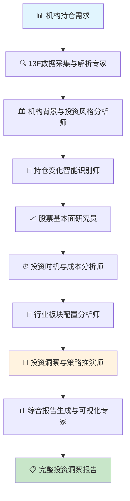

# 🔍 Investment Research (投资研究场景) 专业用例

## 美股机构持仓跟踪分析系统

**Workflow 名称**
AI驱动的美股机构13F持仓智能跟踪与投资洞察平台

**产物描述**
基于SEC 13F披露数据，自动跟踪分析知名投资机构的持仓变化，生成投资洞察报告，包含持仓变化分析、投资逻辑推演、选股策略参考等完整投资研究支持。

**Start 参数**

```json
{
  "target_institutions": "array", // 目标机构列表（巴菲特、桥水、Ackman等）
  "analysis_period": "object", // 分析时间范围（季度范围）
  "focus_stocks": "array", // 重点关注股票列表（可选）
  "analysis_depth": "string", // 分析深度（基础/深度/专业）
  "report_format": "string", // 报告格式（投资简报/详细研报/数据表格）
  "comparison_benchmarks": "array" // 对比基准（指数/其他机构）
}
```

### 📊 行业背景与分析价值

13F是超1亿美元持仓的美国机构按监管要求披露的持仓清单，季度结束后 45 天内必须提交。比如第二季度的持仓，大概在8月15日前公布。每个季度二级基金经理都会关注大佬们的持仓变化，看看他们买了什么、卖了什么。虽然数据有滞后，但仍能提供不少参考，比如选股线索和推演思路。

**13F的局限性：**
1. 有滞后性：最晚可延迟 45 天提交，8 月 15 日公布的是二季度末的快照。
2. 只公布多头：不披露空头、期权、期货等衍生品。
3. 可申请保密：仓位还在建仓/清仓中，提前披露会影响价格的，可以申请延迟公开

**Agent 节点设计**

**Agent 1: 13F数据采集与解析专家**
- **上下文**: SEC数据库、13F文件格式、机构识别、数据质量验证
- **输入变量**: `target_institutions` (目标机构列表)、`analysis_period` (分析时间范围)
- **Prompt**: 从SEC网站和WhaleWisdom自动采集目标机构的13F持仓数据，进行数据清洗和标准化
- **Tools**: HTTP Request API、Web Scraper、Text Parser、Code Interpreter (Python)、Data Validation
- **输出**: 结构化持仓数据、数据质量报告、采集状态确认、历史数据对比

**Agent 2: 机构背景与投资风格分析师**
- **上下文**: 机构历史、投资理念、业绩记录、知名交易案例
- **输入变量**: 机构基础信息、历史持仓数据
- **Prompt**: 深度分析各机构的投资风格、历史业绩和交易特点
- **Tools**: Search Engine API、Code Interpreter (Python)、Text Analysis、Database Query、JSON Parser
- **输出**: 机构画像报告、投资风格分类、业绩统计、参考价值评级

**Agent 3: 持仓变化智能识别师**
- **上下文**: 持仓对比规则、变化阈值、统计方法、趋势识别
- **输入变量**: 多期持仓数据、`analysis_depth` (分析深度)
- **Prompt**: 识别和分析机构持仓的关键变化，包含新建仓、加减仓、清仓等
- **Tools**: Code Interpreter (Python)、Data Comparison、Mathematical Calculator、CSV Parser、JSON Generator
- **输出**: 持仓变化清单、变化幅度统计、重要变化标识、趋势分析

**Agent 4: 股票基本面研究员**
- **上下文**: 股票基本面、财务数据、行业地位、市场环境
- **输入变量**: 持仓变化涉及的股票、`focus_stocks` (重点关注股票)
- **Prompt**: 研究机构买卖股票的基本面情况，分析投资逻辑
- **Tools**: Financial Data API、HTTP Request、Code Interpreter (Python)、Search Engine API、Text Analysis
- **输出**: 股票基本面报告、财务指标分析、行业对比、估值分析

**Agent 5: 投资时机与成本分析师**
- **上下文**: 股价历史、交易时间、市场事件、估算成本
- **输入变量**: 持仓变化数据、股价历史数据
- **Prompt**: 分析机构投资时机，估算买入成本和当前盈亏状况
- **Tools**: Market Data API、Code Interpreter (Python)、Mathematical Calculator、Time Series Analysis、JSON Parser
- **输出**: 成本估算报告、时机分析、盈亏状况、投资表现评估

**Agent 6: 行业板块配置分析师**
- **上下文**: 行业分类、板块轮动、配置比例、趋势变化
- **输入变量**: 持仓数据、行业分类规则
- **Prompt**: 分析机构的行业配置变化和板块偏好趋势
- **Tools**: Code Interpreter (Python)、Data Classification、Mathematical Calculator、Chart Generator、CSV Parser
- **输出**: 行业配置报告、板块变化分析、配置趋势、主题投资识别

**Agent 7: 投资洞察与策略推演师**
- **上下文**: 投资理论、市场逻辑、策略分析、前瞻判断
- **输入变量**: 所有分析结果、市场环境数据
- **Prompt**: 基于持仓分析推演投资逻辑，提供选股和投资策略洞察
- **Tools**: Code Interpreter (Python)、Text Analysis、Pattern Recognition、Search Engine API、JSON Generator
- **输出**: 投资洞察报告、策略建议、选股线索、风险提示

**Agent 8: 综合报告生成与可视化专家**
- **上下文**: 报告模板、可视化要求、投资者需求、展示形式
- **输入变量**: `report_format` (报告格式)、所有分析结果、`comparison_benchmarks` (对比基准)
- **Prompt**: 生成专业的投资研究报告，包含数据可视化和投资建议
- **Tools**: Document Generator、Chart Generator、Code Interpreter (Python)、Template Engine、PDF Generator
- **输出**: 完整研究报告、数据图表、投资建议、后续跟踪计划

**Workflow 流程图**



---

### 🔬 分析方法论与核心价值

**交易风格筛选**
- 高频量化或中短期持仓：参考价值不大。很多仓位可能几天甚至几分钟就换手。13F只提供季度末快照，反映不出真实交易节奏。
- 长期、集中持股、变化少、long only：对个人更有参考价值，比如巴菲特、Bill Ackman、Terry Smith

**关注季度变化**
很多人关注前十大持仓，我觉得意义不大，因为大多是长期底仓。季度之间的变化更重要，信息量更大：新增、大幅加减仓，或直接清仓。

**仓位集中度分析**
前十大持仓占比越高，投资理念越清晰。集中度高的机构，对新进仓位一般也更谨慎。

**行业配置变化跟踪**
- 看持仓稳定度和加减仓节奏
- 连续几个季度都在的标的，可能是长期核心逻辑
- 只出现一两个季度就消失的，可能只是初步研究后发现买错了
- 如果持续大幅加仓/减仓，也能看出他们对趋势信心的变化

**成本与时机分析**
13F 不披露买入价，但 WhaleWisdom 上的 est avg price 可以参考。它是根据持仓变化和股价区间推算出来的。因为 13F 有滞后，不能只看仓位规模不看成本。也许几个月过去，股价已经差别很大。

---

### 📈 典型应用场景与输出样例

**场景1: 季度持仓变化跟踪**
- **输入**: 巴菲特、桥水、Bill Ackman等知名机构，2025年Q1-Q2对比分析
- **输出**: 新增持仓清单、大幅增减持股票、金额变化、占比变化、投资逻辑推演

**场景2: 长期底仓分析**
- **输入**: 2024年Q1-2025年Q2历史数据，重点机构长期持仓
- **输出**: 长期底仓识别、建仓时点、成本估算、收益分析、持仓稳定性

**场景3: 新建仓机会挖掘**
- **输入**: 2024年Q4-2025年Q2数据，新建仓股票筛选
- **输出**: 新建仓股票清单、连续加仓标的、投资主题识别、跟投价值评估

**场景4: 热门股票机构博弈分析**
- **输入**: 英伟达、特斯拉等热门股票，2020年至今机构持仓变化
- **输出**: 机构进出时点、收益排行、卖飞分析、持仓博弈可视化

### 🎯 核心分析维度

**机构画像分析**
1. 背景介绍：历史回报、成名交易、管理规模、投资理念
2. 风格分析：集中度偏好、持仓周期、行业偏好、风险偏好
3. 业绩评估：年化收益、回撤控制、超额收益、风险调整收益

**持仓变化分析**
1. 新建仓分析：建仓原因、市场时机、基本面支撑、投资逻辑
2. 加减仓分析：变化幅度、时机选择、成本分析、信心变化
3. 清仓分析：清仓原因、盈亏状况、时机评估、决策复盘

**板块配置分析**
1. 行业轮动：板块增减配、主题投资、趋势把握
2. 横向对比：机构间配置差异、共同偏好、分歧领域
3. 时机分析：板块配置时点、市场环境、效果验证

**个股深度跟踪**
1. 机构博弈：进出时点、持仓变化、收益排名
2. 价值发现：早期建仓者、坚定持有者、获利退出者
3. 趋势研判：共识与分歧、估值变化、基本面演进

---

### 🔗 数据源与技术接入

**主要数据源**

**1. SEC官网 (源数据，权威完整)**
- **访问路径**: SEC -> search filing https://www.sec.gov/search-filings
- **检索方式**: 搜索filing主体名称，如"BERKSHIRE HATHAWAY INC"
- **文件类型**: 13F-HR/A 和 13F-HR 两个文件 -> Information table for Form 13F
- **数据特点**: 官方权威数据，格式标准，更新及时
- **技术集成**: SEC API、文件解析、数据清洗

**2. WhaleWisdom (处理后数据，易用性强)**
- **访问路径**: https://whalewisdom.com/
- **检索方式**: 直接搜索机构名称，如"BERKSHIRE HATHAWAY INC"
- **功能特色**:
  - 最新季度 top facts 汇总
  - 持仓变化对比 (change in shares、% change)
  - 数据导出功能 (see all holdings)
  - 估算成本价格 (est avg price)
- **技术集成**: Web API、数据爬取、反爬机制处理

**3. 辅助数据源**
- **股价数据**: Yahoo Finance、Alpha Vantage、Quandl
- **基本面数据**: Financial Modeling Prep、IEX Cloud
- **新闻事件**: NewsAPI、Bloomberg API、Reuters

**技术架构集成**
- **数据采集**: HTTP Request API、Web Scraper、定时任务调度器
- **数据处理**: Code Interpreter (Python)、Data Parser、CSV/JSON处理器
- **数据存储**: Database Connector、File Storage、Cloud Storage API
- **分析计算**: Mathematical Calculator、Statistical Analysis、Pattern Recognition
- **报告生成**: Document Generator、Chart Generator、Template Engine

---

### 📊 投资价值与应用场景

**核心投资价值**
1. **跟随智慧资金**: 学习顶级投资者的选股逻辑和时机把握
2. **发现投资机会**: 通过机构新建仓发现潜在投资标的
3. **验证投资判断**: 对比自己的投资决策与大师们的选择
4. **风险控制参考**: 观察机构减仓清仓，及时规避风险
5. **行业趋势洞察**: 通过板块配置变化把握行业轮动机会

**适用投资者类型**
- **个人投资者**: 寻找选股线索，学习投资逻辑
- **基金经理**: 研究同行策略，发现投资机会
- **研究分析师**: 深度分析机构行为，撰写研究报告
- **财富管理师**: 为客户提供投资策略参考和市场洞察

**系统化应用流程**
1. **定期监控**: 每季度自动追踪重点机构持仓变化
2. **深度分析**: 对重要变化进行基本面和时机分析
3. **策略制定**: 基于分析结果制定投资策略和操作计划
4. **持续跟踪**: 验证投资效果，优化跟踪策略

---

## 📋 总结

通过 **AI Native Workflow 3.0** 架构，我们将传统的手工13F分析转化为智能化、系统化的投资研究工具。这个工作流不仅能够自动化数据采集和处理，更重要的是能够通过8个专业化Agent的协作，提供深度的投资洞察和策略建议。

**核心优势:**
- **自动化程度高**: 从数据采集到报告生成全流程自动化
- **分析深度强**: 结合基本面、技术面、时机分析的立体化研究
- **实用性强**: 直接产出可操作的投资建议和选股线索
- **扩展性好**: 可轻松扩展到更多机构和更长时间序列

这个用例展示了AI Native Workflow 3.0在金融投资领域的巨大应用潜力，为投资者提供了一个强大的"智慧资金追踪器"。