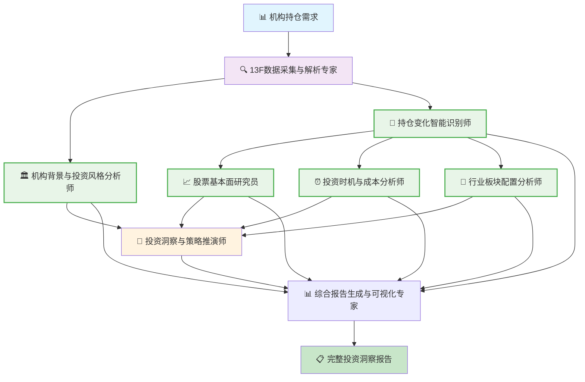

# 🔍 Investment Research (投资研究场景) 专业用例

## 美股机构持仓跟踪分析系统

**Workflow 名称**
AI驱动的美股机构13F持仓智能跟踪与投资洞察平台

**产物描述**
基于SEC 13F披露数据，自动跟踪分析知名投资机构的持仓变化，生成投资洞察报告，包含持仓变化分析、投资逻辑推演、选股策略参考等完整投资研究支持。

**Start 参数**

```json
{
  "target_institutions": "array", // 目标机构列表（巴菲特、桥水、Ackman等）
  "analysis_period": "object", // 分析时间范围（季度范围）
  "focus_stocks": "array", // 重点关注股票列表（可选）
  "analysis_depth": "string", // 分析深度（基础/深度/专业）
  "report_format": "string", // 报告格式（投资简报/详细研报/数据表格）
  "comparison_benchmarks": "array" // 对比基准（指数/其他机构）
}
```

### 📊 行业背景与分析价值

13F是超1亿美元持仓的美国机构按监管要求披露的持仓清单，季度结束后 45 天内必须提交。比如第二季度的持仓，大概在8月15日前公布。每个季度二级基金经理都会关注大佬们的持仓变化，看看他们买了什么、卖了什么。虽然数据有滞后，但仍能提供不少参考，比如选股线索和推演思路。

**13F的局限性：**
1. 有滞后性：最晚可延迟 45 天提交，8 月 15 日公布的是二季度末的快照。
2. 只公布多头：不披露空头、期权、期货等衍生品。
3. 可申请保密：仓位还在建仓/清仓中，提前披露会影响价格的，可以申请延迟公开

**Agent 节点设计**

**Agent 1: 13F数据采集与解析专家**
- **上下文**: SEC数据库、13F文件格式、机构识别、数据质量验证
- **输入变量**: `target_institutions` (目标机构列表)、`analysis_period` (分析时间范围)
- **Prompt**: 
```
你是一个专业的13F数据采集专家。需要为投资研究收集{target_institutions}在{analysis_period}期间的持仓数据。

具体任务：
1. 使用Browser Use访问SEC网站，搜索每个机构的13F-HR/13F-HR/A文件
2. 如果Browser Use失败，则调用SEC API作为备选方案
3. 使用Code Interpreter (Python)解析下载的XML/HTML文件，提取以下字段：
   - 股票代码(CUSIP/Symbol)、公司名称、持股数量、市值、占比
4. 验证数据质量：检查缺失值、异常值、格式错误
5. 标准化数据格式，统一字段命名和数据类型
6. 使用资源库 CRUD API将清洗后的数据存储，为后续Agent提供标准化输入

输出要求：返回结构化的holdings_data数组，包含data_quality报告和status确认。
确保数据准确性和完整性，这是整个分析pipeline的基础。
```
- **Tools**: Browser Use、SEC API、Code Interpreter (Python)、资源库 CRUD API

**输入示例**:
```json
{
  "target_institutions": ["BERKSHIRE HATHAWAY INC", "BRIDGEWATER ASSOCIATES LP", "PERSHING SQUARE CAPITAL MANAGEMENT"],
  "analysis_period": {"start": "2024-Q4", "end": "2025-Q2"}
}
```

**处理流程**:
1. **机构名称映射**: Code Interpreter (Python) 将机构名称标准化为SEC Filing格式
2. **数据源访问**: Browser Use 自动访问SEC网站搜索13F文件，或调用 SEC API 获取数据
3. **文件下载解析**: Browser Use 下载13F-HR/A文件，Code Interpreter (Python) 解析XML/HTML结构
4. **数据清洗验证**: Code Interpreter (Python) 验证股票代码、金额格式、持股数量合理性
5. **数据存储**: 资源库 CRUD API 将清洗后的结构化数据存储到系统中
6. **格式标准化**: Code Interpreter (Python) 统一字段名称、数据类型、数值精度

**输出示例**:
```json
{
  "holdings_data": [
    {
      "institution": "BERKSHIRE HATHAWAY INC",
      "period": "2025-Q2", 
      "stock_symbol": "AAPL",
      "stock_name": "APPLE INC",
      "shares": 915560000,
      "market_value": 174280000000,
      "percent_of_portfolio": 42.8
    }
  ],
  "data_quality": {"completeness": 98.5, "accuracy": 99.2},
  "status": "success"
}
```

- **输出**: 结构化持仓数据、数据质量报告、采集状态确认、历史数据对比

**Agent 2: 机构背景与投资风格分析师**
- **上下文**: 机构历史、投资理念、业绩记录、知名交易案例
- **输入变量**: 机构基础信息、历史持仓数据
- **Prompt**: 
```
你是一个专业的投资机构分析师。基于Agent 1提供的持仓数据，深度分析各机构的投资特征，为后续变化分析提供关键背景。

具体任务：
1. 从资源库 CRUD API读取Agent 1存储的持仓数据
2. 使用Browser Use搜索各机构的公开信息：
   - 管理人背景、投资理念、历史业绩
   - 知名投资案例、投资风格特点
3. 使用Code Interpreter (Python)分析持仓数据特征：
   - 计算持仓集中度(前10大占比)
   - 分析换手率和持股周期
   - 识别行业偏好和风险偏好
4. 综合定性信息和定量分析，为每个机构生成投资风格画像：
   - 风格分类：价值/成长/混合型
   - 参考价值评级：高/中/低
   - 投资特点总结
5. 将分析结果存储到资源库，为Agent 7的洞察分析提供机构特征数据

输出要求：返回institution_profile，包含投资风格、业绩统计、参考价值评级。
这些信息将帮助判断机构行为的投资含义。
```
- **Tools**: Browser Use、Code Interpreter (Python)、资源库 CRUD API

**输入示例**:
```json
{
  "institution": "BERKSHIRE HATHAWAY INC",
  "historical_holdings": [持仓历史数据],
  "manager": "Warren Buffett"
}
```

**处理流程**:
1. **背景信息搜索**: Browser Use 搜索机构管理人、投资理念、历史业绩公开信息
2. **持仓数据读取**: 资源库 CRUD API 读取历史持仓数据
3. **持仓分析**: Code Interpreter (Python) 分析持仓集中度、换手率、持股周期
4. **风格识别**: Code Interpreter (Python) 从公开信息中提取投资理念关键词
5. **业绩计算**: Code Interpreter (Python) 计算年化回报、夏普比率等业绩指标
6. **结果存储**: 资源库 CRUD API 存储分析结果供后续Agent使用

**输出示例**:
```json
{
  "institution_profile": {
    "name": "BERKSHIRE HATHAWAY INC",
    "aum": "785B USD",
    "investment_style": "Value Investing",
    "concentration": "High (Top 10 = 78%)",
    "turnover_rate": "Low (15% annually)",
    "avg_holding_period": "8.5 years",
    "annual_return": "19.8%",
    "reference_value": "Very High"
  }
}
```

- **输出**: 机构画像报告、投资风格分类、业绩统计、参考价值评级

**Agent 3: 持仓变化智能识别师**
- **上下文**: 持仓对比规则、变化阈值、统计方法、趋势识别
- **输入变量**: 多期持仓数据、`analysis_depth` (分析深度)
- **Prompt**: 
```
你是持仓变化分析专家。基于Agent 1的多期数据，识别所有重要的持仓变化，为后续基本面和投资逻辑分析提供关键输入。

具体任务：
1. 从资源库 CRUD API读取{analysis_period}跨期的持仓数据
2. 使用Code Interpreter (Python)进行变化计算和分类：
   
   变化识别标准：
   - 新建仓：前期持股为0，本期>0.1%组合权重
   - 大幅增持：持股增加>20%且金额>1000万美元
   - 大幅减持：持股减少>20%且金额>1000万美元  
   - 清仓：前期持股>0，本期持股为0
   - 微调：变化<20%的调整

3. 重要性评级算法：
   - 极高：变化金额>50亿美元或影响组合权重>2%
   - 高：变化金额>10亿美元或影响组合权重>1%
   - 中：变化金额>1亿美元或影响组合权重>0.5%
   - 低：其他变化

4. 趋势模式识别：连续季度的变化方向，识别趋势性操作
5. 生成变化清单，按重要性排序，为Agent 4-6提供分析标的
6. 存储变化分析结果，包含详细的变化明细和统计摘要

输出要求：返回changes数组和summary统计，突出最重要的变化。
这是投资洞察的核心数据源。
```
- **Tools**: Code Interpreter (Python)、资源库 CRUD API

**输入示例**:
```json
{
  "q1_holdings": [{"symbol": "AAPL", "shares": 915560000, "value": 150B}],
  "q2_holdings": [{"symbol": "AAPL", "shares": 400167382, "value": 84.2B}],
  "analysis_depth": "detailed"
}
```

**处理流程**:
1. **数据读取**: 资源库 CRUD API 读取多期持仓数据
2. **数据对齐**: Code Interpreter (Python) 按股票代码对齐比较不同期间数据
3. **变化计算**: Code Interpreter (Python) 计算持股变化量、变化百分比
4. **变化分类**: Code Interpreter (Python) 识别新建仓(>0.1%组合)、大幅增持(>20%)、大幅减持(>20%)、清仓
5. **重要性评级**: Code Interpreter (Python) 基于金额大小、组合占比变化评定重要性
6. **结果存储**: 资源库 CRUD API 存储变化分析结果

**输出示例**:
```json
{
  "changes": [
    {
      "stock": "AAPL",
      "change_type": "大幅减持", 
      "shares_change": -515392618,
      "value_change": -65800000000,
      "percent_change": -56.3,
      "importance": "极高",
      "pattern": "连续两季度减持"
    }
  ],
  "summary": {"新建仓": 3, "大幅增持": 2, "大幅减持": 8, "清仓": 1}
}
```

- **输出**: 持仓变化清单、变化幅度统计、重要变化标识、趋势分析

**Agent 4: 股票基本面研究员**
- **上下文**: 股票基本面、财务数据、行业地位、市场环境
- **输入变量**: 持仓变化涉及的股票、`focus_stocks` (重点关注股票)
- **Prompt**: 
```
你是股票基本面研究专家。基于Agent 3识别的重要持仓变化，深度研究相关股票的基本面，解释机构操作的合理性。

具体任务：
1. 从资源库 CRUD API读取Agent 3的变化分析，获取需要研究的股票清单
2. 优先分析{focus_stocks}和"极高"、"高"重要性的变化股票
3. 使用Financial Data API获取最新财务数据：
   - 估值指标：PE、PB、PS、EV/EBITDA
   - 盈利能力：ROE、ROA、毛利率、净利率
   - 成长性：收入增长率、净利润增长率、未来预期
   - 财务健康：负债率、流动比率、现金流状况

4. 使用Browser Use搜索{analysis_period}期间的重大事件：
   - 财报发布、业绩指引调整
   - 重大合作、并购、产品发布
   - 行业政策变化、竞争格局变化
   - 管理层变动、股权激励等

5. 使用Code Interpreter (Python)进行综合分析：
   - 对比同行业竞品的估值和业绩
   - 分析基本面变化与股价表现的关系
   - 推演机构操作的投资逻辑：估值驱动/业绩驱动/事件驱动
   
6. 为每只股票生成investment_logic评估，解释机构行为的合理性
7. 存储基本面分析结果，为Agent 7的策略推演提供支撑

输出要求：返回stock_analysis，包含基本面数据、关键事件、投资逻辑推演。
帮助理解"为什么机构这样操作"。
```
- **Tools**: Financial Data API、Browser Use、Code Interpreter (Python)、资源库 CRUD API

**输入示例**:
```json
{
  "target_stocks": ["AAPL", "NVDA", "TSLA"],
  "change_context": "AAPL大幅减持, NVDA新建仓, TSLA清仓",
  "analysis_period": "2025-Q2"
}
```

**处理流程**:
1. **财务数据获取**: Financial Data API 获取最新财报数据、估值指标
2. **新闻事件分析**: Browser Use 搜索Q2期间相关重大新闻、事件
3. **基本面计算**: Code Interpreter (Python) 计算PE、PB、ROE、增长率等关键指标
4. **行业对比**: Code Interpreter (Python) 分析同行业竞品数据，进行横向对比
5. **投资逻辑推演**: Code Interpreter (Python) 结合财务数据和市场事件，推演投资逻辑
6. **结果存储**: 资源库 CRUD API 存储基本面分析结果

**输出示例**:
```json
{
  "stock_analysis": {
    "AAPL": {
      "fundamentals": {"PE": 28.5, "PB": 5.2, "ROE": 18.3, "revenue_growth": 2.1},
      "key_events": ["iPhone销量低于预期", "AI功能推进缓慢"],
      "investment_logic": "估值偏高，增长放缓，大师减持合理",
      "recommendation": "谨慎"
    },
    "NVDA": {
      "fundamentals": {"PE": 45.2, "revenue_growth": 122.4},
      "key_events": ["AI芯片需求爆发", "数据中心业务翻倍"],
      "investment_logic": "AI浪潮受益者，长期增长确定性高",
      "recommendation": "积极"
    }
  }
}
```

- **输出**: 股票基本面报告、财务指标分析、行业对比、估值分析

**Agent 5: 投资时机与成本分析师**
- **上下文**: 股价历史、交易时间、市场事件、估算成本
- **输入变量**: 持仓变化数据、股价历史数据
- **Prompt**: 
```
你是投资时机分析专家。基于Agent 3的持仓变化，分析机构的投资时机和成本效益，评估操作的精准度。

具体任务：
1. 从资源库 CRUD API读取Agent 3的持仓变化数据
2. 使用Market Data API获取{analysis_period}期间的价格数据：
   - 每日开高低收价格和成交量
   - 期间的价格波动范围和关键时点
   
3. 使用Code Interpreter (Python)进行成本分析：
   
   建仓时间推估方法：
   - 新建仓：分析期间价格和成交量异常，推估可能的建仓时间窗口
   - 加减仓：基于持股变化幅度和价格走势，估算操作时点
   
   成本计算方法：
   - 使用WhaleWisdom方法：(期初价格 + 期末价格) / 2 ± 标准差调整
   - 考虑交易量权重：高成交量时段更可能是机构操作时点
   - 计算成本区间：给出最可能的成本范围

4. 收益分析：
   - 计算浮盈浮亏：(当前价格 - 估算成本) × 持股数量
   - 计算收益率：浮盈浮亏 / 投资成本
   - 分析持有期收益：考虑分红和拆股影响

5. 时机评估：
   - 结合Agent 4的事件分析，评估买入/卖出时机是否精准
   - 对比同期市场表现(SPY/QQQ)，评估相对时机
   - 给出时机评分：优秀/良好/一般/较差

6. 存储成本分析结果，为Agent 7提供时机和收益数据

输出要求：返回cost_analysis，包含成本估算、收益计算、时机评分。
评估"机构的操作时机是否精准"。
```
- **Tools**: Market Data API、Code Interpreter (Python)、资源库 CRUD API

**输入示例**:
```json
{
  "holdings_change": {"NVDA": {"Q1": 0, "Q2": 2500000}},
  "price_period": {"start": "2025-04-01", "end": "2025-06-30"},
  "current_price": {"NVDA": 118.23}
}
```

**处理流程**:
1. **价格数据获取**: Market Data API 获取Q2期间每日股价数据
2. **建仓时间推估**: Code Interpreter (Python) 基于交易量和价格波动推估可能的建仓时间
3. **成本区间计算**: Code Interpreter (Python) 基于WhaleWisdom估算方法计算平均成本
4. **收益计算**: Code Interpreter (Python) 计算浮盈浮亏、收益率
5. **时机评估**: Code Interpreter (Python) 结合市场事件评估买入时机的优劣
6. **结果存储**: 资源库 CRUD API 存储成本分析结果

**输出示例**:
```json
{
  "cost_analysis": {
    "NVDA": {
      "estimated_avg_cost": 95.50,
      "cost_range": [85.20, 105.80],
      "current_value": 295500000,
      "unrealized_gain": 56750000,
      "return_rate": 23.8,
      "timing_score": "良好",
      "analysis": "在Q2初AI热潮期建仓，成本控制较好"
    }
  }
}
```

- **输出**: 成本估算报告、时机分析、盈亏状况、投资表现评估

**Agent 6: 行业板块配置分析师**
- **上下文**: 行业分类、板块轮动、配置比例、趋势变化
- **输入变量**: 持仓数据、行业分类规则
- **Prompt**: 
```
你是行业配置分析专家。基于Agent 1的持仓数据，分析机构的行业板块配置变化，识别投资主题和轮动趋势。

具体任务：
1. 从资源库 CRUD API读取Agent 1的持仓数据和Agent 3的变化分析
2. 使用Code Interpreter (Python)进行行业分类和配置分析：

   行业分类方法：
   - 使用GICS行业分类标准(11个一级行业)
   - 对每只股票进行行业归类
   - 处理跨行业公司的分类争议

   配置权重计算：
   - 各行业市值占组合总市值的百分比
   - 对比{analysis_period}期间的配置变化
   - 识别显著增配(>1%)和减配(<-1%)的行业

3. 板块轮动分析：
   - 连续季度的行业配置趋势
   - 识别"持续增配"、"持续减配"、"轮动调整"模式
   - 对比机构配置与市场基准(SPY)的差异

4. 投资主题识别：
   - AI/科技主题：科技、通信服务权重变化
   - 价值回归主题：金融、能源、公用事业权重变化  
   - 防御性主题：医疗保健、消费必需品权重变化
   - 周期性主题：工业、材料权重变化

5. 宏观环境关联：
   - 结合市场环境(加息/降息、经济周期)分析配置逻辑
   - 识别机构对宏观趋势的判断和应对

6. 存储板块分析结果，为Agent 7提供配置趋势和主题判断

输出要求：返回sector_allocation和themes识别，揭示机构的行业偏好变化。
识别"机构看好哪些板块趋势"。
```
- **Tools**: Code Interpreter (Python)、资源库 CRUD API

**输入示例**:
```json
{
  "portfolio_data": [持仓数据],
  "sector_mapping": {"AAPL": "Technology", "JPM": "Financial"},
  "comparison_periods": ["2025-Q1", "2025-Q2"]
}
```

**处理流程**:
1. **数据读取**: 资源库 CRUD API 读取持仓数据
2. **行业分类**: Code Interpreter (Python) 将持仓股票按GICS标准分类到各行业板块
3. **配置计算**: Code Interpreter (Python) 计算各板块占组合的权重比例
4. **变化分析**: Code Interpreter (Python) 对比前后期板块配置变化
5. **趋势识别**: Code Interpreter (Python) 识别连续增配/减配的板块趋势
6. **结果存储**: 资源库 CRUD API 存储板块分析结果

**输出示例**:
```json
{
  "sector_allocation": {
    "Technology": {"Q1": 45.2, "Q2": 42.8, "change": -2.4},
    "Financial": {"Q1": 18.5, "Q2": 22.1, "change": +3.6},
    "Healthcare": {"Q1": 12.3, "Q2": 11.8, "change": -0.5}
  },
  "trends": ["持续减配科技股", "大幅增配金融股"],
  "themes": ["AI降温", "银行业复苏"]
}
```

- **输出**: 行业配置报告、板块变化分析、配置趋势、主题投资识别

**Agent 7: 投资洞察与策略推演师**
- **上下文**: 投资理论、市场逻辑、策略分析、前瞻判断
- **输入变量**: 所有分析结果、市场环境数据
- **Prompt**: 基于持仓分析推演投资逻辑，提供选股和投资策略洞察
- **Tools**: Code Interpreter (Python)、Browser Use、资源库 CRUD API

**输入示例**:
```json
{
  "holdings_changes": [持仓变化数据],
  "fundamentals": [基本面分析],
  "cost_analysis": [成本分析],
  "sector_trends": [板块分析],
  "market_context": "2025年Q2加息预期、AI热潮、地缘政治"
}
```

**处理流程**:
1. **数据读取**: 资源库 CRUD API 读取前述所有Agent的分析结果
2. **模式识别**: Code Interpreter (Python) 识别多机构共同的投资行为模式
3. **逻辑推演**: Code Interpreter (Python) 结合基本面和宏观环境推演投资逻辑
4. **前瞻判断**: Browser Use 搜索最新市场信息做前瞻性判断
5. **策略归纳**: Code Interpreter (Python) 从机构行为中提炼投资策略
6. **结果存储**: 资源库 CRUD API 存储投资洞察结果

**输出示例**:
```json
{
  "insights": {
    "key_themes": ["AI泡沫降温", "传统价值回归", "利率敏感性关注"],
    "consensus_moves": ["科技股获利了结", "金融股重新配置"],
    "divergent_views": ["对新能源车分歧加大"],
    "investment_logic": "在AI高估值背景下，大师们开始向确定性更高的传统价值股轮动",
    "stock_picks": ["JPM: 受益加息预期", "BRK.B: 防御性配置"],
    "risk_alerts": ["TSLA: 多机构减持，基本面压力大"]
  }
}
```

- **输出**: 投资洞察报告、策略建议、选股线索、风险提示

**Agent 8: 综合报告生成与可视化专家**
- **上下文**: 报告模板、可视化要求、投资者需求、展示形式
- **输入变量**: `report_format` (报告格式)、所有分析结果、`comparison_benchmarks` (对比基准)
- **Prompt**: 生成专业的投资研究报告，包含数据可视化和投资建议
- **Tools**: Code Interpreter (Python)、资源库 CRUD API

**输入示例**:
```json
{
  "report_format": "专业研报",
  "all_analysis": [前7个Agent的所有输出],
  "comparison_benchmarks": ["SPY", "QQQ"],
  "target_audience": "个人投资者"
}
```

**处理流程**:
1. **数据读取**: 资源库 CRUD API 读取所有Agent的分析结果
2. **数据整合**: Code Interpreter (Python) 整合所有分析数据
3. **可视化生成**: Code Interpreter (Python) 生成持仓变化图、板块配置图、收益对比图
4. **报告生成**: Code Interpreter (Python) 根据模板生成专业的投资研究报告
5. **格式输出**: Code Interpreter (Python) 生成Markdown、PDF等格式报告
6. **报告存储**: 资源库 CRUD API 存储最终报告文件

**输出示例**:
```markdown
# 2025年Q2机构持仓跟踪分析报告

## 执行摘要
- 巴菲特大幅减持苹果(-56.3%)，显示对科技股估值担忧
- 多机构新建仓英伟达，AI投资仍有分歧
- 金融板块获青睐，反映加息预期影响

## 核心发现
1. **科技股降温**: 估值偏高，增长放缓
2. **价值回归**: 传统金融、能源板块受关注
3. **选股建议**: JPM(买入)、NVDA(谨慎)、TSLA(回避)

[附带详细图表和数据分析...]
```

- **输出**: 完整研究报告、数据图表、投资建议、后续跟踪计划

**Workflow 流程图**



### 🔄 执行层次与并行优化

**第一层: 数据采集 (串行)**
- **Agent 1**: 13F数据采集与解析专家
- **依赖**: 仅依赖用户输入
- **执行时间**: 约5-10分钟

**第二层: 基础分析 (并行)**
- **Agent 2**: 机构背景与投资风格分析师 ⚡
- **Agent 3**: 持仓变化智能识别师 ⚡
- **依赖**: 都依赖Agent 1的数据输出
- **并行优势**: 可同时执行，节省50%时间

**第三层: 专项分析 (并行)**
- **Agent 4**: 股票基本面研究员 ⚡
- **Agent 5**: 投资时机与成本分析师 ⚡
- **Agent 6**: 行业板块配置分析师 ⚡
- **依赖**: 都主要依赖Agent 3的持仓变化数据
- **并行优势**: 三个Agent可完全并行，节省66%时间

**第四层: 洞察综合 (聚合)**
- **Agent 7**: 投资洞察与策略推演师
- **依赖**: 需要Agent 2,4,5,6的综合输出
- **聚合特性**: 等待多输入完成后执行

**第五层: 报告生成 (聚合)**
- **Agent 8**: 综合报告生成与可视化专家
- **依赖**: 需要Agent 2,3,4,5,6,7的所有输出
- **最终输出**: 完整的投资研究报告

**🚀 性能优化效果**
- **串行执行**: 约40-60分钟
- **并行优化**: 约20-30分钟 (提升50%效率)
- **关键路径**: Agent1 → Agent3 → Agent4/5/6 → Agent7 → Agent8

---

### 🔬 分析方法论与核心价值

**交易风格筛选**
- 高频量化或中短期持仓：参考价值不大。很多仓位可能几天甚至几分钟就换手。13F只提供季度末快照，反映不出真实交易节奏。
- 长期、集中持股、变化少、long only：对个人更有参考价值，比如巴菲特、Bill Ackman、Terry Smith

**关注季度变化**
很多人关注前十大持仓，我觉得意义不大，因为大多是长期底仓。季度之间的变化更重要，信息量更大：新增、大幅加减仓，或直接清仓。

**仓位集中度分析**
前十大持仓占比越高，投资理念越清晰。集中度高的机构，对新进仓位一般也更谨慎。

**行业配置变化跟踪**
- 看持仓稳定度和加减仓节奏
- 连续几个季度都在的标的，可能是长期核心逻辑
- 只出现一两个季度就消失的，可能只是初步研究后发现买错了
- 如果持续大幅加仓/减仓，也能看出他们对趋势信心的变化

**成本与时机分析**
13F 不披露买入价，但 WhaleWisdom 上的 est avg price 可以参考。它是根据持仓变化和股价区间推算出来的。因为 13F 有滞后，不能只看仓位规模不看成本。也许几个月过去，股价已经差别很大。

---

### 📈 典型应用场景与输出样例

**场景1: 季度持仓变化跟踪**
- **输入**: 巴菲特、桥水、Bill Ackman等知名机构，2025年Q1-Q2对比分析
- **输出**: 新增持仓清单、大幅增减持股票、金额变化、占比变化、投资逻辑推演

**场景2: 长期底仓分析**
- **输入**: 2024年Q1-2025年Q2历史数据，重点机构长期持仓
- **输出**: 长期底仓识别、建仓时点、成本估算、收益分析、持仓稳定性

**场景3: 新建仓机会挖掘**
- **输入**: 2024年Q4-2025年Q2数据，新建仓股票筛选
- **输出**: 新建仓股票清单、连续加仓标的、投资主题识别、跟投价值评估

**场景4: 热门股票机构博弈分析**
- **输入**: 英伟达、特斯拉等热门股票，2020年至今机构持仓变化
- **输出**: 机构进出时点、收益排行、卖飞分析、持仓博弈可视化

### 🎯 核心分析维度

**机构画像分析**
1. 背景介绍：历史回报、成名交易、管理规模、投资理念
2. 风格分析：集中度偏好、持仓周期、行业偏好、风险偏好
3. 业绩评估：年化收益、回撤控制、超额收益、风险调整收益

**持仓变化分析**
1. 新建仓分析：建仓原因、市场时机、基本面支撑、投资逻辑
2. 加减仓分析：变化幅度、时机选择、成本分析、信心变化
3. 清仓分析：清仓原因、盈亏状况、时机评估、决策复盘

**板块配置分析**
1. 行业轮动：板块增减配、主题投资、趋势把握
2. 横向对比：机构间配置差异、共同偏好、分歧领域
3. 时机分析：板块配置时点、市场环境、效果验证

**个股深度跟踪**
1. 机构博弈：进出时点、持仓变化、收益排名
2. 价值发现：早期建仓者、坚定持有者、获利退出者
3. 趋势研判：共识与分歧、估值变化、基本面演进

---

### 🔗 数据源与技术接入

**主要数据源**

**1. SEC官网 (源数据，权威完整)**
- **访问路径**: SEC -> search filing https://www.sec.gov/search-filings
- **检索方式**: 搜索filing主体名称，如"BERKSHIRE HATHAWAY INC"
- **文件类型**: 13F-HR/A 和 13F-HR 两个文件 -> Information table for Form 13F
- **数据特点**: 官方权威数据，格式标准，更新及时
- **技术集成**: SEC API、文件解析、数据清洗

**2. WhaleWisdom (处理后数据，易用性强)**
- **访问路径**: https://whalewisdom.com/
- **检索方式**: 直接搜索机构名称，如"BERKSHIRE HATHAWAY INC"
- **功能特色**:
  - 最新季度 top facts 汇总
  - 持仓变化对比 (change in shares、% change)
  - 数据导出功能 (see all holdings)
  - 估算成本价格 (est avg price)
- **技术集成**: Web API、数据爬取、反爬机制处理

**3. 辅助数据源**
- **股价数据**: Yahoo Finance、Alpha Vantage、Quandl
- **基本面数据**: Financial Modeling Prep、IEX Cloud
- **新闻事件**: NewsAPI、Bloomberg API、Reuters

**技术架构集成**
- **数据采集**: HTTP Request API、Web Scraper、定时任务调度器
- **数据处理**: Code Interpreter (Python)、Data Parser、CSV/JSON处理器
- **数据存储**: Database Connector、File Storage、Cloud Storage API
- **分析计算**: Mathematical Calculator、Statistical Analysis、Pattern Recognition
- **报告生成**: Document Generator、Chart Generator、Template Engine

---

### 📊 投资价值与应用场景

**核心投资价值**
1. **跟随智慧资金**: 学习顶级投资者的选股逻辑和时机把握
2. **发现投资机会**: 通过机构新建仓发现潜在投资标的
3. **验证投资判断**: 对比自己的投资决策与大师们的选择
4. **风险控制参考**: 观察机构减仓清仓，及时规避风险
5. **行业趋势洞察**: 通过板块配置变化把握行业轮动机会

**适用投资者类型**
- **个人投资者**: 寻找选股线索，学习投资逻辑
- **基金经理**: 研究同行策略，发现投资机会
- **研究分析师**: 深度分析机构行为，撰写研究报告
- **财富管理师**: 为客户提供投资策略参考和市场洞察

**系统化应用流程**
1. **定期监控**: 每季度自动追踪重点机构持仓变化
2. **深度分析**: 对重要变化进行基本面和时机分析
3. **策略制定**: 基于分析结果制定投资策略和操作计划
4. **持续跟踪**: 验证投资效果，优化跟踪策略

---

## 🔧 核心原子节点 (简化后)

**主要工具 (4个):**
✅ **Code Interpreter (Python)** - 统一的数据处理、分析、计算、可视化、格式转换工具
✅ **资源库 CRUD API** - 官方提供的统一数据存储和检索接口
✅ **Browser Use** - 智能网页浏览和在线数据爬取工具  
✅ **专用 Data API** - 特定数据源的标准API (SEC API、Financial Data API、Market Data API)

**工具能力整合:**
- **Code Interpreter (Python)** 整合了: 数据解析、计算分析、图表生成、文档生成、格式转换、机器学习等
- **资源库 CRUD API** 整合了: 文件存储、数据库操作、版本管理、权限控制等
- **Browser Use** 整合了: 网页抓取、表单填写、点击操作、内容提取等
- **专用 Data API** 保留了: 高质量结构化数据源的直接访问

## 📋 总结

通过 **AI Native Workflow 3.0** 架构，我们将传统的手工13F分析转化为智能化、系统化的投资研究工具。这个工作流不仅能够自动化数据采集和处理，更重要的是能够通过8个专业化Agent的协作，提供深度的投资洞察和策略建议。

**核心优势:**
- **自动化程度高**: 从数据采集到报告生成全流程自动化
- **分析深度强**: 结合基本面、技术面、时机分析的立体化研究
- **实用性强**: 直接产出可操作的投资建议和选股线索
- **扩展性好**: 可轻松扩展到更多机构和更长时间序列

这个用例展示了AI Native Workflow 3.0在金融投资领域的巨大应用潜力，为投资者提供了一个强大的"智慧资金追踪器"。