# AI Native Workflow 3.0 用例可视化流程图

## 🚀 Sales (销售场景) Workflow 可视化

### 1. 智能销售线索管理系统

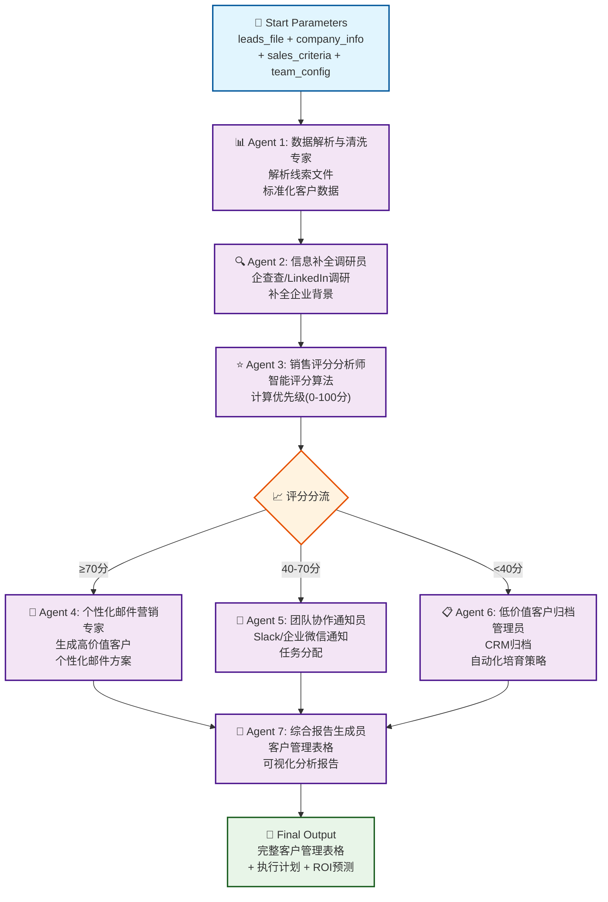

### 2. 客户画像自动生成器

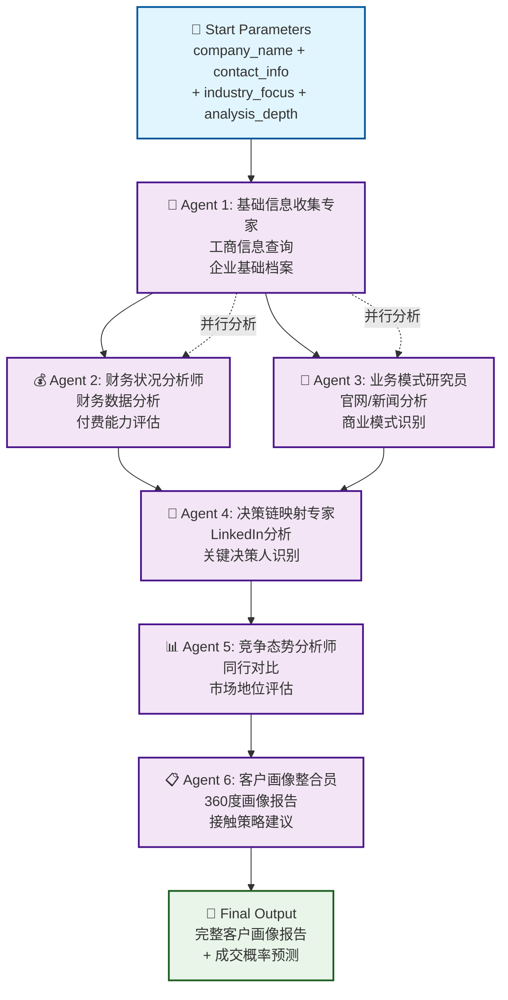

---

## 📈 Marketing (营销场景) Workflow 可视化

### 1. 智能社媒运营全流程系统

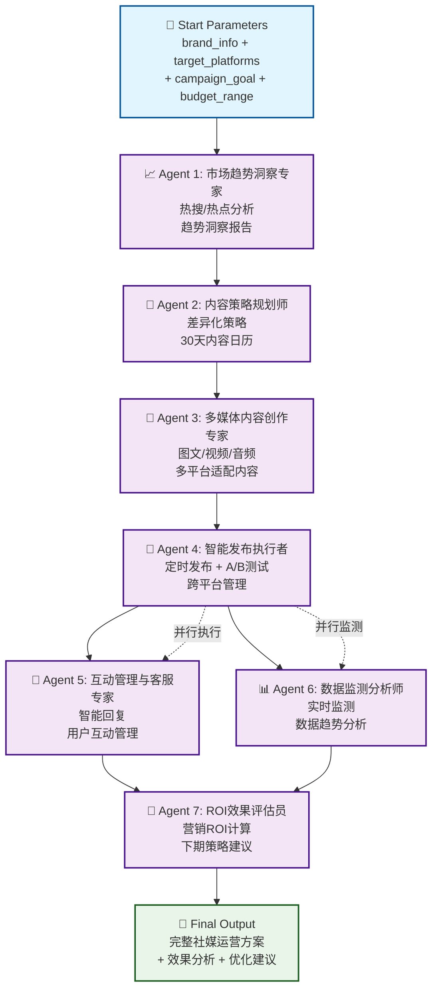

### 2. 多平台营销内容矩阵生成器

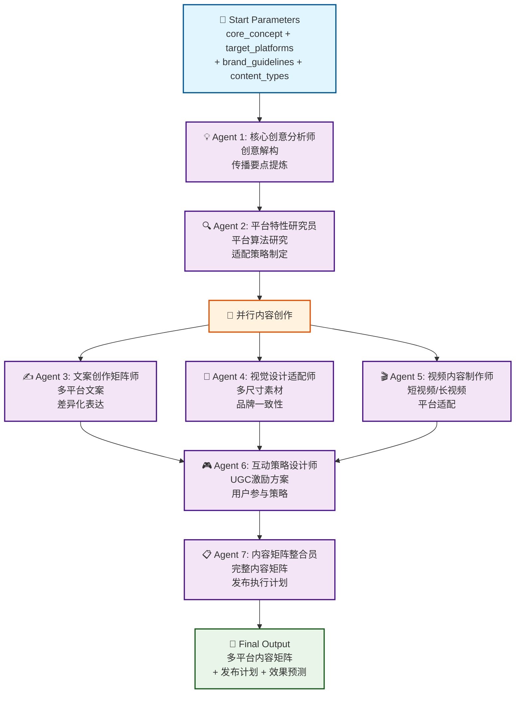

---

## 🔬 Research (研究场景) Workflow 可视化

### 1. 投资机构深度研究系统

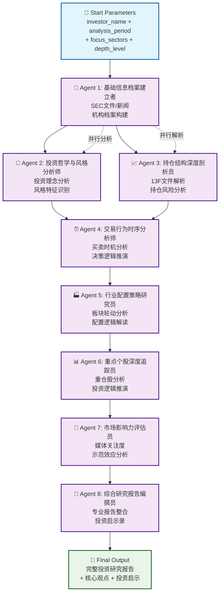

### 2. 行业研究报告生成器

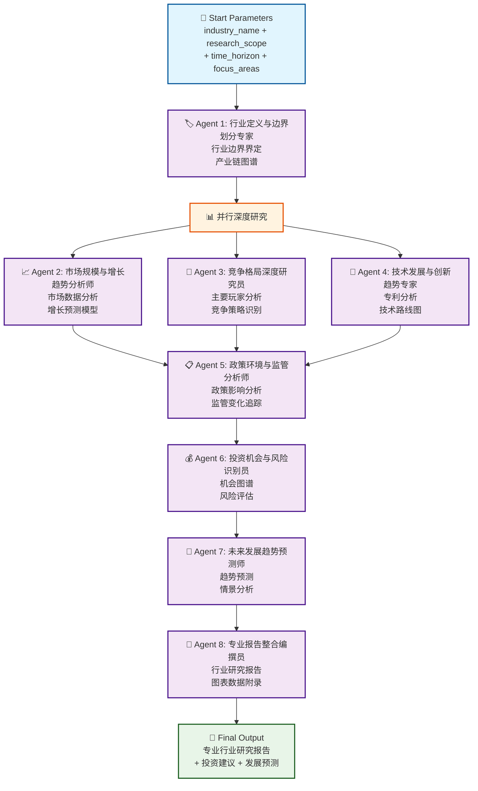

---

## 🎧 Support (客服支持场景) Workflow 可视化

### 1. 智能知识库构建器

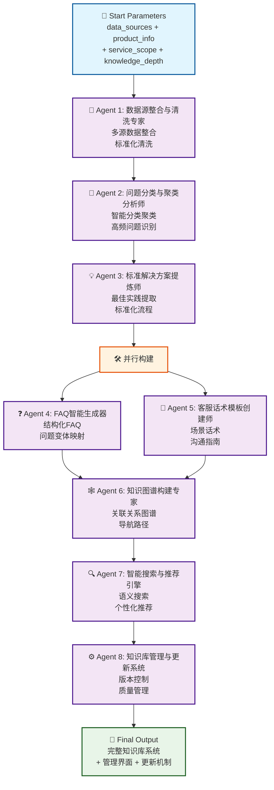

### 2. 客户问题自动分类路由系统

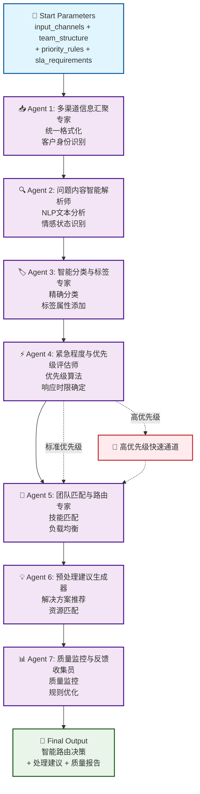

---

## ✍️ Content Creation (内容创作场景) Workflow 可视化

### 1. Product Hunt 全媒体内容生产器

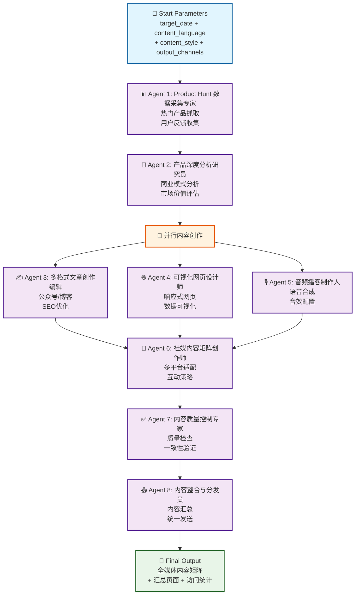

### 2. 多媒体课程制作助手

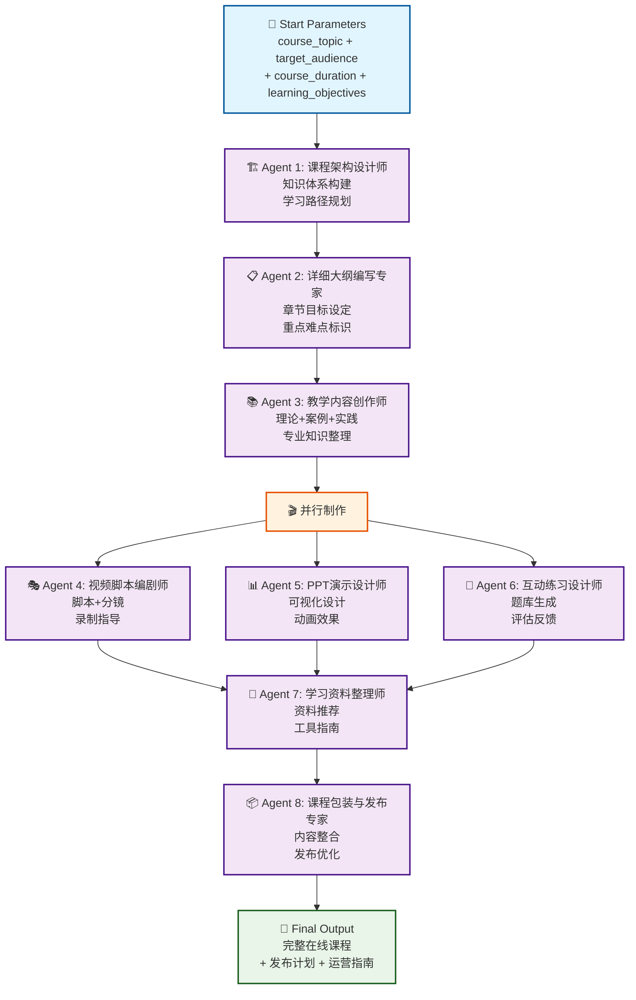

---

## 💼 Business Operations (业务运营场景) Workflow 可视化

### 1. HR招聘流程自动化系统

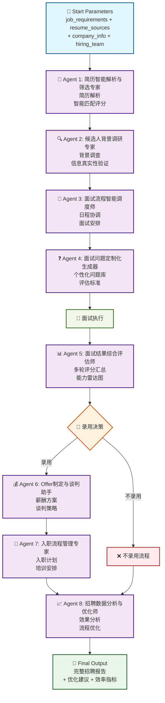

### 2. 财务报表自动生成器

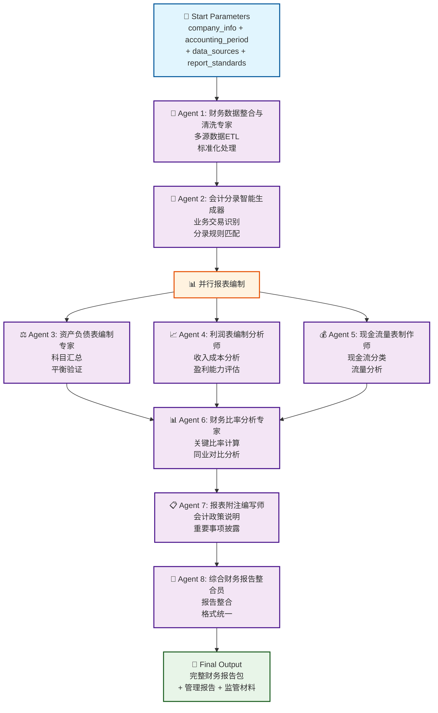

---

## 🎓 Education & Training (教育培训场景) Workflow 可视化

### 1. 个性化学习路径规划器

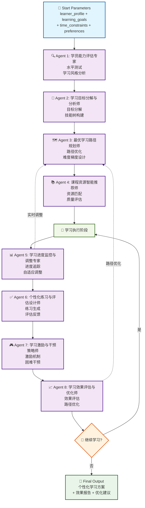

---

## 🔧 Technical Development (技术开发场景) Workflow 可视化

### 1. API文档自动生成器

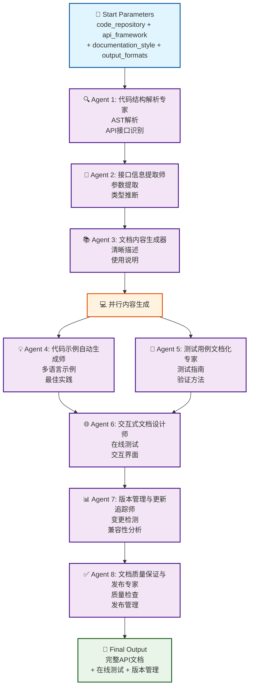

---

## 🎨 Creative Design (创意设计场景) Workflow 可视化

### 1. 品牌视觉识别系统生成器

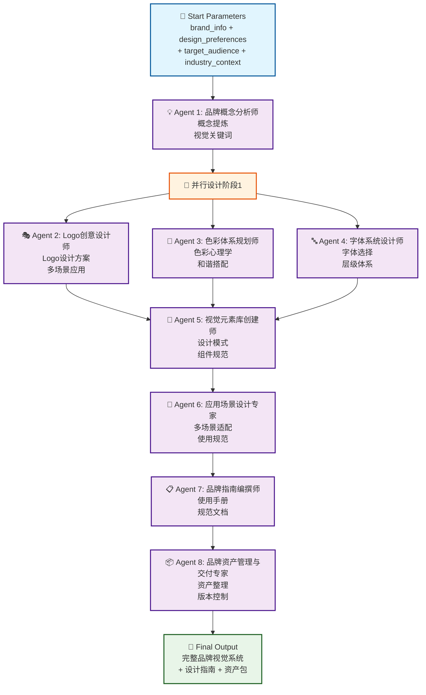

---

## 🎯 Workflow 设计特点总结

### 🔄 **Agent 协作模式**
1. **顺序执行** - 大部分Agent按逻辑顺序依次处理
2. **并行处理** - 关键环节支持并行提升效率  
3. **分支决策** - 基于条件进行智能路由
4. **反馈循环** - 支持迭代优化和质量提升

### 🎨 **可视化设计原则**
1. **清晰的起止点** - 明确的输入参数和输出成果
2. **专业化分工** - 每个Agent职责明确，工具专业
3. **流程可追溯** - 完整的处理链路和数据流向
4. **质量门控** - 关键环节的质量检查和验证

### 💡 **用户体验优势**
1. **一键启动** - 标准化的Start参数，支持模板复用
2. **进度可视** - 实时展示workflow执行进度
3. **结果可控** - 明确的产物交付和质量保证
4. **持续优化** - 基于反馈的流程改进机制

这些可视化流程图展示了AI Native Workflow 3.0的核心设计理念：通过专业化Agent的智能协作，将复杂业务流程分解为可管理、可优化的标准化步骤，真正实现"第三代AI Native Workflow"的愿景。
